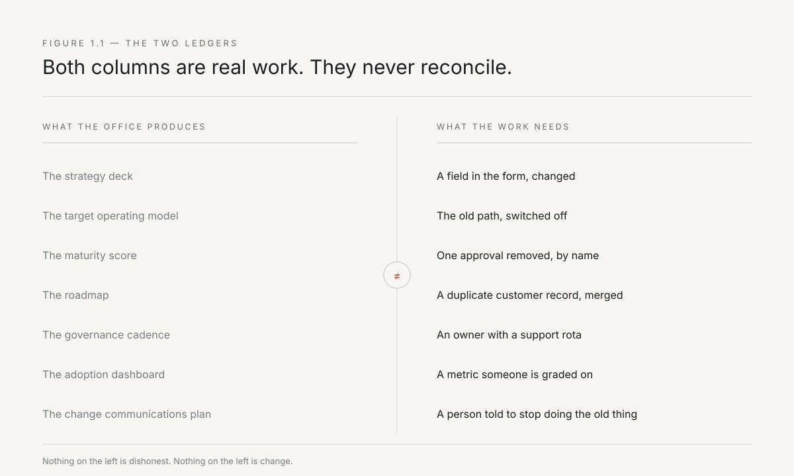
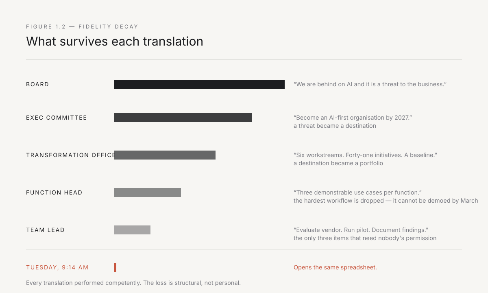
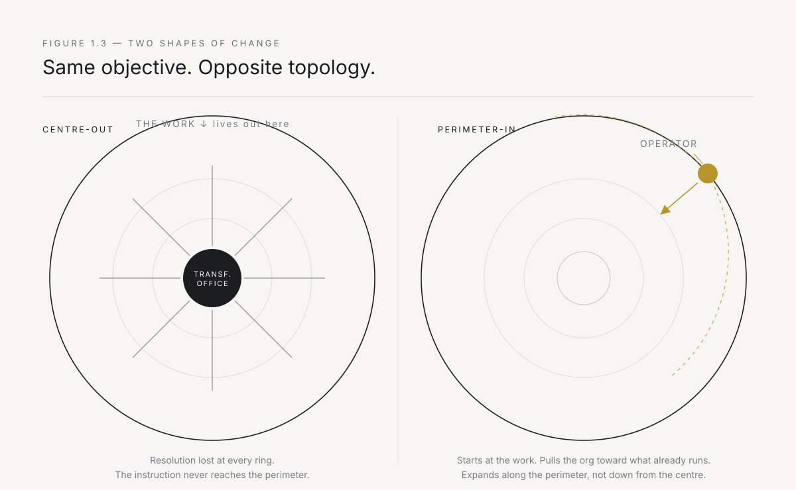

# 1. The transformation office is where change goes to die

Every large company that failed to change in the last twenty years had a department dedicated to changing it.

That is the fact worth sitting with before anything else in this book. The failures were not failures of awareness. Kodak knew about digital photography; it employed the man who built the first digital camera. Nokia knew about touchscreens. The banks knew about UPI. The steel distributors knew about e-commerce. In almost every case the incumbent not only knew — it funded a response, hired for it, gave it a name with a capital letter, and put it on the quarterly earnings call. Then nothing happened.

The standard explanation is culture. Big companies are slow, the story goes, risk-averse, protective of margin, staffed by people whose bonuses depend on last year's business. All true, and all insufficient, because it explains nothing about *why the effort specifically dies where it dies*. Culture is a description of the outcome dressed up as a cause. If culture were the whole answer, transformation programs would fail evenly — some early, some late, some in the middle. They don't. They fail at a predictable point, in a predictable way, with a predictable set of artifacts left behind.

They die between the deck and Tuesday.

That is the argument of this chapter, and it is narrower than it sounds. I am not claiming that executives are stupid or that strategy is worthless. I am claiming something more specific and more uncomfortable: the transformation office is structurally incapable of producing change, because the thing it is built to manufacture — agreement — is not the thing that is scarce. What is scarce is the ability to alter what a specific person does on a specific Tuesday morning with a specific screen in front of them. No office has ever produced that. It isn't a failure of execution. It's a category error about what the work is.

---

## The failure rate that refuses to move

Start with the number, because the number is doing more work than most people who quote it realise.

Roughly seventy percent of large-scale change programs fail to meet their stated objectives. You have seen this statistic. It appears in McKinsey research, in BCG's transformation studies, in a hundred conference keynotes. Its provenance is softer than its citations suggest — the lineage runs back to John Kotter's 1995 observation in *Harvard Business Review* that most change efforts fall short, and it has been re-derived, re-surveyed, and re-published so many times that it now functions as folklore with a footnote.

I am not going to defend the precise figure. Defend the weakest version instead: even the most generous surveys, run by firms with a commercial interest in transformation succeeding, cannot get the success rate above roughly one in three. That is the floor of the claim. It is enough.

Here is what makes it interesting. The number has not moved in thirty years.

Think about what has changed in those thirty years. The entire technology stack, twice. Client-server gave way to web, web to cloud, cloud to mobile, mobile to whatever we are calling this. Storage costs collapsed by orders of magnitude. Compute became a utility. Software went from a capital purchase with an eighteen-month deployment to a monthly subscription with a two-minute signup. The tools for measuring, coordinating, and instrumenting work improved beyond recognition. And through all of it, the rate at which large organisations successfully change themselves stayed flat.

When you hold a variable constant across a total revolution in its inputs, you have learned something. The technology was never the constraint. Something else is, and that something else has been sitting in the same place, doing the same thing, for three decades, immune to every improvement in the tooling around it.

That thing is the operating model — the accumulated set of decisions about who decides, who does, who checks, who gets blamed, and what gets rewarded. It is the least glamorous object in the enterprise and the only one that matters. And here is the load-bearing point: it does not respond to instruction. You cannot change an operating model by describing a better one. It responds only to changes in what people actually do, repeatedly, until the doing becomes the new default.

The transformation office issues descriptions. That is its entire product line.

---

## What the office is actually for

It would be lazy to conclude that transformation offices exist because executives are foolish. They are not foolish. They are responding rationally to the incentives they face, and the office is a rational response — just not to the problem it claims to solve.

Consider the position of a promoter or CEO at a group with forty thousand employees and a business model under visible threat. The board is anxious. Analysts are asking about AI on every call. Two competitors have announced something, and a Jio or a Zepto has appeared in the adjacent space. The CEO has perhaps four levers: capital allocation, senior hiring, structure, and narrative. Notice what is *not* on that list — they cannot reach the workflow. There are six layers between them and the person who actually processes the credit application at a branch office in Nagpur. They could not change that person's Tuesday if they wanted to, and they have never seen that person's screen.

So they do what the levers allow. They allocate capital, hire a Chief Digital Officer, create a structure, and give it a narrative. The transformation office is born.

Now watch what it does, because its behaviour is coherent once you see its real function. It absorbs risk: the board's anxiety is converted into a governance structure with milestones, which makes the anxiety legible and therefore manageable. It produces visibility: dashboards, maturity scores, adoption percentages — a rendering of progress that can be presented upward. It creates a defensible position: when the transformation underdelivers, the office is the thing that can be restructured, and the restructuring is itself reportable as decisive action.

None of this is cynicism. Every one of those functions is genuinely useful to the organisation as a political and financial entity. The problem is simply that none of them is change. The office optimises for the legibility of transformation, and legibility and transformation are not just different — under budget pressure they are actively opposed. The most legible programs are the ones with the cleanest reporting lines and the most standardised milestones, which means the ones furthest from the ugly particularity of real work. The most transformative interventions are illegible almost by definition: one person, one process, one weird exception case that turns out to explain forty percent of the cycle time.

The office cannot fund the second kind, because it cannot report it.

*Figure 1.1 — The two ledgers never reconcile. Everything on the left is real work, produced by capable people. None of it appears on the right.*

---

## Fidelity decay: how intent dissolves on the way down

Here is the mechanism. It is not mysterious, and once you have seen it you will see it everywhere.

An instruction issued at the top of a large organisation does not travel down intact. At every layer it is received by someone who must do three things with it: interpret it, reconcile it with the twelve other things they are accountable for, and convert it into something they can defend to the layer above. That third step is the killer. Defensibility is a filter, and it strips out exactly the properties that made the instruction useful — specificity, risk, and the demand that something be given up.

Watch a real one degrade.

The board says: *we are behind on AI and it is a threat to the business.* True, urgent, actionable in principle.

The executive committee converts this into a strategy: *become an AI-first organisation by 2027.* Still directionally right. But notice what just happened — a threat became a destination, and destinations do not have deadlines that anyone feels in their body.

The transformation office converts the strategy into a program: *six workstreams, forty-one initiatives, a maturity baseline, and a governance cadence.* The threat is now a portfolio. Portfolios are managed, not won.

The function head converts the program into a roadmap: *three use cases per function, prioritised on an effort-impact matrix.* The use cases are chosen for demonstrability, because the function head has to present them at the quarterly review. So the hardest and most valuable workflow — the one everybody complains about — is not chosen, because it cannot be demoed cleanly by March.

The team lead converts the roadmap into a backlog: *evaluate vendor, run pilot, document findings.* These are the only three items the team lead can commit to without asking anyone for anything, so these are the three items on the backlog.

And on Tuesday morning, an analyst who has been doing the same reconciliation in the same spreadsheet for four years opens the same spreadsheet. Nothing has reached them. Nothing was ever going to.

*Figure 1.2 — Each translation is performed competently. The loss is structural, not personal. By the fifth translation, the original intent has been converted into an activity that can be reported without changing anything.*

The critical thing to notice is that nobody in this chain did anything wrong. Each person did their job well. The executive was right to set direction. The office was right to create structure — an unstructured forty-thousand-person effort would be worse. The function head was rational to pick demonstrable use cases. The team lead was rational to commit only to what was within their control. The system produced its designed output. The designed output is a report.

This is why "better execution" is not the fix, and why the answer is never a stronger PMO. You cannot solve a translation-loss problem by adding translators.

---

## The three artifacts, and what each one is really doing

Transformation offices produce a remarkably consistent set of objects. Three of them appear almost universally, and each is worth reading as evidence rather than as instruction.

**The roadmap.** Ostensibly a plan; functionally a promise about the future that defers accountability into it. The roadmap's most important property is that it is always about next quarter. It converts the question "what changed?" into "are we on track?", and those questions have very different failure modes. A program can be on track for eleven consecutive quarters and have changed nothing. I have watched it happen. The roadmap is what makes it possible to watch it happen without anyone raising an alarm.

**The target operating model.** A diagram of how the organisation would work if it worked differently. The tell is that it is drawn in boxes and arrows, which is to say in structure. Structure is what the top can change, so structure is what the diagram addresses. But the operating model that actually governs behaviour is not made of boxes — it is made of a hundred thousand micro-decisions about what is worth escalating, what can be skipped, whose email gets answered first, and which field in the form everybody knows to leave blank. No target operating model has ever contained a sentence about which field everybody leaves blank. That sentence would be worth more than the diagram.

**The maturity assessment.** A score, usually out of five, usually against a framework. Its function is to convert an unbounded problem into a bounded one, which is genuinely comforting and completely false. Maturity models measure the presence of practices, not the presence of outcomes. An organisation can score four out of five on "data governance maturity" while the people who need the data continue to email each other spreadsheets, because the practices exist and the workflow routes around them. The score is not lying. It is measuring the wrong object with great precision.

If you want a fast diagnostic on any transformation program, ask what proportion of its output is one of these three artifacts. Then ask what proportion is a thing that runs.

---

## The case that should have worked

General Electric was, for a period, the most credible attempt any incumbent has made at this. It is worth studying precisely because so little about it was stupid.

The thesis was correct. GE built and serviced the world's turbines, engines, and scanners — machines that generate enormous quantities of operational data and whose unplanned downtime is catastrophically expensive. Nobody was better positioned to sell industrial analytics. Jeff Immelt saw it early, and GE committed at a scale almost no other incumbent has matched: a software centre in San Ramon, a serious technical leader hired in from Cisco, a platform called Predix, and a stated ambition to become a top-ten software company. Reported investment ran into the billions.

The strategy was right. The technology mostly worked. The failure was structural, and it is instructive in every particular.

Predix was built as a platform, at a centre, for a market that had to be assumed rather than observed. Platforms are the correct answer once you know the shape of ten deployments. GE built the platform first and went looking for the deployments after. The direction of that arrow is the whole story.

Then it had to sell inward. GE Digital's customers were, substantially, GE's own industrial businesses — Aviation, Power, Healthcare — each of which had its own P&L, its own century of accumulated process, and its own perfectly reasonable view that its problems were not going to be solved by a software unit in California. The industrial businesses were asked to adopt something built by a group with no authority over their workflows and no daily presence in them. They did what any business unit does: they complied at the level of the announcement and continued as before.

And it was measured wrong. Software bookings became the metric, so the organisation optimised for bookings — for deals signed, for platform commitments, for the appearance of a software company. What it needed to measure was whether a turbine service crew in Ohio changed how it scheduled maintenance on a Tuesday.

By 2018, under new leadership, GE Digital was cut back. ServiceMax — acquired for close to a billion dollars two years earlier — was largely sold on. In 2021, GE announced it would break into three companies. The industrial internet thesis was not wrong; the deployment model was. A version of that thesis is being executed today by companies that started at the wound and worked outward.

Read GE not as a cautionary tale about ambition but as a controlled experiment. Give an incumbent correct strategy, real capital, genuine technical talent, and executive sponsorship at the highest level. Run it from the centre. Observe the result. The experiment has been run. We do not need to run it again.

The Indian version is quieter but no less instructive. Every large group — Tata, Mahindra, L&T, the steel and cement majors — has created a digital subsidiary or a platform play in the last decade. The promoter saw it early, the capital was real, the hires came from Flipkart and Amazon and Google. In each case, the new entity was given a mandate and a Bangalore or Gurugram address and told to modernise the group. In each case, the group's manufacturing plants, dealer networks, and branch offices continued as before, because the people running them had never met anyone from the digital entity, and the digital entity had never seen a dealer's screen. The pattern is identical to GE's. The geography changed. The failure mode did not.

---

## Authority to approve is not authority to change

There is a specific confusion at the heart of all of this, and naming it precisely is the point of the chapter.

Senior executives hold enormous authority to *approve*. They can fund a program, create a unit, hire a leader, kill a project, restructure a division. This authority is real and it is the authority the organisation is designed to give them.

They hold almost no authority to *change*. Changing a workflow means changing a form, a system integration, a handoff, a rule about who signs, a habit about what gets skipped, and usually a metric that someone is bonused on. Each of those sits with a different person, most of whom do not report to each other, several of whom have veto power they have never had to name because nobody has ever forced the question. An executive who tries to reach into that layer directly will find their instruction converted into a project, and the project converted into a roadmap, and we are back where we started.

The two authorities feel identical from the top. This is the trap. A promoter who approves five hundred crore of transformation spend has genuinely exercised power, and the exercise produces immediate visible effects — hires, announcements, a program. It takes eighteen months for it to become clear that none of the effects touched the work. By then the program has its own constituency, its own reporting, and its own explanation for the delay, which is invariably that the organisation needs to be more committed.

Indian groups have one structural feature that should help and mostly does not: the promoter can, in principle, reach any layer of the organisation directly. The phone call from the chairman's office can move a decision that would otherwise take six months. But this is authority to approve exercised as a shortcut, not authority to change. The workflow reverts within a quarter of the phone call, because the phone call changed a decision, not a system. The promoter's reach is real and it is not the fix, because the fix requires a hundred changes to a hundred screens, not one phone call to one plant head.

The organisation was committed. The instruction never arrived.

*Figure 1.3 — The transformation office pushes outward from the centre and loses resolution with every ring. The deployed unit starts at the perimeter, where the work is, and pulls the organisation toward what already works. Same objective, opposite topology.*

---

## The Tuesday test

I want to leave you with one diagnostic, because it is the only one I have found that cannot be gamed and it takes ninety seconds to run.

Walk into any transformation program and ask a single question: **name one workflow that runs differently on Tuesday than it did last Tuesday, and tell me who does it.**

Not "what's on the roadmap." Not "what have we enabled." Not "what's our adoption rate." Name the workflow. Name the person. Describe what they used to do and what they do now.

The responses sort themselves cleanly, and the sorting tells you everything.

Some people answer instantly and in concrete nouns. *The credit ops team used to pull four documents from three systems and key them into an assessment template; that now arrives pre-filled and they review exceptions. It's Priya's team, eleven people, since March.* That program is real, whatever its size.

Most people answer with capability. *We've stood up the platform, we've trained two hundred people, we have twelve use cases in flight.* Every word is true. None of it is an answer. Capability is not consumption, and consumption is not change.

And some people answer with a question about the question — why are you defining it so narrowly, transformation is a journey, it doesn't work like that. It does work like that. That is exactly how it works. A transformation is the sum of workflows that run differently, and nothing else, and if you cannot name one after eighteen months and forty million rupees then you have not been transforming, you have been reporting.

The Tuesday test is not a rhetorical trick. It is a statement about where the unit of change lives. It lives in a workflow, performed by a named person, on an ordinary day. Everything in the rest of this book follows from taking that seriously — because if that is where change lives, then that is where you have to put the people who make it.

Not above it. In it.

---

*Next: the technology was never the bottleneck. Chapter 2 shows exactly where between capability and outcome the value leaks out — and why the leak has a hundred-year-old precedent that nobody in the enterprise has read.*
