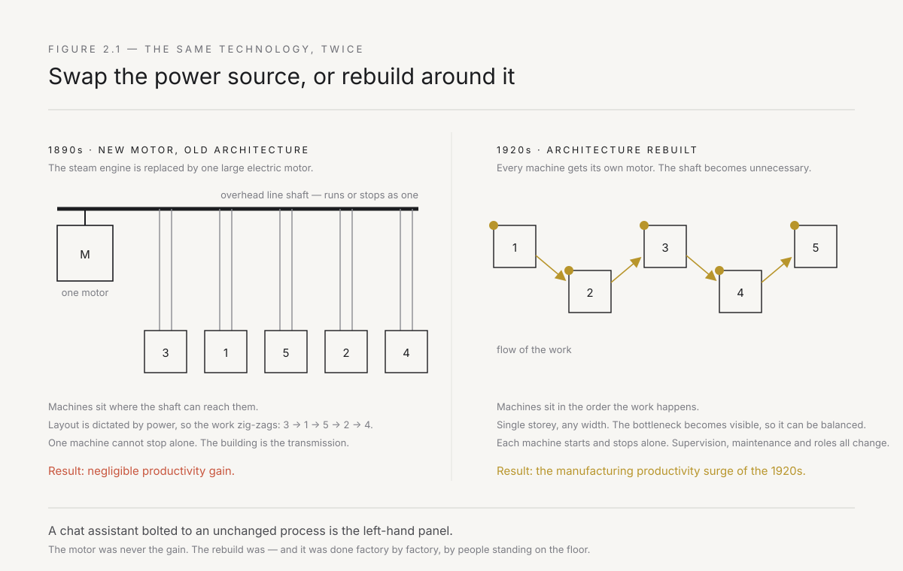
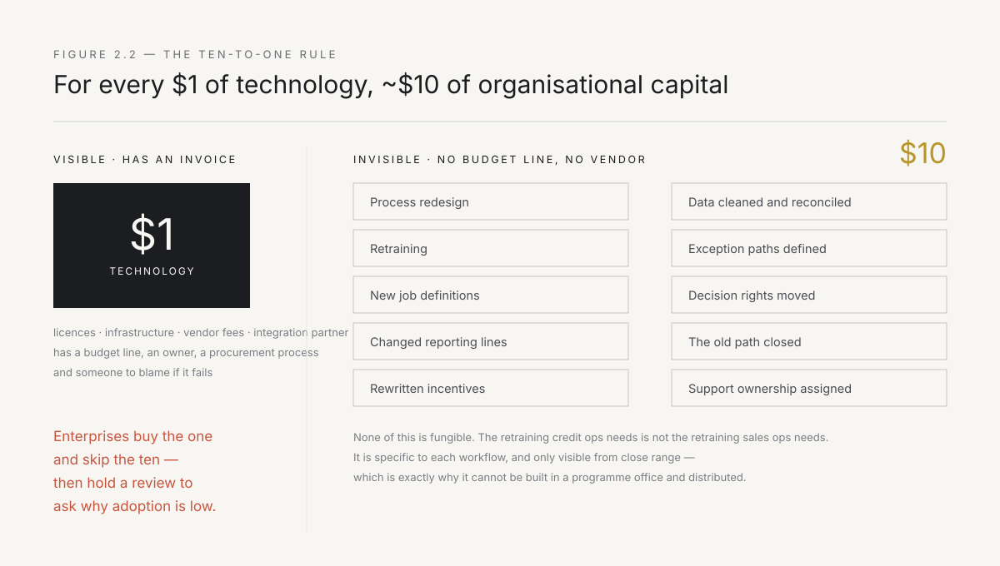
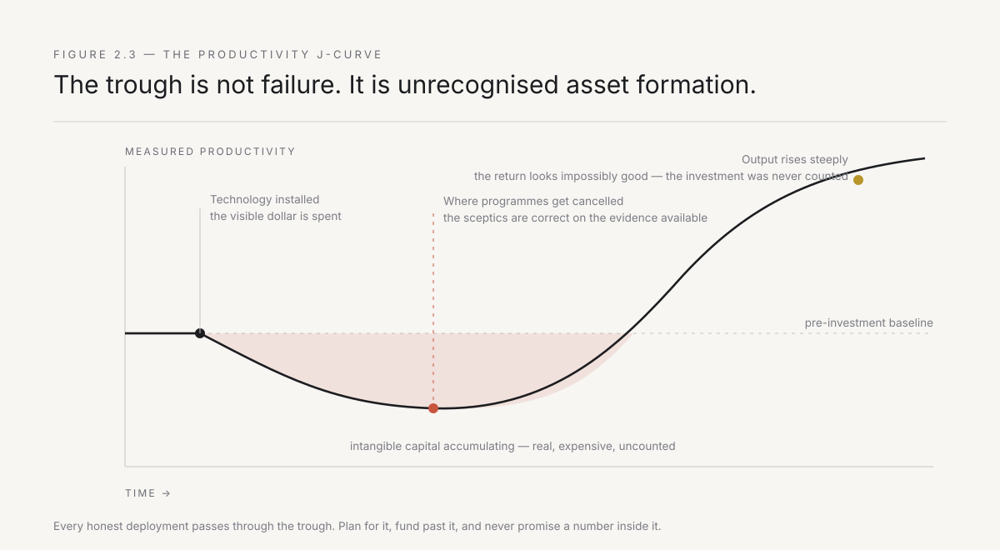
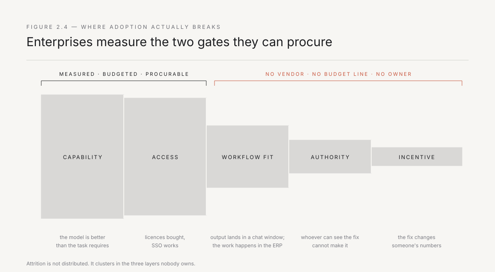

# 2. The adoption gap

The technology arrives finished. The value arrives a decade later, and only at the companies that rebuilt the work.

This is the most reliable pattern in the history of industrial technology, it has never once been broken, and every generation of executives discovers it personally at enormous expense. The gap between a capability existing and that capability producing economic output is not a delay in the technology. It is the time required to demolish and rebuild an operating model — and that work is done by hand, at the level of individual workflows, by people standing where the work happens.

The last chapter argued that transformation fails because instruction cannot reach the workflow. This chapter locates the gap precisely, measures it, and shows why it is the only place worth deploying anyone.

---

## Forty years of electricity and nothing to show for it

In 1987 Robert Solow wrote the sentence that defined a decade of economic argument: *you can see the computer age everywhere but in the productivity statistics.* Firms had spent enormously on computers. Output per hour had barely moved. The paradox was real and it was embarrassing.

Three years later the economic historian Paul David published the answer, and it did not come from computing at all. It came from electricity.

The story is worth telling in detail, because it is the single most useful object in this book and almost nobody in an enterprise has encountered it.

The commercially viable electric motor arrived in the 1880s. By 1899 — nearly two decades later — electricity accounted for less than five percent of mechanical drive capacity in American manufacturing. By 1929 it was around eighty percent. And the great manufacturing productivity surge did not accompany the invention. It arrived in the 1920s, forty years after the technology was available and working.

Why the delay? Not cost, not reliability, not awareness. The delay was architectural.

A nineteenth-century factory was organised around a single enormous steam engine. The engine turned a central shaft. The shaft ran the length of the building, usually overhead, and every machine in the plant was connected to it by a leather belt. This architecture dictated everything. Machines had to be close to the shaft, so the factory was tall and narrow — multi-storey, with the heaviest equipment nearest the power. Machines had to be arranged by their power draw, not by the sequence of production. The entire plant ran or stopped together, because the shaft ran or stopped together. Any machine's downtime was a function of a system-level decision. The building was the transmission.

When electricity arrived, factory owners did exactly what enterprises do today. They bought the new technology and installed it inside the old architecture. They removed the steam engine and put in one large electric motor. Same shaft. Same belts. Same layout. Same everything.

The gains were negligible. Of course they were. They had swapped the power source and preserved the constraint.

The transformation came only when someone stopped thinking of the motor as a replacement engine and started thinking of it as something small enough to put on every machine. Unit drive. Each machine gets its own motor, its own switch, its own independent start and stop. Once that is true, the shaft is unnecessary. Once the shaft is unnecessary, the factory can be one storey and as wide as you like. Once the factory can be any shape, machines can be arranged in the order the work actually flows. Once machines are arranged by workflow, you can see the whole line, which means you can find the bottleneck, which means you can balance it. Materials handling gets redesigned. Supervision changes because supervisors can see. Maintenance changes because a machine can stop alone. Job roles change because a worker now controls their own machine's power.

That cascade — motor to layout to flow to supervision to roles — is the productivity gain. Not the motor. The motor was a precondition. The gain was in the rebuild, and the rebuild took a generation, because it had to be done factory by factory, by people standing on the floor of each one.

*Figure 2.1 — Left: the new power source installed inside the old architecture. Right: the architecture rebuilt around what the new power source makes possible. The technology is identical in both. Only one of them produced a productivity revolution.*

Now say it in today's terms, because the mapping is exact.

An Indian industrial group buys AI. It installs it inside the existing architecture — a chat assistant bolted to the side of an unchanged process, a copilot licence issued to every employee, a summarisation feature added to a system nobody wanted to open in the first place. The work still routes through the same approvals, the same handoffs, the same four systems that do not talk to each other — the ERP that was customised in 2014, the dealer management system that runs on a different database, the Excel workbook that a regional manager maintains because neither system captures what they actually need — and the same person who has to check the output because the process was designed around the assumption that the previous step was unreliable.

That is one big electric motor driving the same line shaft. It will produce a modest gain, a good demo, and a large number of unused licences. It cannot produce a step change, because the constraint was never the power source.

The step change requires someone to ask the unit-drive question: *if this capability is small enough and cheap enough to put at every point in this process, what does the process look like when we stop preserving the shape the old constraints forced on it?* That question cannot be answered from a headquarters. It can only be answered by someone who knows what the four systems are, why the checking step exists, and which of the twelve approvals is real.

---

## The ten-to-one rule

There is a number for this, and it is the most useful number in enterprise technology.

Erik Brynjolfsson and his collaborators, studying firm-level data across decades, found that for every dollar a company invests in computer hardware, it needs to invest roughly ten dollars in organisational capital before the technology pays. Process redesign. Retraining. New job definitions. Changed reporting lines. Rewritten incentives. Cleaned-up data. New exception-handling paths. New decision rights.

Ten to one. And the ten is invisible.

This asymmetry explains almost everything about how enterprises misallocate. The one dollar is easy to see, easy to budget, easy to approve, and easy to attribute — it has an invoice attached to it. The ten dollars has no invoice. It is not a line item. It shows up as senior people's time, as temporarily reduced throughput while a team learns a new way of working, as the political cost of taking a decision right away from someone who has held it for nine years. There is no procurement process for that. There is no vendor to blame if it goes wrong.

So enterprises buy the one and skip the ten, and then hold a review to ask why adoption is low.

Worse, the ten is not fungible and cannot be centralised. You cannot build organisational capital in a programme office and distribute it. It is specific to each workflow — the retraining that credit ops needs is not the retraining that sales ops needs, and the decision right that has to move in one is not the decision right that has to move in the other. This is precisely why it defeats top-down transformation: the thing that must be built is local, particular, and only visible from close range.

*Figure 2.2 — The visible dollar has a vendor, an invoice, and an owner. The invisible ten has none of those, which is why it is systematically underfunded and why it is the entire job.*

Brynjolfsson later formalised the consequence as the productivity J-curve. When a firm invests in a genuinely general-purpose technology, measured productivity *falls* first. It falls because the firm is spending real resources producing an asset — the rebuilt operating model — that standard accounting does not recognise as an asset. Output looks flat or worse while the intangible capital accumulates. Then, when the rebuild completes, output rises steeply and the measured return looks impossibly good, because the investment phase was never counted.

The J-curve is not a curiosity. It is a political fact inside a large company. It means the honest version of the work will look like failure at exactly the moment it needs its second year of funding. Every deployment you attempt will pass through a trough where the numbers do not yet justify it and the sceptics are correct on the evidence available. Chapter 9 is about how to survive that trough; for now, know that it is structural, expected, and not a sign that you are wrong.

*Figure 2.3 — The trough is not failure. It is unrecognised asset formation. Most transformation programs are cancelled inside it, which is why the incumbent never reaches the upswing and concludes the technology did not work.*

---

## The present-day evidence

None of this is history. The current wave is producing the same result at higher speed and greater volume.

Through 2025, the reporting on enterprise AI converged on an uncomfortable picture. An MIT-affiliated study of enterprise generative AI initiatives — widely circulated as the "95% figure" — reported that the overwhelming majority of enterprise pilots produced no measurable P&L impact. Gartner separately projected that a large share of generative AI projects would be abandoned after proof of concept. Survey after survey found the same shape: near-universal experimentation, near-universal executive sponsorship, and a small single-digit percentage of initiatives that changed a financial outcome.

The Indian evidence is identical in shape and larger in volume. Every major group has an AI initiative. NASSCOM surveys through 2025 showed that enterprise AI adoption in India tracked global patterns — high experimentation rates, low production rates. The Tata group, Reliance, the Adani conglomerate, the large banks — all announced AI programmes, all hired teams, all produced demos. The manufacturing and infrastructure companies are running pilots with predictive maintenance. The banks are running pilots with document processing. The NBFCs are running pilots with credit scoring. And the people at the branch office, at the dealer's counter, at the plant floor, continue to do the work the way they did it before the pilot was announced.

Treat the specific percentages with appropriate suspicion — methodologies vary, definitions of "return" vary, and there is a publication bias toward alarming numbers. But the direction is not in dispute and it is corroborated from every angle. The failure is not distributed randomly across the stack. It clusters.

It does not cluster at model capability. Frontier models in 2026 are, for the overwhelming majority of enterprise tasks, more capable than the task requires. The model is not the reason the credit memo still takes four days.

It does not cluster at access. Access has been solved to the point of absurdity. Most large enterprises have deployed assistants to tens of thousands of employees. The licences are bought. The single sign-on works.

It clusters in the three layers nobody owns.

**Workflow fit.** The capability exists and is available, but it does not sit where the work sits. The output arrives in a chat window and the work happens in an ERP screen — or, in much of Indian enterprise, in a WhatsApp group, a Tally instance, or a regional Excel workbook that feeds into the ERP quarterly. Somebody has to copy it across, and that somebody is the process. A capability that requires a human transport layer has not been deployed; it has been made available.

**Authority.** Making the workflow actually different requires changing something owned by someone else — a field in a system of record, a rule about who approves, a report that a director looks at every morning. The person who can see the fix cannot make it. The person who can make it cannot see it. This is the central deadlock of the enterprise and it has almost nothing to do with technology.

**Incentive.** Even where the fix lands and works, someone's numbers change. If the process improvement reduces headcount requirements in a team whose manager is graded on headcount and span of control, the improvement has created an enemy. If the automation removes a control step that gave a compliance function its visibility, compliance will restore it in a different form within two quarters. Nobody says any of this out loud. It doesn't need saying.

*Figure 2.4 — Enterprises measure the first two gates because those are the ones they can procure. The attrition happens at the last three, which have no vendor and no budget line.*

---

## Lidl, and the cost of refusing the rebuild

The clearest modern illustration of what happens when a company buys the technology and refuses the rebuild is a German grocer.

Lidl set out to replace its inventory management system with SAP. The programme ran for roughly seven years. Reported spend approached half a billion euros. In 2018 it was abandoned and the company reverted to its old system.

The proximate cause has become a small legend, and it is almost too perfect. Lidl valued its inventory at purchase price. Standard SAP retail practice valued it at retail price. This is not a large difference in principle — it is a modelling choice, and one that most retailers had already accommodated. But Lidl's internal reporting, its buyer incentives, its supplier negotiations, and decades of managerial habit had accreted around purchase-price valuation. So rather than change the practice, Lidl changed the software. And then changed it again for the next mismatch, and the next, until the system was a mass of customisations that could not be maintained, upgraded, or reasoned about.

Every one of those decisions was locally defensible. Each customisation was cheaper and less disruptive than the corresponding organisational change. That is the trap, and it is not a German trap or a grocery trap. The choice presents itself, in every enterprise deployment, as: *do we change the process or configure around it?* Configuring around it is always cheaper today and always more expensive by the fifth time. The accumulated weight of those choices is what people are describing when they say a company's technology is a decade behind. The technology is fine. It is carrying a decade of preserved habit.

Lidl's failure was not that it bought the wrong system. It was that it spent half a billion euros to avoid changing the way its buyers thought about inventory value. That is the ten-to-one rule presenting its invoice.

India has its own version of this pattern, and it runs at staggering scale. Every large Indian enterprise that implemented SAP or Oracle in the 2000s and 2010s — the steel groups, the cement companies, the auto manufacturers — customised the software to match the process rather than changing the process to match the software. The customisations were driven by the same logic: GST was structured differently than VAT, the dealer network required a credit-check workflow that no global template anticipated, the regional offices had been filing reports in a format the group head had read for twenty years. Each customisation was rational. The aggregate is a system so heavily modified that the vendor's own consultants cannot upgrade it, and the organisation is now locked into a version of the software that is itself a monument to every process it refused to change. When someone says an Indian enterprise's ERP is "heavily customised," they are describing the ten-to-one rule's unpaid balance.

---

## Ninety-four percent

W. Edwards Deming spent his career arguing a proposition that most managers accept in the abstract and violate every day: the overwhelming majority of problems in an organisation belong to the system, not to the people working in it. His estimate was ninety-four percent.

If that is even approximately true, it has a brutal implication for how adoption is usually pursued. Adoption programmes are almost entirely aimed at the six percent. Training. Change management. Communications campaigns. Champions networks. Nudges. Gamified leaderboards showing which department has the highest assistant usage. All of it directed at persuading individuals to behave differently inside a system that is producing exactly the behaviour it was designed to produce.

The person who does not use the AI tool is not resistant. They are responding accurately to their situation: the tool produces output they cannot paste into the system they are graded on; using it means they own the error if it is wrong, whereas the old process distributes that risk across three people; and nobody who evaluates them has ever mentioned it. Change any one of those three facts and behaviour changes without a single training session. Change none of them and no amount of communication will help.

This is why the deployed operator is an engineer and not a change manager. The intervention that works is not persuasion. It is removing the reason the person was right to say no.

---

## The gap has an address

Pull the argument together, because Part I is nearly done and the thesis has to stand before we name the fix.

The bottleneck is not model capability. It is not compute, not data availability in any interesting sense, not tooling, not awareness, and not executive will. Every one of those has improved by orders of magnitude while the outcome stayed flat, which is the same evidence pattern we saw in Chapter 1 and it means the same thing.

The bottleneck is the rebuild — the ten dollars of organisational capital that has to be constructed workflow by workflow, and which cannot be procured, centralised, mandated, or communicated into existence. It is built by someone who is close enough to see which of the twelve approvals is real, technical enough to change the system rather than describe the change, and empowered enough that when they alter what happens on Tuesday, it stays altered.

Historically, those three properties lived in three different people who did not work for the same manager and did not like each other. The person who could see it was in operations — at the branch, at the plant, at the dealer's office. The person who could build it was in IT — at headquarters, or at an outsourced services firm in Pune or Chennai, six weeks behind on a queue. The person who could authorise it was a business head who had never seen the screen. Coordinating them cost more than the fix was worth, so the fix did not happen, and the gap persisted for a hundred years.

The reason this book exists is that the three properties can now, for the first time, be assembled in one small unit and pointed at a specific wound — cheaply enough to do it in a hundred places at once. That is what forward deployment is. That is what the rest of this book is about.

But first, one chapter of evidence from inside the machine, because I would not believe any of this either if it came only from research.

---

*Next: what this actually looks like from the inside of a large incumbent — the two clocks, the pilots that die of success, and the small number of changes that survived.*
