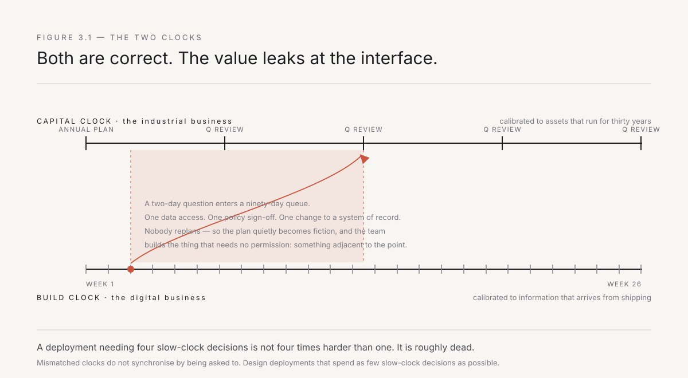
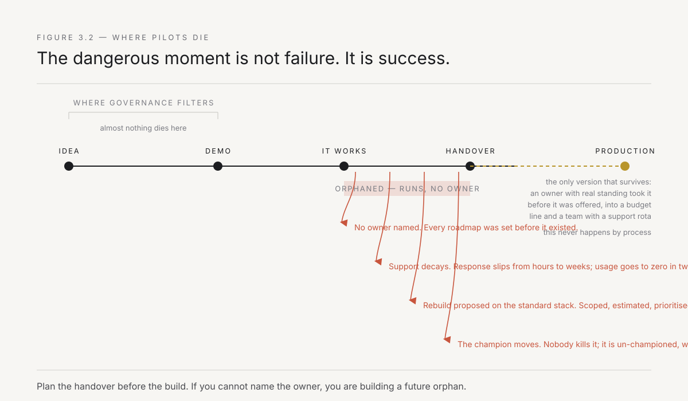
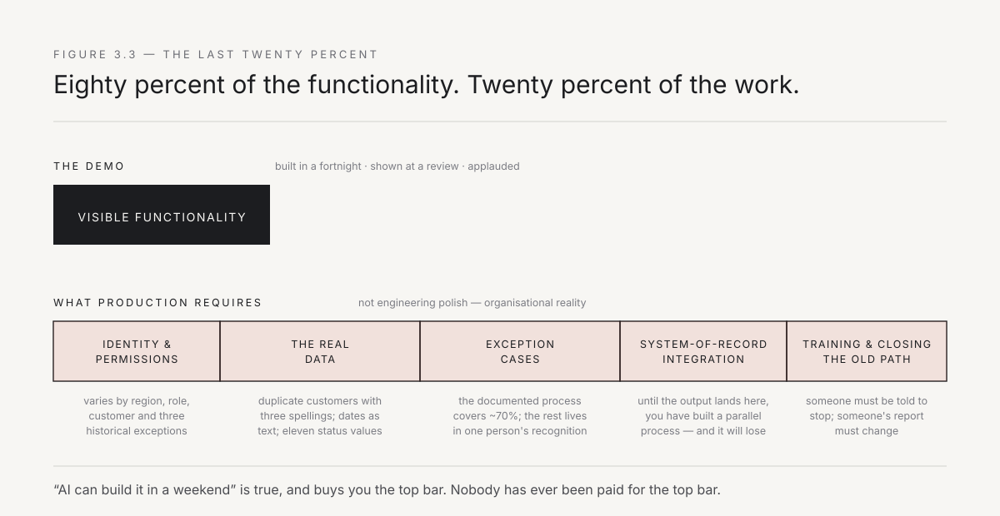

# 3. Notes from inside a giant

I did not learn any of this from research. I learned it standing inside a company that was genuinely trying to change and could not, watching intelligent people spend real money on the correct strategy and produce nothing.

That sentence is not an accusation. It is the most interesting thing I have ever observed professionally, and it is the reason for this book. If incumbents failed because they were staffed by fools, there would be no book — the fix would be hiring. What I watched was harder and more useful: capable people, adequate budget, executive sponsorship, real urgency, and a near-zero conversion rate from intent to changed work. Something in the machine was eating the effort. This chapter is what I saw when I went looking for it.

> **A note on method.** These are field notes, not a case study. I have kept every dynamic exactly as I observed it and removed everything that would identify a person or a business — names, units, numbers that could be traced, and the specific commercial context. Where a pattern held across more than one situation I have written it once, as a pattern. Where a detail matters and only my own experience can supply it, I have left a marked slot: ⟦like this⟧. Those slots are for the finished book, and they should be filled with the specific, unflattering, verifiable version of the event. Nothing here is invented; a good deal of it is compressed.

---

## The company

Picture the shape rather than the name.

An Indian industrial group, decades old, built on physical assets that cost a fortune and last thirty years. It makes things, moves things, and finances the people who buy things. Its planning horizon is measured in capacity expansions and capital cycles that run through DRHP filings and board approvals. Its true operating system is a set of relationships — with distributors, with dealers, with a long tail of small businesses across tier-two and tier-three towns that buy in volumes too small for the group to serve efficiently and too numerous to ignore.

It is not a dinosaur. That is the first correction I would offer to anyone who has only read about incumbents from the outside, or who arrived from a Bangalore startup and concluded that slowness is the same as stupidity. This company is extremely good at the thing it does. The processes people mock as bureaucratic are, on inspection, mostly scar tissue from real disasters — a control step exists because a receivable went bad in 2011, an approval exists because someone once shipped against an unverified order, a manual reconciliation persists because the GST migration in 2017 left two systems that never fully agreed. Every piece of friction is a monument to a specific past failure. The friction is not stupidity. It is memory.

Then the group does what most groups of that size have now done. It creates a digital entity — a platform, a subsidiary, a new business unit — staffed with people hired from Flipkart, from Amazon, from Google India, given a mandate to modernise, and positioned as the future. The entity gets an office in Bangalore or Gurugram, a different pay scale, and a different dress code. ⟦Your entity, its founding mandate, and the sentence used to describe it internally at the start.⟧

Everything I am about to describe happens in the gap between that entity and the group that created it — a gap that is partly organisational and partly geographic, because the digital team sits in a co-working space in Koramangala and the business it is supposed to transform operates out of plant offices in Jamshedpur and branch offices in Indore.

---

## Observation one: the company runs two clocks

This is the first thing you notice and the last thing you learn to work with.

The industrial business runs on a capital clock. Decisions are annual and quarterly — aligned to the Indian financial year, which means March is not a month but a deadline that bends the organisation's spine. A commitment made in April is reviewed in July. A plan is a document with a year in the title. This is not sluggishness — it is calibrated to the underlying physics. When a decision commits you to an asset that will run for three decades, deliberation is cheap and reversal is not. People who complain that the incumbent is slow have usually never had to be right about something for thirty years, or had to explain a bad capex decision to a promoter whose family built the business.

The digital business runs on a build clock. Decisions are weekly. A commitment made on Monday is visible on Friday. Reversal is cheap; deliberation is expensive, because the information that would justify deliberating arrives faster from shipping than from analysis.

Both clocks are correct for their domain. The problem is the interface.

Every meaningful digital change requires at least one decision from the capital clock — a budget, a data access, a change to a system of record, a policy sign-off. So a two-day question enters a ninety-day queue. And because the digital team's plan assumed the two-day answer, the delay is not experienced as a delay; it is experienced as a plan that quietly became fiction. Nobody replans. The team works around the missing decision, builds the thing that does not require it, and ships something adjacent to the point.

I watched this happen enough times to stop believing it was a coordination problem. It is a clock-speed mismatch, and mismatched clocks do not synchronise by being asked to. What actually works — and this is a preview of the whole playbook — is to design deployments that need as few capital-clock decisions as possible, and to spend the ones you do need very deliberately. A deployment that requires four sign-offs from the slow clock is not four times harder than one requiring one. It is roughly dead.

*Figure 3.1 — Both clocks are correct for their domain. Value leaks entirely at the interface, where fast-clock plans are made against slow-clock dependencies that nobody re-forecasts.*

---

## Observation two: everyone already knows the answer

Go and sit with the person doing the work. Not their manager. Not the team lead presenting at the review. The person at the desk, at the counter, at the plant-floor terminal.

Within twenty minutes they will tell you exactly what is broken, why, and what would fix it. They will know which report nobody reads. They will know that the mandatory field in the form is filled with a placeholder value by every single user because the real value is not available at that step — and that someone enters "NA" or "999" because the system will not let them proceed without a value. They will know that the four-day turnaround is actually six hours of work and three and a half days of waiting for one person who is in meetings, or travelling between sites, or attending a review that the corporate office scheduled. They will know which customer complaints are systematic and which are noise, because they take the calls — often on WhatsApp, in a group that has become the actual system of record for that process.

This knowledge is complete, accurate, cheap to obtain, and almost entirely unused.

The first time this happens you think you have found something. The tenth time you realise you have found the actual disease. The organisation is not short of diagnosis. It is not short of ideas. It has a perfect map of its own dysfunction, distributed across the people at the bottom, and no mechanism for converting that map into a change — because the person holding the knowledge has no authority over the system that produces the problem, and the person with authority has never seen the screen.

This is the deadlock from Chapter 2, and from inside it feels much worse than it reads. It feels like watching someone describe the exact location of a fire to a person who is not allowed to carry water.

⟦The specific conversation where someone described the fix to you in one sentence, and what happened to it.⟧

An honest corollary: this is also why "just talk to users" is not a method. Every consultant runs workshops. The workshops surface the same knowledge, write it on a wall, photograph the wall, and put it in a report. Diagnosis was never scarce. What is scarce is the ability to walk from the diagnosis to the code to the changed process without passing through a queue. That walk is the entire job.

---

## Observation three: pilots die of success

This one inverted my model, so I will state it plainly. Inside an incumbent, the dangerous moment for a pilot is not failure. It is success.

A pilot that fails is easy. It gets shut down, everyone learns something, nobody's territory is touched, and the failure is genuinely useful. Failed pilots are cheap and I stopped worrying about them.

A pilot that works creates a problem the organisation has no mechanism to solve: **who owns it now?**

The moment it works, it stops being an experiment and becomes a production system. Production systems need an owner, a budget line, a support rota, a security review, an entry in the architecture register, and a person whose bonus is affected when it breaks at eleven at night. None of that was arranged, because arranging it would have required the capital clock, and the pilot was deliberately designed to avoid the capital clock. That was the only reason it happened at all.

So the successful pilot enters a state I came to think of as orphaned. It runs. People use it. It is genuinely producing value. It has no owner, no budget, no support, and no path into anyone's roadmap, because every roadmap was set before it existed. Then one of four things happens, and I have seen all four:

The champion moves. The director who sponsored it takes another role, and the new director's list is their own. The thing does not get killed; it gets un-championed, which is slower and more final.

Support becomes untenable. A user reports a bug to the person who built it, who now has a different assignment. The response time slips from hours to weeks. Users route around it. Usage decays to zero over about two quarters, and the eventual post-mortem records low adoption.

It gets absorbed and rebuilt. Central IT correctly points out that an unowned production system is a risk, and proposes to rebuild it properly on the standard stack. The rebuild is scoped, estimated at three quarters, prioritised against everything else, and does not start. Meanwhile the original is frozen pending the rebuild.

Or — rarely, and this is the case worth studying — someone with real standing takes ownership *before* it is offered, absorbs it into an existing budget line, and gives it to a team that already has a support rota. This is the only version that survives. It never happens by process. It happens because a specific person decided to be responsible for it.

*Figure 3.2 — The failure modes cluster after the demo, not before it. Most transformation governance is designed to filter ideas at the front of this pipeline, where almost nothing dies.*

The lesson I took: **plan the handover before the build.** If you cannot name the person who will own the thing in production, and get them to say the sentence out loud, you are not building a solution. You are building a future orphan. Chapter 9 turns this into a rule.

---

## Observation four: the last twenty percent is the whole project

Every demo I saw was built in a fortnight. Every one of them was eighty percent of the visible functionality. And every single one required more effort to finish than it had taken to reach that point — usually several times more.

The remaining twenty percent is always the same list, and it is worth memorising because you will be asked to estimate against it for the rest of your career.

Identity and permissions: who is allowed to see what, in an organisation where the answer varies by region, by role, by customer, by entity within the group, and by three exceptions that exist for historical reasons nobody can reconstruct — and where the same dealer may be a customer of one division and a supplier to another.

The real data: the demo ran on an extract that someone cleaned. Production data has duplicate customers with three spellings in two scripts, dates stored as text, a status field with eleven values of which four are in active use and two mean the same thing, PAN numbers entered inconsistently, GST registrations that changed during the migration, and a decade of records that predate the current schema.

Exceptions: the process as documented covers perhaps seventy percent of cases. The rest are handled by someone knowing what to do — the regional manager who knows that this particular dealer's credit terms were set by the promoter's office directly, the accounts team that knows which invoices to hold during a GST quarter-close. That knowledge is not written anywhere and the person who has it will not be able to enumerate it if you ask — only to recognise cases when they appear. Extracting it takes weeks of sitting beside them.

Integration into the system of record: until the output lands in the system where the work is actually tracked, you have built a parallel process, and parallel processes lose to the original within a month.

And the human wiring: someone must be trained, someone must be told to stop doing the old thing, and someone's report must change or they will keep asking for the old numbers, which means the old process must keep running to produce them.

*Figure 3.3 — What the demo shows, and what production requires. The bar on the right is not engineering polish. It is organisational reality, and it is where the ten dollars from Chapter 2 gets spent.*

This is why "AI can build it in a weekend" is both completely true and completely irrelevant to an incumbent. The weekend is real. It buys you the left-hand bar. Nobody has ever been paid for the left-hand bar.

---

## Observation five: the antibodies are polite

I expected resistance to look like resistance. Someone saying no. An argument. A political fight.

It almost never does. In a well-run large company, rejection arrives dressed as diligence, and it is genuinely indistinguishable from diligence, which is what makes it so effective.

It sounds like: *this needs to go through architecture review.* Correct. *We should align this with the broader roadmap so we don't build twice.* Sensible. *Let's socialise it with the other business units before we scale.* Prudent. *Can we see a business case with quantified benefits before we commit resources?* Entirely reasonable. *Security will need to look at it.* They should.

Every one of those is a legitimate request that a responsible organisation should make. Any one of them, honestly applied to a proposal, improves it. Applied in sequence to a small change, they cost more than the change is worth, and the proposal dies of correct process.

The tell is not the content of the objection. It is the *sequencing* — each requirement surfaces only after the previous one is satisfied, so the total cost is never visible at the start and there is never a single moment where anyone says no. And it is the *asymmetry*: the same requirements are not applied to the incumbent process, which was never architecture-reviewed, has no business case, and would not pass a security review if anyone ran one.

I want to be fair here, because the cynical read is wrong and will get you killed if you act on it. The people raising these objections are usually not protecting territory. They are protecting the organisation from a real class of harm they have personally seen — the ungoverned system that breached, the shadow database that gave the board a wrong number, the pilot that became critical infrastructure with nobody on call. They have been burned. They are right to be careful.

Which means the response cannot be to fight the antibodies or to sneak past them. It has to be to arrive already carrying the answers, and to make the deployment small enough that the honest version of each objection is cheap to satisfy. Chapter 12 is entirely about this. It is the hardest chapter in the book because there is no clever trick in it.

---

## Observation six: the demo is not the deployment, and the org cannot tell

There is a specific failure that recurs with such regularity I now consider it the default outcome of any enterprise AI effort.

Someone builds something impressive. It is genuinely impressive — a system that reads documents and produces a draft, or answers questions over the company's own data, or automates a task that visibly consumed a person's afternoon. It is shown at a review. It gets applause. It gets a mention in the next town hall. Occasionally it gets an award.

Nothing changes.

The reason is always the same and it has nothing to do with quality. The demo showed the capability existing. Change requires the capability being *in the path* — meaning the work cannot proceed without going through it, because the old route has been closed. As long as both routes are open, people use the old one. Not out of resistance. Out of accurate risk assessment: the old route is known, the new one is not, and nobody has told them that using the new one is now their job.

Closing the old route is an organisational act, not a technical one. It requires someone with authority to say: from the fifteenth, this is how we do it, and the old form is switched off. That sentence is worth more than the entire build. I watched more than one excellent system fail for want of it, and I watched a genuinely mediocre one succeed because somebody said it.

⟦The specific system that was applauded and never used, and the specific one that was worse and stuck.⟧

---

## Observation seven: what actually worked

Not everything failed. A small number of things worked, and they were unglamorous enough that nobody wrote them up. When I lined them up afterwards, they had the same shape, and that shape is the thesis of this book arrived at empirically rather than theoretically.

Every one of them was **small in scope and specific**. One workflow. Not a platform, not a capability, not an enablement layer. A named process performed by a named team.

Every one of them was **adjacent to money**. Something that visibly affected revenue collected, cost incurred, or working capital held. Not because financial impact is the only value, but because financial impact is the only argument that survives contact with a budget review. Efficiency benefits get discounted. Cash does not.

Every one had **one owner who wanted it**, personally, before it existed. Not a steering committee. One person, whose own numbers improved, who would answer a message on a Saturday.

Every one was **built by someone who was physically present** — in the room, in the messages, on the calls where the work was discussed. Not present at kickoff and at the review. Present continuously, boring their way in, until they knew the exception cases as well as the operators did.

And every one **changed a system of record**, not a side channel. A field, a form, a status, a report. Something that people could not route around because it was the route.

Small, adjacent to money, one hungry owner, continuous presence, and a change to the thing everyone must use. That is five conditions, and where all five held, the change stuck. Where four held, it usually did not.

I notice that the list contains no strategy, no framework, no operating model diagram, and no maturity score. It contains a person, a place, and a change. This is not because strategy is worthless. It is because the strategy was already correct — it had been correct for three years — and the constraint was several floors below it, sitting where nobody senior had ever sat.

---

## What I concluded

The incumbent I watched was not failing to adopt. It was adopting exactly as fast as its slowest mechanism for changing a workflow allowed, which is roughly the speed at which a single motivated person can drag one process through the antibodies to the other side.

That speed is not a function of budget. Doubling the budget does not double it. It is a function of how many people you have who can simultaneously see the problem, build the fix, and get it into the path — and how close those people are standing to the work.

For most of corporate history that number was near zero, because those skills lived in different departments — and in India, often in different cities. The person who could see the problem was at the plant in Rourkela. The person who could build the fix was at an IT services firm in Hyderabad. The person who could authorise the change was at the group head office in Mumbai. The whole argument of the rest of this book is that this has changed, that the number can now be large, and that the constraint on transformation has quietly moved from *capability* to *how many operators you can put in how many rooms.*

That is a deployment problem. Deployment problems have been solved before, by people with much worse odds than ours, and they left us a doctrine.

---

*Part I ends here. The thesis is earned: transformation fails because instruction cannot reach the workflow, the gap is organisational rather than technical, and the only interventions that survive are made by someone standing at the work. Part II names the fix precisely — starting with where the name came from, and why it means something more specific than "being helpful on site."*
