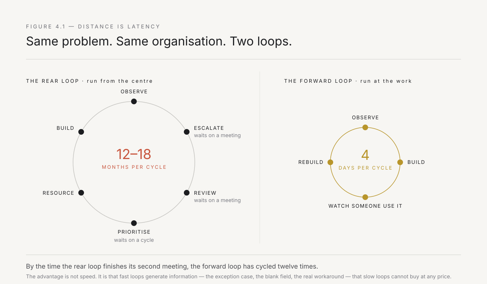
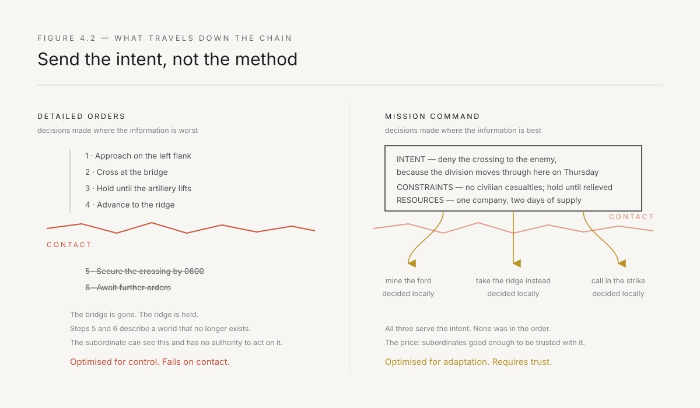
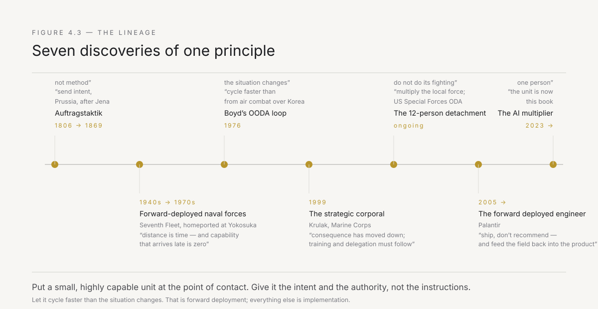

# 4. Borrowed from the battlefield

Forward deployment is not a synonym for being helpful on site. It is a specific doctrine about where decisions are made, developed over a hundred and fifty years by organisations that pay for latency in lives rather than in quarterly variance.

That is why the term is worth taking seriously rather than treating as a piece of borrowed swagger. Militaries arrived at this doctrine the hard way, reversed it repeatedly when it produced uncomfortable outcomes, and returned to it every time because the alternative kept losing. The doctrine has four parts, each discovered separately, and every one of them maps onto the problem in Part I with an exactness that should make you suspicious until you check it.

This chapter traces the lineage, then draws the line where the analogy stops. That second part matters. Metaphors that are never bounded become slogans, and the enterprise does not need another slogan.

---

## The literal meaning: distance is time

Start with the plainest version, because it is the origin of the phrase and it is purely physical.

A forward-deployed force is one stationed near where it will be needed rather than at home. The United States Navy has kept its Seventh Fleet homeported in Japan since the 1970s for exactly one reason: a ship at Yokosuka is days from a contingency in the Western Pacific, and a ship at San Diego is weeks. Nothing else about the two ships differs. Same hull, same crew, same capability. The forward one is worth several times more, and the multiplier is entirely a function of where it is parked.

This has an uncomfortable corollary that militaries accepted long before businesses did. **Capability that arrives late is not partial capability. It is zero.** A destroyer that shows up after the situation has resolved has not contributed eighty percent, or twenty percent. The event is over. The response is now a report.

Every enterprise has experienced this and filed it under something else. The analysis that arrives after the decision was made. The system that goes live the quarter after the market moved. The insight that was correct in March and delivered in September. These are recorded as delays. They are not delays. They are total losses, and they are the direct result of keeping the capability at headquarters where it was cheaper to garrison.

Forward deployment costs more. That is the honest part nobody says. Basing forces abroad is expensive, politically complicated, and logistically ugly. The reason it persists is that the alternative is a fleet with a perfect readiness score that has never been anywhere in time.

---

## The real meaning: shorten the decision loop

Distance is the surface of the idea. The substance is the decision cycle, and the person who made that explicit was an American fighter pilot with a talent for irritating his superiors.

John Boyd spent the 1950s flying and teaching air combat, and spent the following decades working out why the American F-86 had dominated the MiG-15 over Korea despite the MiG being, on paper, the better aircraft. It climbed better. It turned tighter. It should have won.

Boyd's conclusion was that combat is not a contest of position but of *transitions*. The F-86 had hydraulic controls and better visibility — it could move from one manoeuvre to the next faster, and it could see the situation sooner. Neither advantage shows up in a specification sheet. Both are advantages in the speed of the cycle: observe the situation, orient yourself within it, decide, act — and then observe again, because your action has changed the situation.

The OODA loop is now a business-book cliché, which has cost it most of its meaning. The part that survives the cliché is this: if you cycle faster than your opponent, they are perpetually responding to a world that no longer exists. You do not defeat them by being more correct. You defeat them by making their correctness irrelevant on arrival. Boyd's word for the effect was that the enemy's decisions become *disconnected* from reality.

Now apply that inside a company, and be precise about who the opponent is. The opponent is not a competitor. It is the rate at which the world changes relative to the rate at which the organisation can respond to it. The transformation program in Chapter 1 has a decision loop measured in quarters: observe a problem, escalate it, get it into a review, get it prioritised, get it resourced, get it built, get it deployed. Six steps, each of which waits on a meeting — and in an Indian group, often a meeting that requires someone to travel from a plant site to a head office, or that cannot be scheduled until the business head returns from a dealer visit. Twelve to eighteen months, at which point the observation is stale and the answer is being built for a situation that has moved.

A deployed operator has a loop measured in days. See the problem on Monday because you are sitting at the branch office in Indore, next to the person who does the work. Build a first version by Thursday. Watch someone use it on Friday. Discover the exception case you missed — the dealer whose credit terms were set directly by the promoter's office and do not follow the standard workflow — which invalidates a third of the design. Rebuild it over the weekend. By the time the traditional loop has finished its second meeting, the deployed loop has completed twelve cycles and is now working on a version of the problem the analysis phase would never have found — because it was invisible until you built the wrong thing and watched somebody use it.

That last point is the one people miss. The advantage is not speed for its own sake. It is that **fast loops generate information slow loops cannot obtain at any price.** The exception cases, the workaround everybody uses, the reason the field is always blank — none of it appears in requirements-gathering. It appears when a real person uses a real thing and it fails in a specific way. You cannot buy that information. You can only cycle for it.

*Figure 4.1 — Same problem, same organisation, two loops. The rear loop is not slower by a constant factor. It is slower by an amount that exceeds the useful life of its own information.*

---

## Mission command: send intent, not instructions

The doctrinal core comes from Prussia, and it was born from a humiliation.

In 1806 Napoleon destroyed the Prussian army at Jena and Auerstedt. The post-mortem, run by Scharnhorst and Gneisenau, reached a conclusion that ran against everything an aristocratic army wanted to hear: the French won partly because their subordinate commanders acted on their own initiative while Prussian officers waited for orders. The reform that followed was cultural before it was tactical. It required an army to trust its juniors.

Helmuth von Moltke the Elder turned it into doctrine as Chief of the Prussian General Staff. His guidance to commanders included the line that everyone now quotes badly: no plan of operations extends with any certainty beyond the first encounter with the enemy's main force. And the corollary that nobody quotes, which carries the actual doctrine: a favourable situation will never be exploited if the commander waits for orders.

The system built on that is *Auftragstaktik* — mission command. It is a rule about what travels down the chain and what does not.

**What travels down:** the intent — what outcome is to be achieved and, critically, *why*, so that a subordinate encountering an unforeseen situation can reason from purpose rather than pattern-match against instructions. Also the boundaries: resources available, constraints that must not be violated, and the point at which the subordinate must come back and ask.

**What does not travel down:** the method. How the objective is achieved is decided by the person standing in front of it, because they can see it and the commander cannot.

The genius of the arrangement is not that it is more humane or more empowering, though it is often sold that way now. It is that it puts the decision where the *information* is. Information about the actual situation is maximal at the point of contact and degrades with every layer of transmission — exactly the fidelity decay from Chapter 1, running in the opposite direction. Detailed orders move decisions to where the information is worst. Mission command moves decisions to where it is best.

*Figure 4.2 — Detailed orders optimise for control and fail on contact, because the situation they described no longer exists. Mission command optimises for adaptation and requires something more expensive than control: trust, and a subordinate competent enough to deserve it.*

There is a price, and it is worth naming because the enterprise version has the same price. Mission command requires subordinates good enough to be trusted with it. The Prussian and later German systems invested enormously in officer and NCO education for precisely this reason — the doctrine is worthless without the people. An organisation that adopts the language of empowerment without the investment in capability gets neither control nor adaptation. It gets confusion, and then it re-centralises, and then it concludes empowerment does not work.

Chapter 5 is about what that capability actually consists of, because the equivalent investment is the binding constraint on everything in this book.

---

## The strategic corporal: consequence has moved down

In January 1999, General Charles Krulak, then Commandant of the Marine Corps, published a short piece called "The Strategic Corporal." Its argument was that modern operations compress the levels of war. A Marine might, within a few city blocks on a single day, deliver humanitarian aid, separate two warring factions, and fight a mid-intensity engagement — Krulak's "three block war." And because of the media environment, the decision made by a twenty-year-old corporal in the third block could determine national policy by evening.

The strategic consequence had descended to the lowest tactical rank. The training and the delegation had to follow it down.

The enterprise equivalent is already true and almost entirely unacknowledged. The decisions that determine whether a company's AI investment produces anything are not being made in the boardroom — or in the promoter's cabin. They were made there in the sense that the money was approved. But the decisions that determine the *outcome* are made by a small number of people at the bottom: the engineer at the plant who decides whether to integrate into the system of record or build a side panel; the branch manager who decides whether to keep the old form open because the dealer is used to it; the accounts team lead who decides whether to trust the generated reconciliation or redo it manually because their job depends on the number being right.

Those are strategic decisions being made by people who have not been told they are strategic, are not trained for it, hold no delegated authority, and will not be asked. The organisation continues to place its planning effort where the rank is — in Mumbai, in the head office, in the quarterly review — and its outcome-determining decisions where the work is — in Nagpur, in Raipur, in the dealer's back office — and never reconciles the two.

Forward deployment is the reconciliation. It puts a person of genuine capability at the level where consequence has already migrated, and gives them the authority that migration should have carried with it.

---

## Force multiplication: the A-team is not there to fight

Here is the part of the military analogy that corrects the most common misreading of forward deployment, so it deserves the most care.

A US Special Forces Operational Detachment Alpha is twelve people. Its signature mission is not direct action. It is unconventional warfare and foreign internal defence — which in plain terms means that twelve people deploy into a place, live with a local force, and make that force capable of fighting for itself. The detachment is built for it: paired specialists in weapons, engineering, medicine, and communications, so that each can teach as well as do, and so the team can split.

The multiplier is not that twelve highly trained people fight like a hundred. It is that twelve people can raise, train, and enable a force of hundreds or thousands, which then fights on its own account after the twelve have gone.

Autumn 2001 is the demonstration everyone cites, and for once the citation is warranted. A small number of Special Forces detachments and intelligence officers — on the order of a few hundred people total — deployed into Afghanistan, linked up with existing Northern Alliance forces, and within weeks contributed to the collapse of a regime that a conventional invasion would have taken far longer and far more force to dislodge. The Americans did not constitute an army. They joined one that already existed, supplied the two things it lacked, and let it do the fighting.

Hold that structure against the enterprise, because it maps precisely.

The incumbent already has the army. An Indian industrial group has tens of thousands of people who know the domain better than any outsider ever will — who understand the customers, the products, the regulations, the dealer relationships, the exception cases, and the reasons the friction exists. The branch manager in Ludhiana has been serving the same hundred dealers for fifteen years. The plant engineer in Jamshedpur knows every quirk of the process line. Chapter 3's second observation was that these people already know the answer. That is a competent local force.

What they lack is not knowledge and not motivation. It is two specific things: the ability to convert what they know into a working system, and the authority to change the path the work runs on.

The deployed operator supplies exactly those two things, and nothing else. This is the correct reading of the whole model, and it kills the most common misinterpretation — that forward deployment means an elite team parachuting in to do the incumbent's work for them. That is not force multiplication. That is doing the fighting, and when you leave, the capability leaves with you, which is what happens at the end of every consulting engagement and why the next engagement is always necessary.

The test is what remains after the operator withdraws. If the workflow reverts, you were not multiplying anything. You were a temporary staff augmentation with better tooling.

---

## Delegated authority: one person, directing enormous assets

One more piece, and it is the one that explains why a very small unit can matter at all.

A Joint Terminal Attack Controller is a qualified individual who, from a forward position, directs the action of combat aircraft in close air support. One person, on the ground, holding delegated authority to call in assets worth orders of magnitude more than their own unit — and crucially, holding the authority to do it *without* referring back, because referring back would take longer than the situation allows.

The reason the arrangement works is not the radio. It is the qualification and the delegation. The JTAC has been certified to a standard that makes the delegation defensible, and the authority has been formally pushed down in advance rather than negotiated in the moment. Both halves are required. Authority without qualification is reckless; qualification without authority is a spectator with a good view.

This is the single most transferable idea in the chapter, and it is the one enterprises get wrong in both directions. They will happily give a junior person a laptop, a model, and a mandate to innovate — capability without authority, which produces prototypes. Or they will delegate authority to change a process to someone senior enough to be trusted with it and too senior to know what is actually happening — authority without proximity, which produces the target operating model diagram.

The pairing is the whole thing. Someone qualified enough to be trusted, standing close enough to see, holding authority granted in advance rather than requested in the moment.

---

## The software mutation

The term crossed into technology through Palantir, and it is worth being precise about what was actually novel, because the surface description sounds like consulting and the difference is the entire point.

Palantir's model, from the mid-2000s onward, sent engineers — not analysts, not account managers, engineers who write production code — into customer sites for extended periods. They worked against the customer's real data, on the customer's real problems, inside the customer's building. They built things that ran.

Three properties made it something other than consulting.

**They shipped, they did not recommend.** The output of a deployment was a working system in use, not a report describing one. The distinction seems small until you notice that it changes the feedback signal entirely. A recommendation is validated by whether the client agrees with it. A running system is validated by whether it survives contact with the work. Only one of those tells you the truth.

**The deployment fed the product.** What the forward engineers learned in the field was pulled back and generalised into the platform, so that the tenth deployment started from a much higher floor than the first. This is the mechanism that makes the model an increasing-returns business rather than a services business, and it is the part almost every imitator skips. Without the return path, forward deployment is just expensive consulting with better engineers.

**They were positioned at the wound, not at the buyer.** Traditional enterprise software sells to a senior sponsor and then hands off to an implementation partner who meets the actual users a year later. The forward model inverts it: the engineer is with the users from the start, and the senior relationship is downstream of things visibly working.

The model attracted a specific and reasonable criticism for years: it looked like a services business wearing a software valuation. Deployments were expensive, human-intensive, and did not obviously scale — every new customer seemed to need another team of expensive engineers. The critique was fair on the evidence available at the time. The answer, insofar as there is one, is that the deployment cost per customer falls as the platform absorbs what earlier deployments learned, so the model looks like services early and like software late.

Which sets up the question that Part II exists to answer, and that Chapter 6 answers directly. If forward deployment was economically marginal even for the company that invented it — viable only at very high contract values, for a small number of customers, with an unusually elite talent pool — then why would it now be the default model rather than a curiosity?

Because the cost of the unit collapsed. That is the whole argument, and it is the next chapter but one.

*Figure 4.3 — Four separate discoveries of the same principle, each made by an organisation that could not afford to be wrong about it, and one commercial mutation.*

---

## Where the analogy stops

I said this chapter would draw the line, and drawing it honestly is more useful than extending the metaphor further than it goes. Four places where the military framing will mislead you if you carry it into an enterprise unexamined.

**There is no chain of command.** The single most important enabler of military forward deployment is that the forward unit and the headquarters are part of the same hierarchy. Delegation is possible because someone has the standing to delegate. A deployed operator inside a client organisation — or inside a different division of their own group — usually has authority over nothing and nobody. Everything they change belongs to someone else. In an Indian group this is compounded by the informal hierarchy: the plant head who has been with the group since the founder's time carries an authority that no org chart describes, and a twenty-six-year-old operator from Bangalore carries none at all, regardless of their title. This is not a small gap in the analogy. It is the central difficulty of the entire model, and it is why Chapter 10 is about trust rather than about mandates. Authority in the enterprise is not delegated downward. It is accumulated laterally, by shipping things that work, in front of people who did not expect you to.

**There is no enemy.** Military doctrine is built around an opposing will. The enterprise has no opposing will, and importing one is the fastest way to fail. The friction is not an adversary; as Chapter 3 put it, the friction is memory. Every control step is a monument to a past disaster. An operator who arrives treating the organisation's immune system as an enemy to be defeated will lose, deservedly, because the immune system is usually protecting something real and has been doing so for longer than the operator has been there.

**The stakes are not comparable, and pretending otherwise is unserious.** Nobody dies if a credit workflow stays broken for another quarter. The urgency that makes military doctrine coherent is absent, which means the discipline it produces has to be manufactured artificially — through short cycles, hard kill dates, and self-imposed constraints. Borrow the structure. Do not borrow the drama.

**Speed is not automatically a virtue.** Boyd's fast loop wins when the environment is genuinely contested and information decays quickly. Some enterprise decisions are correctly slow, because they commit capital for thirty years and reversal is impossible. Chapter 3's two clocks were both right. An operator who treats every slow decision as an obstacle will burn the trust needed for the decisions that actually should be fast.

---

## The whole idea, in one line

Strip the history away and the doctrine reduces to a single sentence that has now been arrived at independently by the Prussian General Staff, a fighter pilot, a Marine commandant, an Army detachment structure, and a software company:

**Put a small, highly capable unit at the point of contact, give it the intent and the authority rather than the instructions, and let it cycle faster than the situation changes.**

That is forward deployment. Everything else is implementation.

The remaining question is what that unit looks like when the point of contact is a workflow rather than a battlefield, and the answer turns out to be smaller than anyone expected. Not a team. One person, and a machine.

---

*Next: the unit itself. What a deployed operator actually is, the four properties that define one, the three ways they get authority, and the four ways they fail.*
