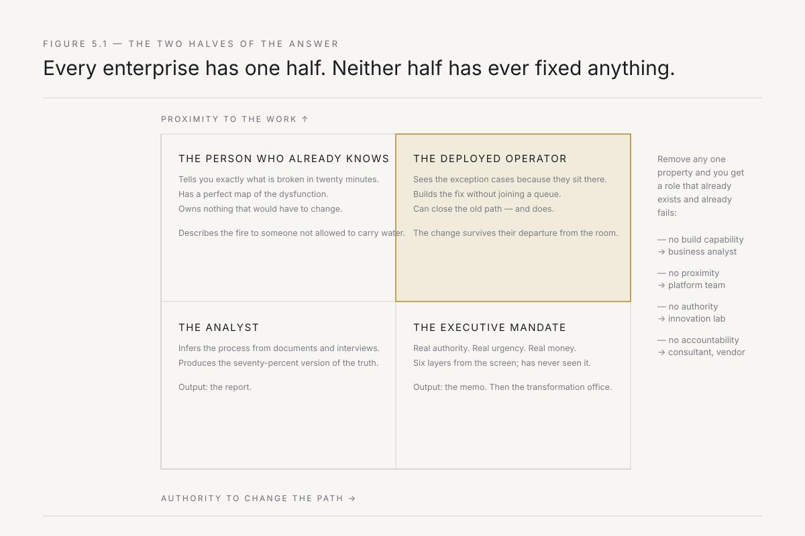
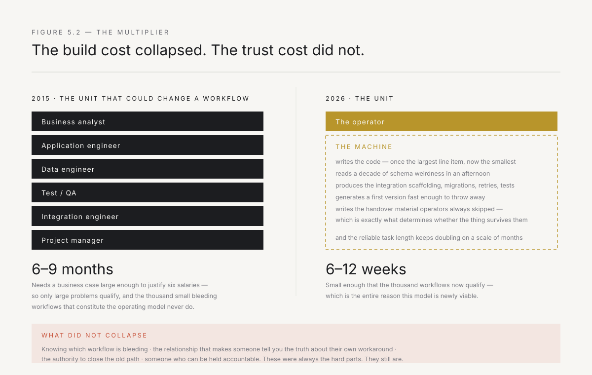
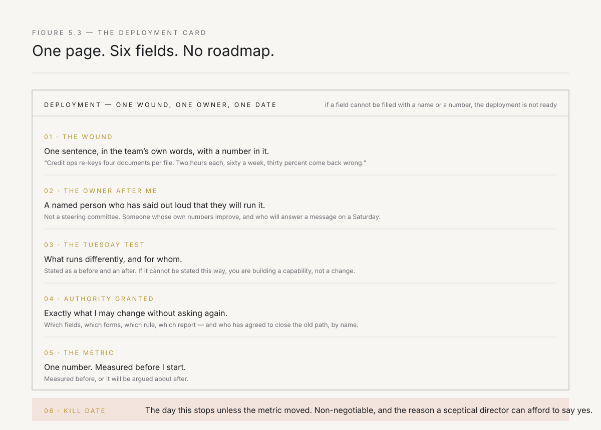

# 5. The deployed operator

The unit of change is one person, standing where the work happens, able to build the fix themselves, holding enough authority that when they alter what happens on Tuesday it stays altered — multiplied by a machine that supplies the team they used to need.

That is the definition. Every word in it is load-bearing, and the rest of this chapter is an argument for why removing any one of them collapses the model into something that already exists and already fails.

Note what the definition does not contain. It does not contain a methodology, a framework, or a team structure. It does not contain a sponsor, a steering committee, or a centre of excellence. It contains a person, a place, a capability, and a permission. The smallness is not modesty. It is the mechanism — a unit this size can be placed in a hundred rooms at once, and a hundred rooms is the actual requirement, because Chapter 2 established that the ten dollars of organisational capital has to be built workflow by workflow and cannot be centralised.

---

## The four properties

Four things define the unit. Each is individually unremarkable. The combination is rare enough that most organisations have never seen it, which is why they keep solving the wrong half of the problem.

**Proximity.** The operator is present where the work is done — not present at kickoff and at the steering review, but continuously, in the room and in the message threads, for long enough to learn the exception cases. In India, this often means being at a branch office or a plant site that the digital team in Bangalore has never visited. Proximity is not a soft virtue. It is an information-acquisition strategy, and it is the only one that returns the specific class of fact that determines whether a deployment works: the workaround everybody uses, the field that is always blank, the person whose approval is the real bottleneck, the dealer segment that breaks the rule, the WhatsApp group that has become the actual process because the system is too slow on the branch office's internet connection.

**Build capability.** The operator can convert an observation into a running system without asking anyone to build it for them. This is what separates the model from every consulting variant ever attempted, and the separation is not about skill snobbery — it is about loop length. An operator who must specify, queue, and wait has a decision cycle measured in weeks and has surrendered the one advantage the position confers.

**Authority to alter the workflow.** Not authority to recommend altering it. The change must survive the operator's departure from the room, which means it has to touch a system of record, a form, a rule, or a metric — something owned by somebody. Where this is absent, everything else produces a very good prototype.

**Accountability for the outcome.** The operator is measured on whether the workflow got better, not on whether a system was delivered. This inverts the incentive that governs every vendor and every internal project team, both of which are measured on delivery against a specification and are therefore rewarded for building precisely the wrong thing very well.

The interesting part is what happens when you have three of the four, because those failures all have familiar names.

Take away build capability and you have a business analyst — someone close to the work, accountable for it, allowed to change things, who has to describe what they want to a queue. This role exists in every large company. It is not useless; it is rate-limited to the speed of the queue, which is the speed we established is the actual constraint.

Take away proximity and you have a platform team — capable engineers with real authority, building for a workflow they have inferred from requirements documents. They will build something correct and unused, and will conclude the users were resistant.

Take away authority and you have an innovation lab. Close to the work, technically excellent, accountable for demos. Chapter 3's sixth observation covers what happens next.

Take away accountability for the outcome and you have a consultant, or a vendor, or an internal project delivered on time and on budget against a specification that turned out to describe the wrong problem.

*Figure 5.1 — The two failure modes of enterprise change are each exactly half the answer. The executive mandate has authority and no proximity. The person doing the work has proximity and no authority. Neither has ever fixed anything alone, and organisations keep alternating between them.*

---

## What the operator actually does

Abstraction is cheap here, so be concrete. A deployment has a rough shape, and the shape is remarkably consistent.

**Week one is not analysis. It is presence.** The operator sits with the team doing the work and watches. Not a workshop — workshops produce the sanitised version of the process, the one people believe they follow. Watching produces the real one. In India this is culturally loaded: the person doing the work will not tell you what is broken in a meeting, because meetings are for presenting the version that makes their manager look competent. They will tell you over chai, after two days, once they have decided you are not from the head office conducting a review. The single most valuable question in the first week is not "what's broken?" but *"show me what you did yesterday"*, because the answer contains the workarounds, and the workarounds are the map of where the system fails.

By the end of week one the operator should be able to state the wound in one sentence, with a number attached, in the words the team itself uses. Not "inefficiency in the order-to-cash process." Something like: *the credit team re-keys four documents into an assessment template, it takes them two hours per file, they do sixty a week, and thirty percent come back because a field was wrong.* If that sentence does not exist by Friday, the deployment has not started.

**Week two is the first shipped thing.** Not a plan, not an architecture, not a business case — something that runs and that someone uses. It will be small and partial and will cover the seventy percent of cases that are not exceptions. Its purpose is not to solve the problem. Its purpose is to generate the information that no amount of analysis will produce: which of your assumptions about the work were wrong.

They will be wrong. That is not a failure of preparation; it is the design. The fast loop from Chapter 4 buys information that slow loops cannot obtain at any price, and the price of admission is being visibly wrong early, in front of the people whose respect you need. This is uncomfortable and it is the job.

**Weeks three to eight are the exception cases and the path.** This is the ninety percent of the work that the demo did not contain — the identity rules, the eleven-value status field, the region that does it differently, the customer type that is exempt. Chapter 3's fourth observation, encountered personally. It is also where the authority question becomes real, because closing the old path requires someone to say the sentence out loud: *from the fifteenth, this is how we do it, and the old form is switched off.*

**Week twelve is the handover, and it was designed in week two.** The operator names the owner before the build begins, gets that person to say the words, and spends the deployment making the thing supportable by them rather than by the operator. A deployment that ends with the operator as the only person who understands the system has failed on its own terms, however well it works. It has produced a dependency, not a capability. That is the ODA test from Chapter 4: what remains when the twelve people leave.

---

## What the operator is not

Four adjacent roles exist, all of them respectable, none of them this. The distinctions are not territorial — each maps to a different failure I have watched.

**Not a consultant.** The consultant's product is a recommendation and their accountability ends at its acceptance. This produces a specific and predictable distortion: effort flows to whatever makes the recommendation persuasive, because persuasion is the terminal condition. The best consultants fight this and some of them win. The economics do not help them.

**Not a vendor.** The vendor arrives with a product and a commercial interest in that product being the answer. This is not dishonesty; it is the structure. A vendor cannot conclude that the correct fix is a hundred-line script and a change to who approves what, because that conclusion has no revenue attached. The operator can and frequently should, and in my experience the highest-value interventions look embarrassingly unlike products.

**Not an internal IT function.** IT takes requirements and delivers against them, and is measured on delivery, cost, and risk. This is correct for IT — you do not want the team running the systems of record improvising. But it means IT is structurally downstream of a specification written by someone else, and Chapter 2's whole argument is that the specification is where the value is lost.

**Not an innovation lab.** The lab is organised around exploration and is insulated from the operating business, which is exactly backwards. Insulation is what prevents transplant rejection in the short term and guarantees it in the long term, because nothing built in isolation ever gets into the path.

---

## Where authority comes from

This is the hardest part of the model and the one where the military analogy failed in Chapter 4. There is no chain of command. Nobody has to do what the operator says. Every system they want to change belongs to someone who did not ask for their help.

Authority arrives from three places and they are not equivalent.

**Delegated authority** comes from a sponsor who has real standing and says so publicly. It is the fastest to obtain and the least durable. Its half-life is the sponsor's tenure in that role, which in a large organisation is often shorter than a deployment. It is also brittle in a specific way: delegated authority produces compliance rather than cooperation, and compliance is sufficient to get a meeting and insufficient to learn what actually happens on Tuesday. Take it when offered. Never build on it alone.

**Earned authority** comes from having shipped something that visibly worked, in front of people who did not expect you to. It is slow to accumulate and extremely durable, and it is the only kind that converts into the thing you actually need, which is people telling you the truth. It compounds: the second deployment starts from a much better position than the first, which is the whole mechanism of Chapter 9. The first one is always the hardest and is always underpriced by everyone planning it.

**Structural authority** comes from owning something the organisation needs — a system in the path, a dataset everyone relies on, a report the leadership reads on Monday morning. It is the most powerful and the most dangerous. Powerful because it does not depend on anyone's goodwill; dangerous because accumulating it deliberately makes you a political actor, and political actors attract the immune response described in Chapter 12 in its most aggressive form.

The sequence that works, in my observation: take delegated authority to get in the door, spend it immediately on one small visible win, convert that into earned authority, and let structural authority accrue as a consequence of owning things that work rather than as an objective. Operators who pursue structural authority directly get read correctly as empire-building and are shut down by people who have seen it before.

One more thing about authority that is rarely said. The most reliable source of it is being the person who will still be there in six months. Incumbent organisations have absorbed an enormous number of transformation initiatives, and the people doing the work have learned, correctly, that these things pass. Their default posture toward a new arrival is polite waiting — *yeh bhi chal jaayega*, this too shall pass. An Indian enterprise has seen more consultants, more digital transformation leads, and more strategy decks than most. The branch manager who has survived eight reorganisations knows that the polite, engaged expression is the cheapest possible investment until the new initiative goes away. Nothing you say defeats that posture. Only staying does.

---

## The multiplier

Now the part that makes any of this newly viable, stated carefully, because this is where books like this usually start lying.

The four properties above are not new. A person with all four has always been able to change a workflow. The reason it did not happen at scale is that the build capability required a team. To take a real process from observation to production you needed, roughly: someone to work out the requirements, someone to write the application, someone to wrangle the data, someone to test it, and someone to handle the integration. Five to seven people, six to nine months, and a business case large enough to justify them. Which meant only large problems qualified, which meant the thousand small bleeding workflows — the ones that in aggregate constitute the operating model — never qualified for anyone's attention.

What has changed is that a competent operator with current AI tooling now performs most of that team's function themselves. Not all of it, and the boundary matters enormously, but enough that the economics invert.

**What the machine genuinely absorbs.** Writing the code, which was the largest single line item and is now the smallest. Reading and making sense of an unfamiliar schema with a decade of accumulated weirdness — a task that used to eat weeks and now takes an afternoon. Producing the tedious integration scaffolding, the migration scripts, the test cases, the retry logic, the error handling. Generating a first version fast enough to be thrown away, which is what makes the fast loop affordable. Writing the documentation and the handover material that operators historically skipped and which is exactly what determines whether the thing survives them.

The trend line matters more than the current level. Independent measurement of how long a task an AI system can complete reliably has shown that length roughly doubling on a scale of months rather than years. Whatever the precise figure, the direction has held for long enough that planning against a static capability is the mistake, not planning against an improving one.

**What it does not absorb, and will not soon.** Knowing which workflow is bleeding — that requires sitting in the room and reading a face when someone says the process is fine. Deciding what not to build, which is most of the judgment in the job. Holding the relationship that makes someone tell you the truth about their own workaround. Carrying accountability, because accountability requires somebody who can be held to it. And the authority to close the old path, which is a social act and always will be.

Which produces the honest form of the claim: **AI collapsed the build cost of the unit; it did not touch the trust cost or the authority cost.** The build was the part that made the unit unaffordable. The trust and the authority were always the hard parts and remain so. That is why this book has three chapters on trust, antibodies, and rewiring, and one on the technology.

*Figure 5.2 — What collapsed and what did not. The dark bars were the reason the model could not scale. The light bars are the reason it still requires a person.*

---

## Who can do this

The selection problem is the binding constraint on everything in this book, so treat it seriously.

The operator needs two capabilities that are almost never found together, and the reason they are not is not mysterious — they are trained in different buildings by different people who mildly disdain each other.

The first is genuine build capability. Not literacy, not the ability to direct a technical team, not a computer science degree from a while back. The ability to sit down and make something run against real production data with real edge cases, and to know when the machine's output is wrong. AI raises the floor on this substantially, which widens the pool — but it also raises the cost of not being able to evaluate output, because an operator who cannot tell good code from confident code will ship something that fails in front of the people whose trust they were there to earn.

The second is the ability to read a room. To tell the difference between an objection and a veto. To notice that the person who has said nothing in three meetings is the one whose cooperation determines the outcome. To hear "we should align this with the broader roadmap" and correctly parse whether it means *help me not duplicate work* or *I am killing this politely*. To take being wrong in public without becoming defensive, because being wrong in public early is the method.

Most engineers have the first and find the second beneath them or invisible. Most consultants and product managers have the second and have outsourced the first. The intersection is rare, and it is rare for a structural reason: nothing in a normal career path rewards holding both, so people specialise out of it by their early thirties.

Where they come from, in my experience: engineers who spent time in a customer-facing or operations-facing role and did not hate it; founders of small companies that did not work, who had to do everything and learned what production means; people who were technical, moved into product or operations, and kept their hands in. In India specifically: IIT or NIT graduates who went into an operating role at a Tata or a Mahindra rather than into a product company, and kept coding; startup founders from the tier-two SaaS wave who built for Indian enterprise customers and learned that the last mile is the whole problem; engineers from the services firms who got tired of building to someone else's specification and wanted to own the outcome. What they have in common is not a background. It is that all of them have shipped something and then had to watch a real person use it — in a branch office, on a mobile phone, over a 4G connection that drops — which is an experience that permanently changes what you think the job is.

How to test for it, without a long interview process: give a candidate a genuinely messy real problem, three days, and access to the actual data. Then look at two things. What did they build, and — more diagnostic — *what did they ask?* The operators ask about the exception cases and about who owns the field. The non-operators ask for a clearer specification.

---

## The four ways operators fail

I want these enumerated, because every one of them is a way of failing while doing excellent work, which is the only kind of failure worth warning anyone about.

**They build the platform.** Two deployments in, the operator sees the common pattern and proposes to build the reusable version. This is technically correct and organisationally fatal, and it is exactly the GE mistake from Chapter 1 executed at small scale. The platform has no user, takes two quarters, and by the time it exists the trust that funded it has expired. Generalise only what three deployments have independently demanded, and never before revenue.

**They solve the interesting problem.** The bleeding workflow is usually boring — a re-keying task, a reconciliation, a status chase. Sitting next to it is a genuinely fascinating problem that would be a pleasure to work on and that nobody is losing money over. The pull toward it is strong, and it is the single most common way capable people waste a deployment.

**They go native.** After six months inside the host organisation, the operator has absorbed its constraints, learned which fights are unwinnable, and started explaining why things cannot change — using the same sentences they arrived to disprove. This is not weakness. It is what proximity does to anyone, and the mitigation is structural rather than personal: fixed deployment lengths, and a peer outside the host who is allowed to ask why you are now defending a process you called broken in week one.

**They become the system.** The deployment works so well that the operator becomes the only person who can run it. Every question routes to them. They are indispensable, which feels like success and is the precise opposite of the ODA test. The signal to watch for is pleasant and misleading: you are busy, valued, and constantly needed. If the workflow would break when you leave, you have not deployed anything. You have inserted yourself.

---

## The one metric, and the card

Everything in this chapter reduces to one measurement, and it is the same one from Chapter 1 because the book has a spine.

**Name the workflow that runs differently on Tuesday, and name the person doing it.**

Not systems delivered. Not licences activated. Not hours saved in a model. A named process, performed by a named person, that runs differently than it did, and that would keep running differently if the operator disappeared tomorrow.

Which gives the closing artifact of Part II — the only document a deployment needs. It fits on one page and every field on it is a commitment someone has to make out loud.

*Figure 5.3 — One page, six fields, no roadmap. If any field cannot be filled in with a specific name or number before the work starts, the deployment is not ready — and the missing field tells you exactly what to go and get.*

The kill date is the field people want to remove and the one that does the most work. A deployment with a date on which it will be shut down unless the metric moved is a deployment that cannot become a permanent programme, cannot accumulate a constituency, and cannot quietly convert into the thing described in Chapter 1. It also does something subtler: it makes the host organisation's cooperation cheap. Agreeing to a twelve-week experiment with a defined end costs a sceptical director very little. Agreeing to a transformation costs them their autonomy, and they know it.

Start with what is cheap to say yes to. That is not a compromise on ambition. It is how the first deployment gets to exist at all, and the first one is the only one that has to be won without evidence.

---

*Next: why the unit economics inverted. One operator and a machine now do what a team did in a year — which explains both why this model is newly viable and why the incumbents of consulting, whose entire business is the pyramid of people the machine just absorbed, cannot follow.*
