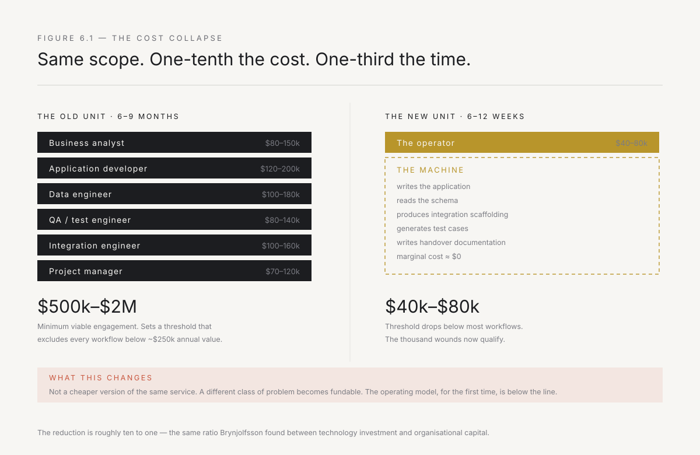
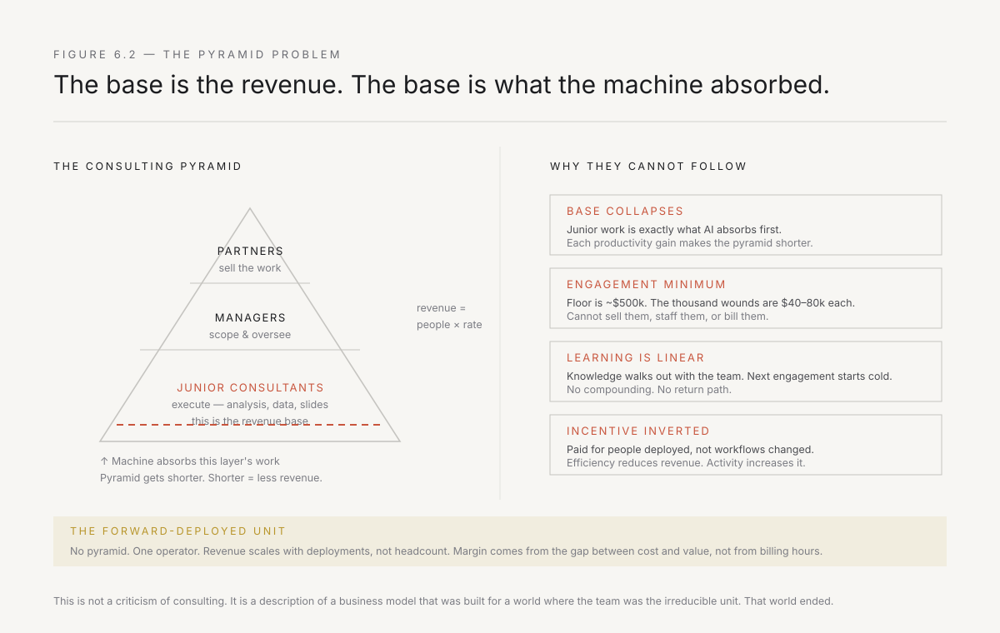
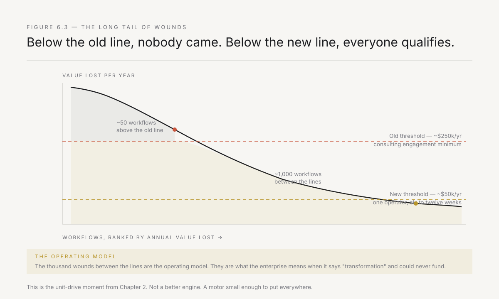

# 6. The cost collapse

The model described in the last two chapters is not new. The economics are.

A person with proximity, build capability, authority, and accountability has always been able to change a workflow. The reason it stayed a curiosity rather than becoming a method is that the unit was too expensive to deploy at scale. The build capability required a team. The team required a business case. The business case required a problem large enough to justify six salaries for nine months, which meant only large problems qualified — and the operating model is not made of large problems. It is made of a thousand small ones, bleeding in parallel, each individually too minor to fund, collectively constituting the entire gap.

That arithmetic changed. This chapter is about what exactly changed, what it costs now versus what it cost before, and why the incumbents of consulting — whose entire business model is the team the machine just absorbed — cannot follow the unit down the cost curve.

---

## The old arithmetic

Be specific about what it cost, because specificity is what makes the inversion legible.

To take a real workflow from observation to production inside a large enterprise — not a demo, not a prototype, but something that runs against live data, handles the exception cases, integrates into the system of record, and has a named owner — you needed, roughly, this:

A business analyst to understand the process and translate it into requirements. An application developer to build the system. A data engineer to wrangle the schema, the extracts, the mappings between the four systems that do not talk to each other. A QA engineer to test against the exception cases — the eleven-value status field, the customer type that is exempt, the region that does it differently. An integration engineer to connect the new thing to the system of record. And a project manager to coordinate them, because six people working on one thing without coordination produce six things.

Five to seven people, fully loaded, for six to nine months. In the US or Europe, that is somewhere between half a million and two million dollars. In India — where the IT services firms have made this arithmetic their entire business — the sticker price is lower but the real cost is not as different as it looks: a team from a TCS or an Infosys might bill at a lower rate, but the timeline is the same or longer, the coordination overhead is the same, and the client's own time — the business team pulled into requirements workshops, the plant head dragged into steering reviews — is priced at Indian executive salaries, not IT services rates. A realistic all-in cost for a meaningful workflow change in an Indian enterprise is one to four crore rupees. Before the change management, before the security review, before the second iteration when half the assumptions turn out to be wrong.

That cost structure creates a threshold. Any workflow improvement below that threshold does not happen. It does not get proposed, it does not get estimated, it does not enter a backlog. It is invisible to the allocation system, because allocation systems are designed to weigh things that cost more than the minimum viable unit.

The threshold was somewhere around two crore rupees of expected annual value — roughly a quarter of a million dollars. Below that, the business case could not be written. And how many workflow problems in a large Indian enterprise produce two crore rupees of annual value? A few dozen. Maybe fifty.

How many produce fifty lakh? A thousand. Maybe two thousand. The dealer reconciliation that takes three people two days a month. The branch-level credit check that is done manually because the two systems do not talk. The plant maintenance report that is compiled in Excel because the ERP module was never configured for the Indian regulatory format. The entire operating model is made of them, and the entire operating model has been below the funding threshold for the entire history of enterprise technology.

---

## What the machine absorbed

State the change precisely, because this is where books like this start over-claiming, and over-claiming here costs the rest of the argument its credibility.

A competent operator with current AI tooling now performs the function of the five-to-seven person team described above. Not metaphorically. Specifically:

**The code.** Writing the application was the largest single line item on a traditional project — the developer, the six months, the sprints, the reviews, the rework after the business analyst's requirements turned out to be wrong. A competent operator with an AI coding assistant now produces that output in days rather than months. Not because the code is simpler. Because the machine writes it, the operator reviews and corrects it, and the cycle from intent to running system has collapsed from weeks to hours.

**The data engineering.** Understanding an unfamiliar enterprise schema — a decade of accumulated tables, renamed columns, deprecated fields that are still populated, joins that make sense only if you know that a migration in 2017 split one table into three — used to consume weeks of a specialist's time. The machine reads the schema, infers the relationships, asks clarifying questions, and produces a working data layer in an afternoon. Not perfectly. Well enough to start, which is the requirement, because starting produces the information that perfects it.

**The integration scaffolding.** The migration scripts, the API connectors, the retry logic, the error handling, the logging — the engineering that is necessary and undifferentiated and used to consume a third of the project. The machine produces it reliably and the operator validates it against the specific system's behaviour.

**The test cases.** Especially the tedious kind — the permutations of the eleven-value status field, the boundary conditions around the date format that three systems represent differently. The machine generates them exhaustively from the spec. The operator adds the ones that come from sitting in the room and learning that nobody actually uses status value seven.

**The documentation and handover material.** This is the one almost nobody talks about, and it may be the most consequential. Operators historically skipped documentation because the time cost was not worth it. The machine writes it as a by-product of the build. Which matters, because documentation is exactly what determines whether the deployment survives the operator's departure — and an operator who cannot leave has failed on their own terms.

The trend line matters. Independent measurement of reliable task length for AI systems has shown that length roughly doubling on a scale of months. Today's boundary — the point at which a human must intervene to keep the output correct — is substantially further than it was a year ago, and will be substantially further a year from now. Planning against a static capability is the mistake.

*Figure 6.1 — The same scope of work, priced two ways. The team on the left made the model unaffordable below a threshold that excluded most workflows. The unit on the right moved the threshold below most workflows.*

---

## The new arithmetic

One operator. Current AI tooling, which has a marginal cost approaching zero for the volume of code and analysis a single deployment generates. Six to twelve weeks rather than six to nine months.

Fully loaded, the deployment costs somewhere between forty and eighty thousand dollars — and in India, where the operator's cost is lower but the proximity requirement means they must travel to plants and branch offices across the country, the number lands at roughly thirty to fifty lakh rupees all-in. Call it forty lakh as a round number. That is a reduction of roughly ten to one from the old model, which — notice — is the same ratio Brynjolfsson found between technology investment and organisational capital in Chapter 2. The parallel is not a coincidence. The operator is the mechanism that builds the ten dollars, and the cost of deploying the operator has just dropped by the same order of magnitude.

At forty lakh, the threshold drops. A workflow producing fifty lakh of annual value — one that was invisible to the old allocation system — now has a payback period of less than a year. It enters the backlog. It gets proposed. It gets built.

But that is not the real change. The real change is what happens to the number of workflows that qualify.

Above the old threshold — two crore in annual value — there were a few dozen per enterprise. Below it, there are a thousand. The operating model is made of them. The transformation that was structurally unfundable is now structurally viable, not because the problems changed, but because the cost of fixing them crossed below the value they bleed.

This is the unit-drive moment from Chapter 2, arrived via a different route. The electric motor did not produce a productivity revolution by being a better steam engine. It produced one by being small enough and cheap enough to put everywhere, which changed the architecture. The AI-augmented operator does not produce a transformation by being a better consulting team. It produces one by being cheap enough to deploy at the thousand wounds that consulting could never reach.

This is stated here as economics — a threshold, a cost curve, a count of newly qualifying workflows. Chapter 14 makes it concrete: a real, evidenced build showing exactly what that cheapness looks like at the keyboard, and a compression factor with a citation behind it rather than an assertion.

---

## Why consulting cannot follow

This is not a polemic against consulting. It is a structural observation about a business model, and the structure is why the transition will not be led by the incumbents best positioned to lead it.

The large consulting and IT services firm's business model is a pyramid. A small number of partners sell work. A larger number of managers scope and oversee it. A much larger number of junior consultants and engineers execute it. The pyramid is the product. Revenue is a function of the number of people deployed multiplied by their billing rate. Growth means hiring. Margin comes from the spread between what a junior resource is billed at and what they cost.

India is where this model exists in its purest and largest form. TCS, Infosys, Wipro, and HCL together employ over a million and a half people. Their entire business is the pyramid — hire engineers from Indian colleges, train them on a technology stack, deploy them on a client project, bill the spread. It is one of the most successful business models in the history of Indian enterprise, it built Bangalore and Hyderabad and Pune into technology cities, and it is the model that the forward-deployed unit attacks at every face.

Every part of the forward-deployed model attacks a different face of the pyramid.

**The base collapses.** The work that junior engineers and analysts do — the coding, the testing, the data wrangling, the first-draft modelling, the slide production — is precisely the work the machine now does. Not because the juniors are bad at it. Because it is the structured, definable, pattern-recognisable work that AI absorbs first. The large firms know this — TCS has Ignio, Infosys has its own AI platform, every services company is buying AI tooling for its own people. But each tool that makes a junior engineer more productive makes the pyramid shorter, and a shorter pyramid is a smaller revenue base. When your business model is billing fifty thousand engineers at a margin, a tool that lets ten thousand do the work of fifty thousand is not an efficiency gain. It is an existential threat to three-quarters of your revenue.

**The unit shrinks below the engagement minimum.** Services firms have a minimum viable engagement — a size below which the business development cost, the staffing overhead, the partner time, and the margin expectation cannot be met. At a global consulting firm that floor is typically half a million dollars; at an Indian IT services firm it is lower but still substantial — two to three crore rupees, below which the onboarding cost and the account management overhead eat the margin. The forward-deployed unit costs a fraction of that. The thousand workflows that now qualify are individually below the engagement minimum. A services firm cannot sell them, cannot staff them, and cannot bill them. It is not that they choose not to. The economics do not permit it.

**The feedback loop inverts.** A consulting engagement ends with a deliverable. The knowledge the team accumulated — about the client's workarounds, exception cases, and political map — walks out the door with them. The next engagement starts from scratch. A forward-deployed firm that runs a hundred deployments and pulls the pattern back into its tooling starts the hundred-and-first from a vastly higher floor. The consulting model is linear in learning. The forward-deployed model is compounding.

**The incentive is wrong.** The consulting firm is paid for people deployed. The forward-deployed firm is paid for workflows changed. These incentives produce opposite behaviours. The consulting firm's rational response to a problem solvable by one person in six weeks is to staff it with three people for four months, because that is where the revenue is. The forward-deployed firm's rational response is to solve it as cheaply as possible, because the margin comes from the gap between the operator's cost and the value delivered, not from the hours billed.

This is not corruption. It is structure. The people inside TCS, Infosys, McKinsey, and Deloitte are as talented and as well-intentioned as people anywhere. The economics they operate within are designed for a world where build cost was the dominant expense and the team was the irreducible unit. That world ended. India's IT services industry — three decades old, four hundred billion dollars in revenue, the country's single largest source of white-collar employment — is built on the premise that you need a pyramid of people to build software. The machine just absorbed the pyramid.

*Figure 6.2 — The consulting pyramid funds itself from the base. When the base layer's work is absorbed by the machine, the pyramid does not get more efficient. It gets shorter, and shorter means smaller.*

---

## The long tail of wounds

Now state the strategic consequence, because it is the reason this chapter exists and it is the bridge to Part III.

A large Indian industrial group — forty thousand employees, a hundred business units, plants across six states, a dealer network in three hundred towns, a thousand distinct workflows — has been carrying its operating model essentially unchanged through three decades of technology revolutions. Not because it chose to. Because the cost of changing a workflow was higher than the value most workflows bleed.

That constraint has lifted. For the first time, a unit exists that is cheap enough to deploy at the level where the work actually happens — at Priya's credit team in the Mumbai office, at the logistics desk in Vizag that reconciles shipping documents against invoices, at the branch office in Coimbatore where a dealer's order is re-entered into a second system because the first system cannot talk to the one that checks credit, at the plant in Jharsuguda where the maintenance log is kept in a notebook because the ERP module was never configured for that equipment type.

The thesis of this book, stated in economic terms: **the forward-deployed model is the first that operates below the cost threshold the enterprise's own allocation system created.** It reaches the problems that have never qualified for anyone's attention, which are precisely the problems that constitute the operating model, which are precisely the problems whose sum is what the enterprise calls transformation.

The number matters. Not one deployment. A hundred. Not one workflow fixed. A hundred workflows fixed, each small, each specific, each owned by a named person whose Tuesday changed. The compounding is in the number. And the number is newly affordable.

*Figure 6.3 — The enterprise's workflows, ranked by annual value lost. Above the old line, consulting could reach them. Below it, nobody could. The new line sits below most of them, which is not an incremental improvement. It is a change in what the word "transformation" means.*

---

## The honest version of the claim

I want to close with the boundaries, because the honest version is more useful than the excited one.

The cost collapse is real. The ten-to-one reduction in deployment cost is observable, repeatable, and not dependent on a frontier model that exists only in a lab. It is available today, to an operator with current commercial tooling, against a real enterprise workflow.

What has not collapsed:

**The trust cost.** Getting into the room, earning the right to hear the truth, building the relationship that makes someone tell you about the workaround they are embarrassed by — all of this takes the same time and the same skill it always did. The machine does not help. If anything, the speed of the build makes the trust phase feel disproportionately slow, which tempts operators into skipping it, which is the fastest way to build something correct and unused.

**The authority cost.** Closing the old path, getting someone to say the sentence, changing the metric someone is graded on — this is organisational and political and it takes exactly as long as it ever did. A faster build does not make a faster decision about who owns the new process.

**The selection cost.** Finding people who can do this — who hold both build capability and the ability to read a room — is not easier because the build tools improved. If anything, it is harder, because the tools create a plausible imitation of capability in people who cannot evaluate their own output. The hiring problem is the binding constraint, and Chapter 11 is entirely about it.

So the collapse is in the build. The build was what made the unit unaffordable. The trust and the authority were always the hard parts and remain so. The model is newly viable not because the hard parts got easier, but because the expensive part got cheap. That is enough.

It is enough because the expensive part was the one that determined whether the thousand workflows qualified for anyone's attention. They do now. What happens next is the subject of Part III.

---

*Next: how the forward-deployed firm is different from every adjacent model — and why the difference is the whole point. Chapter 7 closes Part II.*
