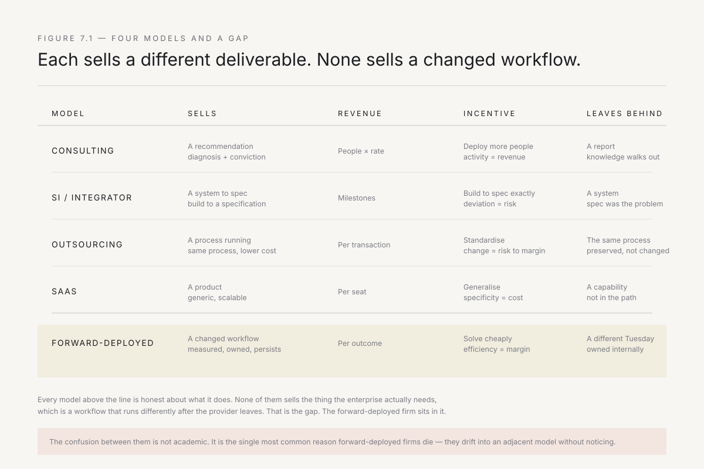
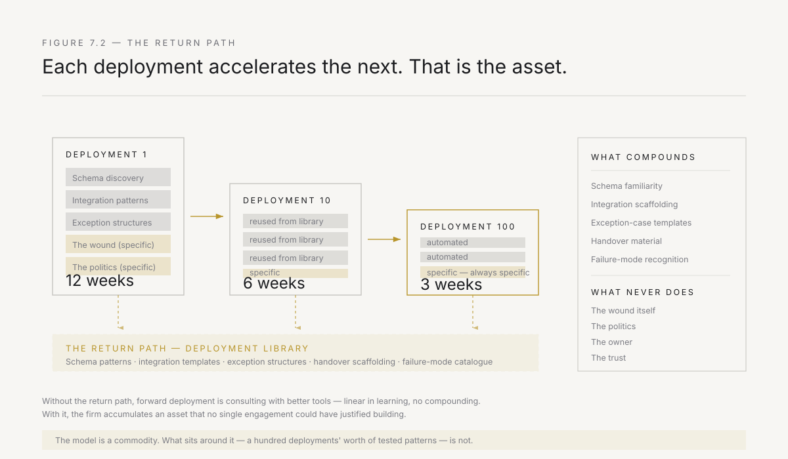
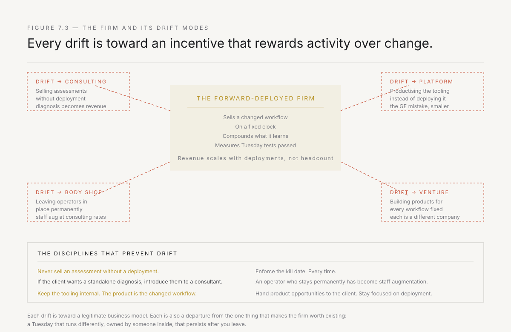

# 7. The forward-deployed firm

There are four things you can sell a large company when its operating model is broken. The forward-deployed firm is the fifth, and the reason it is different is the reason it works.

This chapter closes Part II by drawing the line between the model described in chapters 4 through 6 and everything adjacent to it. The distinction matters because every adjacent model has been tried, each has a respectable track record at the thing it actually does, and none of them solves the problem this book is about. The confusion between them is not academic — it is the single most common reason forward-deployed firms die, because they slide into an adjacent model without noticing, and by the time they notice, their economics have followed.

---

## The four adjacent models

State them cleanly, because each has an honest claim to a piece of the territory.

**Management consulting.** The firm sends smart people to diagnose a problem and recommend a course of action. The product is the recommendation. Revenue is billed by the person, by the hour or the week. The firm's incentive is to deploy as many people as the client will absorb. The engagement ends when the deliverable is accepted, not when anything changes. This model excels at diagnosis and at lending the client someone else's conviction — the outside perspective that makes an internal decision defensible. It does not excel at implementation, because implementation is not what it sells. Its practitioners are selected and trained for persuasion, not production.

**Systems integration.** The firm takes a specification — sometimes one it wrote during a consulting engagement — and builds the system described by it. In India, this is the bread and butter of the IT services industry: TCS, Infosys, Wipro, HCL, and Tech Mahindra collectively run thousands of such engagements, building ERP implementations, custom applications, and integration layers to specification. The product is a working system that matches the specification. Revenue is tied to delivery milestones. The firm's incentive is to build exactly what was specified, because deviations create risk and rework. This model excels at large, well-defined builds where the specification is trustworthy. It does not excel at the problem in this book, because the problem in this book is that the specification is where the value is lost — the specification was written by someone at the head office who has never seen the branch manager's screen.

**Outsourcing.** The firm takes over the execution of a process and runs it, typically at lower cost. India built the global BPO industry on this model — from Genpact's origin as a GE captive to the process outsourcing arms of every major IT services firm. The product is the process running. Revenue is per transaction or per FTE equivalent. The firm's incentive is to standardise, because standardisation is where the margin is. This model excels at high-volume, well-understood, stable processes. It does not solve the problem in this book because it preserves the process rather than changing it. An outsourcer who proposes to redesign the workflow they were hired to run is proposing to reduce their own revenue — to eliminate the very FTEs whose billing justifies the engagement — and the economics will not permit it.

**Software as a service.** The firm builds a product and sells access to it. The product is the software. Revenue is per seat or per usage. The firm's incentive is to generalise — to build for the broadest possible market, because each additional customer costs almost nothing to serve. India's SaaS wave — Zoho, Freshworks, Darwinbox, Leadsquared — has produced excellent products for the generic layers: CRM, HR, helpdesk. This model excels at problems that are common across enterprises. It does not solve the problem in this book because the problem in this book is specific. The credit team's workflow at a steel distributor is not the logistics desk's workflow at an auto manufacturer. The eleven-value status field is not anyone else's eleven-value status field. The GST filing process that requires a manual reconciliation because the ERP was customised in 2018 is nobody else's problem. SaaS solves the generic part, and the generic part was never the constraint.

Each model is honest about what it does, or should be. The confusion arises because the problem described in Part I touches all four and is solved by none.

*Figure 7.1 — Each model optimises for a different deliverable. The gap in the centre is what the enterprise actually needs: a changed workflow, owned by someone inside, that persists after the provider leaves.*

---

## What the forward-deployed firm actually sells

Not diagnosis. Not a system. Not a process. Not a product.

**A changed workflow, measured before and after, with a named internal owner, on a fixed clock.**

Read that sentence against the deployment card from Chapter 5, because it is the same object stated as a commercial proposition. Every field on the card maps to a term in the engagement:

The wound is the scope. The owner after me is the success criterion. The Tuesday test is the acceptance test. The authority granted is the precondition. The metric is what gets measured. The kill date is the engagement length.

Nothing else. No roadmap. No phase two unless phase one changed a number. No ongoing retainer unless the next wound is identified and the next card is filled in. The engagement is the card, and the card is one page.

This produces a specific and uncomfortable discipline. The firm cannot hide inside a long programme. It cannot bill for diagnosis that leads to more diagnosis. It cannot succeed on delivery if delivery did not produce a measured change. And it cannot avoid the hardest question in enterprise work — *what runs differently?* — because that question is the contract.

---

## The five structural differences

Walk through them, because each is a choice that the adjacent models cannot make without ceasing to be themselves.

**1. The operator ships, they do not recommend.**

The output of a deployment is not a report, a specification, or a set of requirements. It is a running system in use, integrated into the system of record, with the old path closed. This is the Palantir mutation from Chapter 4, and it is the single property that makes everything else possible. When the deliverable is a working change, the feedback signal is real — the operator knows within days whether the design was right, and the knowing is specific enough to act on. When the deliverable is a recommendation, the feedback signal is agreement, and agreement tells you nothing about whether the workflow changed.

The cost of this property: the operator must be good enough to build it themselves. The hiring constraint is real and is the binding limit on scale. Chapter 11 is entirely about it.

**2. The engagement is priced on the outcome, not the input.**

A consulting firm charges for people deployed. A systems integrator charges for milestones delivered. The forward-deployed firm charges for value changed — a fixed fee for a defined outcome, with a kill date after which the engagement stops unless the metric moved.

This inverts the incentive that governs every adjacent model. A consultant who solves a problem with a hundred-line script and a changed approval rule has eliminated their own revenue. A forward-deployed operator who does the same thing has produced maximum margin, because the cost of the deployment was low and the value was real. The economics reward efficiency rather than activity.

The risk is also inverted. In a consulting engagement, the client bears the outcome risk — they paid for the people and the recommendation, and if the recommendation does not produce results, that is an implementation problem. In a forward-deployed engagement, the firm bears the outcome risk. If the workflow does not change, the engagement failed on its own terms, regardless of what was built.

**3. The deployment has a fixed length and a kill date.**

No forward-deployed engagement should exceed twelve weeks for an initial deployment. This is not a scheduling preference. It is a structural requirement, and the reasons compound.

A fixed length prevents scope expansion. The most reliable way to convert a focused deployment into a failed programme is to let it grow — one more workflow, one more integration, one more stakeholder group. The kill date is the forcing function that keeps the scope at one wound.

A fixed length makes the host organisation's agreement cheap. As Chapter 5 put it, a twelve-week experiment with a defined end costs a sceptical director very little. A transformation costs them their autonomy. Start with what is cheap to say yes to.

A fixed length prevents the operator from going native. Chapter 5's third failure mode — absorbing the host organisation's constraints and starting to defend the status quo — is a function of time. Twelve weeks is short enough to retain the outsider's perspective and long enough to build something real. Beyond that, diminishing returns set in fast.

**4. The return path feeds the next deployment.**

This is the property that makes the model a business rather than a practice, and it is the one almost every imitator skips.

What the operator learns in the field — the common schema patterns, the recurring exception-case structures, the integration scaffolding that works, the failure modes that repeat — is pulled back and generalised into the firm's tooling. Not as a product that is sold to the client. As acceleration that makes the next deployment start from a higher floor.

The first deployment takes twelve weeks. The tenth deployment, against a structurally similar workflow in a different company, takes six. The hundredth takes three, because ninety percent of the scaffolding has been seen before and the operator's time is spent entirely on the twenty percent that is specific — the wound, the politics, the owner, the path.

This is the mechanism that converts a services business into an increasing-returns business. Without it, forward deployment is consulting with better tools — each engagement starts from scratch, the margin is linear, and the firm's value does not compound. With it, the firm accumulates an asset that no individual engagement could have justified building: a library of deployment patterns, tested against real enterprises, that gives the hundred-and-first operator a six-week head start.

The return path also explains why the firm's AI tooling is structurally better than the client's, even though the underlying models are the same. The client has a general-purpose model and general-purpose prompts. The firm has the same model, tuned against a hundred prior deployments' worth of schema patterns, exception structures, and integration templates. The model is a commodity. What sits around it is not.

*Figure 7.2 — Each deployment is a single engagement. The learning that returns from it accelerates every deployment after. This is the mechanism that converts a services shape into a compounding shape.*

**5. The firm's growth metric is workflows changed, not people deployed.**

A consulting firm measures utilisation — the percentage of its billable staff that is on a client engagement at any given time. The growth loop is: sell more, hire more, deploy more, bill more. Revenue scales with headcount.

The forward-deployed firm measures workflows changed. The growth loop is: deploy, learn, accelerate, deploy again. Revenue scales with deployments, and deployments per operator increase as the return path compounds. This means the firm can grow revenue faster than it grows headcount, which is the defining property of a technology business and the property that makes the economics work.

It also means the firm's most important internal metric is not how many operators it has, but how many deployments each operator can run per year. That number is small today — four to six, depending on complexity — and it will grow as the tooling improves and the return path deepens. When it doubles, the firm's capacity doubles without a hire.

---

## The failure modes of the firm

State them, because the firm is as susceptible to structural drift as any of its clients, and the drift is always toward one of the four adjacent models.

**Drifting into consulting.** This happens when the firm starts selling diagnosis without a commitment to ship. A client says: *before we deploy, can you do an assessment?* The assessment is a real need and a real skill. It is also a consulting engagement, and it is the door through which the incentive structure changes. Once the firm is billing for assessments, assessments become a revenue stream, and revenue streams develop constituencies. Within a year the firm has a consulting practice that competes with the deployment practice for the same operators' time, and the deployment practice — which is harder, riskier, and more accountable — loses.

The fix is simple and painful: never sell an assessment that does not convert into a deployment within the same statement of work. If the client wants a standalone assessment, introduce them to a consultant. That sentence will be difficult to say when the assessment is worth two hundred thousand dollars. Say it anyway.

**Drifting into platform.** This happens when the return path becomes the product. After twenty deployments, the firm's internal tooling is genuinely powerful — reusable components, tested patterns, a library of integrations. Someone proposes to productise it and sell it as a platform. This is the GE mistake from Chapter 1, reproduced at the firm level, and it is equally fatal for the same reason. A platform without a deployment is a capability without a user. It will require a sales team, a product team, a support team, and a roadmap — all of which will compete with the deployment practice for capital and attention, and all of which will produce revenue that is easier to recognise than deployment revenue. The firm becomes a SaaS company that used to do interesting things in the field.

The tooling should stay internal. It is the firm's competitive advantage, not its product. The product is the changed workflow.

**Drifting into body shop.** This happens when the client asks the firm to leave the operator in place indefinitely — the deployment worked so well that nobody wants it to end. This is flattering and fatal. An operator who stays permanently has become staff augmentation, and staff augmentation is an outsourcing business priced at a consulting rate. The kill date exists to prevent this. Enforce it.

**Drifting into venture.** This happens when the firm starts building products for the workflows it fixed — the credit automation becomes a product, the logistics reconciliation becomes a product. Each is a genuinely good idea for a company, and each is a different company. The forward-deployed firm that tries to be all of them will be none of them. The discipline is to hand the product opportunities to the client, or to spin them out, and to stay focused on the deployment.

---

## The shape of Part II, completed

Pull it together.

Chapter 4 established the doctrine: put a capable unit at the point of contact, give it intent and authority rather than instructions, and let it cycle faster than the situation changes.

Chapter 5 defined the unit: one operator, four properties, three sources of authority, and a deployment card that fits on one page.

Chapter 6 showed why the unit is newly affordable: the machine absorbed the build cost, which was the cost that kept the model above the threshold that excluded most workflows.

This chapter drew the boundary: the forward-deployed firm is not a consulting firm, not an integrator, not an outsourcer, and not a software company. It sells a changed workflow on a fixed clock, it compounds what it learns, and it measures success in Tuesday tests passed.

That is the model. India is where it should scale fastest, for reasons that are structural and not sentimental: the cost of the operator is lower, the number of workflows per enterprise is higher — because Indian groups tend to be more vertically integrated and more geographically dispersed than their Western counterparts — and the IT services industry that would otherwise own this transition is structurally unable to follow, for the reasons Chapter 6 laid out.

Part III is the playbook — how to actually do it. Starting with the first deployment, which is always the hardest, because it has to be won without evidence.

*Figure 7.3 — What the forward-deployed firm is, and what it is not. Every drift toward an adjacent model is a drift toward an incentive that rewards activity over change.*

---

*Part II ends here. The model is defined: a doctrine, a unit, an economics, and a firm. Part III is the playbook — the first deployment, the trust problem, the compounding sequence, the hiring constraint, and the antibodies. Chapter 8 starts with the cold start: how to get the first one when you have no track record and the host has every reason to say no.*
