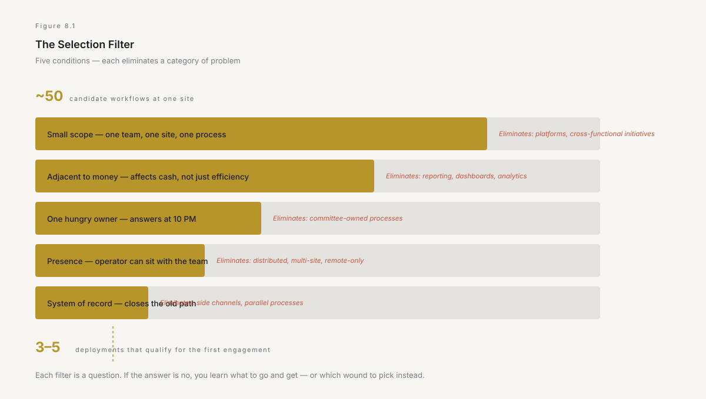
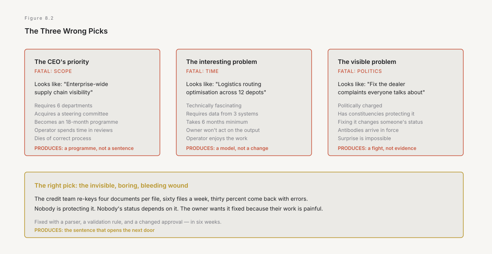
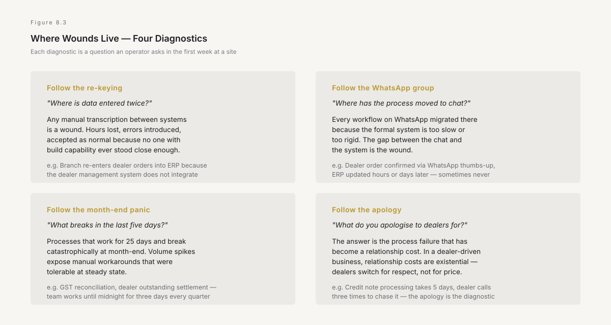

# 8. Pick the wound, not the vision

The first deployment is the only one that has to be won without evidence. Every deployment after it has something to point at — a workflow that changed, a number that moved, a person who will take a call. The first one has nothing. It is a cold start, and cold starts have killed more forward-deployed efforts than bad execution ever has, because the selection of what to work on determines the outcome before the work begins.

This chapter is about how to pick right, and more usefully, about the specific ways smart people pick wrong — because the failure modes are not random. They cluster around a single mistake: choosing a problem that is interesting to the operator rather than one that is bleeding from the host.

---

## Why the first one matters disproportionately

Be precise about the mechanism, because it is not about momentum or morale. It is about the thing the first deployment produces that no amount of planning can substitute: **evidence that the model works, witnessed by someone inside.**

A second deployment sold on the strength of the first is a fundamentally different sale. The director who saw the credit team's turnaround time drop from four days to six hours — who watched the number move on their own dashboard — is not evaluating a proposal. They are extending a bet that already paid. The conversation moves from *convince me this is worth trying* to *where else does this apply*, and the second conversation is ten times easier than the first.

This is Chapter 5's earned authority, encountered commercially. The first deployment is the investment that buys it, and the return on that investment is not the value of the first workflow fixed. It is the access to the second, third, and tenth — the ones that could never have been reached without the first.

Which means the selection criterion for the first deployment is not *which problem is biggest* or *which problem is most strategic*. It is: **which problem, if solved, makes someone inside say the sentence that opens the next door?**

That sentence has a specific shape. It is not "the technology worked." It is: *this thing we have been living with for three years — the one we stopped complaining about because we assumed it could not change — changed. And it changed in six weeks, not eighteen months.*

The first deployment exists to produce that sentence. Every selection decision flows from it.

---

## The five selection criteria

Chapter 3's seventh observation listed what worked: small, adjacent to money, one hungry owner, continuous presence, and a change to the system of record. Those five conditions are not just retrospective patterns. They are the selection filter for the first deployment, and each one eliminates a category of problem that would otherwise consume the first engagement and produce nothing reusable.

**Small in scope.** One workflow, not a platform. One team's process, not a cross-functional initiative. The temptation is to go big because the first deployment needs to be impressive — and the temptation is wrong, because the most impressive thing a first deployment can do is *finish*. A twelve-week deployment that changes one process and produces a number is worth infinitely more than a six-month deployment that is eighty percent complete and needs another quarter. The completed one generates the sentence. The incomplete one generates a steering review.

In an Indian enterprise, small means something specific: it means one plant, one branch, one team, one geography. Not the national roll-out. Not even the regional pilot. The credit check process at the Mumbai branch. The dealer reconciliation at the Vizag depot. The maintenance log at one furnace line in Jharsuguda. One site, one process, one team whose names you know.

**Adjacent to money.** The workflow must visibly affect cash — revenue collected, cost incurred, working capital tied up, or a penalty avoided. Not because financial impact is the only value, but because Chapter 3 established the reason: financial impact is the only argument that survives contact with a budget review in an Indian industrial group, where the CFO's office has seen a hundred efficiency claims and learned to discount all of them.

The best first deployments are embarrassingly concrete. The dealer pays four days late because the credit note takes three days to process. The branch holds eight lakh in buffer stock because the replenishment signal is a phone call that sometimes gets missed. The plant pays a two-percent GST penalty three times a year because the reconciliation is manual and the deadline is the twentieth. These are not strategic problems. They are cash problems, and cash problems have the property that when you fix them, the fix shows up in a report someone is already reading.

**One owner who wants it.** Not a steering committee. Not a transformation programme. One person — typically a mid-level manager, the person whose own numbers are affected — who will answer a WhatsApp message at ten at night, who will walk you into the branch and introduce you to the team, who will spend their own political capital to get you the data access and the system credentials.

This person exists or they do not. If they do not exist, the deployment is not ready. No amount of executive sponsorship substitutes for this person, because executive sponsorship opens the door and this person keeps it open. In an Indian group, finding this person often means going below the level that attends the steering review — the deputy general manager who runs the actual process, not the vice president who presents it.

The test is simple. Ask: *whose Tuesday gets better if this works?* The person whose hand goes up — not politely, not because they were told to, but because they have been living with the problem — is the owner. If nobody's hand goes up, you have selected the wrong problem.

**Presence is non-negotiable.** The operator must be physically at the site where the work happens. Not for a day. Not for a workshop. For weeks. The reasons are in Chapter 5 and they are not soft — they are informational. The exception cases, the workarounds, the person who actually decides — none of it is available remotely, and all of it determines whether the deployment works or produces a correct and unused system.

In India this has a specific logistics cost. The work happens in a plant office in Rourkela, not in a WeWork in Bangalore. It happens at a branch in Coimbatore, not over a Zoom from Gurugram. The operator travels, sits in an unfamiliar office, eats in the canteen, and earns the right to hear the truth by being present when the truth happens — at 4 PM when the system freezes during the batch upload, at month-end when everyone is doing the reconciliation manually because the automated version missed three entries last quarter.

**The change must touch the system of record.** Until the output lives in the system where the work is tracked — the ERP, the CRM, the ledger, the dealer management system — you have built a side channel. Side channels lose to the original within a month, always, because nobody's job depends on the side channel and everyone's job depends on the system of record.

This criterion eliminates the entire category of dashboards, analytics layers, and reporting tools as first deployments. Not because they are useless. Because they do not close the old path, and closing the old path is the act that makes the change stick. The first deployment must change what someone does, not what someone sees.

*Figure 8.1 — Five conditions, each eliminating a class of problem. A problem that passes all five is usually small and boring. That is the point — boring problems bleed real money, and the first deployment exists to stop one bleeding, not to impress anyone.*

---

## The three wrong picks

State them, because each is a way of choosing while feeling rigorous, and each is fatal to the first deployment for a different reason.

**The CEO's priority.** The most common wrong pick, and the most politically difficult to refuse. The CEO — or in an Indian group, the promoter or the group managing director — has a problem they care about. It is usually large, strategic, and cross-functional. Digital supply chain visibility. Integrated dealer analytics. Enterprise-wide working capital optimisation. These are real problems and real priorities. They are also eighteen-month programmes, not twelve-week deployments, and they require decisions from six departments, each of which has a different incentive.

The first deployment cannot carry that weight. It will be subsumed into a programme, acquire a steering committee, attract the antibodies from Chapter 3, and die of correct process. The operator will spend their time in reviews instead of at the branch, writing status updates instead of shipping code, and the deployment will end without the sentence.

The response to the CEO's priority is specific and must be said aloud: *that problem is real and I want to help with it. Let me show you what this looks like by fixing one small piece of it — the part that bleeds at one site — in twelve weeks. If that works, we talk about the rest.* The CEO who will accept that framing is the CEO worth working with. The one who will not accept it — who insists that only the enterprise-wide version is worth doing — has just told you that the first deployment will be a programme, and programmes are what Chapter 1 described.

**The technically interesting problem.** Chapter 5's second failure mode, encountered at the selection stage. The operator sees two problems during their first week. The first is a re-keying task — the credit team copies four fields from a PDF into a template, sixty times a week, and thirty percent come back because a field was wrong. The second is a genuinely fascinating optimisation problem — the logistics routing algorithm that could save crores if it accounted for real-time inventory positions.

The re-keying task is solved with a parser, a validation rule, and a change to who approves the output. It is boring and it will work in six weeks. The logistics optimisation is a beautiful problem that will take six months, require data from three systems that do not agree, and produce a recommendation that the logistics head will not act on because their bonus is tied to on-time delivery and the optimisation sometimes recommends holding a shipment.

Pick the re-keying task. The urge to work on the interesting problem is the single most reliable predictor of a wasted first deployment, because interesting problems are interesting precisely because they are hard, and hard means long, and long means the first deployment does not finish in time to produce the sentence.

**The most visible problem.** This is subtler than the other two, because visible problems seem like the right choice — if everyone sees the fix, the evidence is obvious. The trap is that visible problems are visible because they are politically charged, which means they have constituencies, which means fixing them changes someone's position, which means the antibodies arrive in force.

The invisible problem — the one that bleeds quietly, that nobody has complained about because they stopped noticing it, that sits in a branch office nobody visits — is a much better first deployment. Nobody is protecting it. Nobody's status depends on it staying broken. The owner wants it fixed because their own work is painful, not because fixing it advances their career. And when it gets fixed, the surprise — *wait, that changed? That thing we have been doing manually for four years?* — produces a sentence that is worth more than any amount of visibility, because surprise is more memorable than confirmation.

*Figure 8.2 — Each wrong pick looks like the right choice from the top. Each is fatal to the first deployment for a reason visible only from the bottom.*

---

## The deployment card as selection tool

The deployment card from Chapter 5 is not just an engagement document. It is a selection test, and the test works by refusal — any field that cannot be filled in with a specific name or number before work starts tells you exactly what is missing, and the missing field tells you whether to proceed or to walk away.

Try to fill in the card for a candidate deployment:

**The wound.** State it in one sentence, in the team's own words, with a number. If the sentence requires a paragraph, the scope is too large. If the number requires an assumption, the problem is too speculative. *The credit team re-keys four documents per file, sixty files a week, two hours each, and thirty percent are returned for errors.* That is a wound. *Our digital maturity is below industry benchmark* is not a wound. It is a consulting engagement.

**The owner after me.** Name the person who will own the changed workflow after the operator leaves. Not their title. Their name. And they must say the sentence before the deployment starts — *I will own this when you leave.* If they will not say it, the deployment will produce an orphan, and Chapter 3's third observation explained what happens to orphans. Walk away.

**The Tuesday test.** State what runs differently on Tuesday after the deployment. Not what is possible. What actually happens, in whose hands, using which system. If this cannot be stated before the build, the deployment has not been designed — it has been imagined.

**The authority granted.** Name the specific permission: the data access, the system change, the ability to close the old path. If this requires a conversation that has not happened, have it before committing. The worst outcome is discovering in week eight that the change requires an approval that takes twelve weeks.

**The metric.** One number. Before and after. Not a composite index, not a maturity score, not a satisfaction survey. A number that changes visibly and that the owner already tracks.

**The kill date.** Twelve weeks for a first deployment. Not a suggestion. A commitment, stated publicly, after which the engagement stops unless the metric moved. The kill date is what makes the host organisation's agreement cheap — Chapter 5's closing point — and it is also what keeps the operator honest. Without it, the deployment becomes a programme, and programmes are what Chapter 1 described.

If all six fields fill in cleanly, the deployment is ready. If one does not, the missing field is the work — go and get it. If three do not fill in, the deployment is not ready and no amount of energy will make it ready. Find a different wound.

---

## Where the wounds are, in practice

Be concrete about where to look, because the search is not random and the terrain in an Indian enterprise has specific features.

**Follow the re-keying.** Any process where information is manually transcribed from one system to another is a wound. In an Indian enterprise, these are everywhere — the branch that re-enters dealer orders into the ERP because the dealer management system does not integrate, the accounts team that copies invoice data from the GST portal into the reconciliation sheet, the plant that transcribes maintenance readings from a logbook into the SAP module. Each one bleeds hours, introduces errors, and has been accepted as normal because nobody with build capability has ever stood close enough to see it.

**Follow the WhatsApp group.** Chapter 3's observation about WhatsApp as the shadow system of record is not a cultural commentary. It is a diagnostic. Every workflow that has migrated to WhatsApp has done so because the formal system is too slow, too rigid, or too far from the work. The WhatsApp group is a map of the gap between the system and the process, and the gap is the wound.

In an Indian enterprise, WhatsApp groups are not supplementary. They are often primary — the dealer sends their order on WhatsApp, the branch manager confirms on WhatsApp, the credit check is a WhatsApp message to the regional head who replies with a thumbs-up. The formal system is updated afterwards, sometimes hours later, sometimes the next day, sometimes not at all. This is not dysfunction. It is the organisation routing around a system that does not fit the work. The wound is not that people use WhatsApp. The wound is whatever about the formal system made WhatsApp necessary.

**Follow the month-end panic.** Every Indian enterprise has a set of processes that work adequately for twenty-five days of the month and break catastrophically during the last five, when the volume spikes, the deadlines arrive, and the manual workarounds that were tolerable at normal volume become impossible. The GST reconciliation, the dealer outstanding settlement, the inventory count, the inter-unit transfer reconciliation — each one is manageable in steady state and produces a crisis at month-end, quarter-end, or year-end in March.

These are excellent first deployments because the pain is acute, the timing is predictable, and the metric is obvious — did the team finish the close on time, or did they work until midnight for three days?

**Follow the apology.** Ask the branch manager or the plant head: *what do you apologise to your customers or dealers for most often?* The answer is the wound. It is the process failure that has become a relationship cost, and relationship costs in an Indian dealer-driven business are existential — a dealer who feels the company cannot process their credit note in time will not switch to a competitor for price. They will switch because they are tired of calling someone to chase a number.

*Figure 8.3 — The wounds cluster in four places. Each diagnostic is a question, not an analysis. An operator who asks these four questions at one site in one week will have more candidate deployments than they can run in a year.*

---

## The cold start, specifically

The first deployment has a specific commercial and political challenge that no subsequent deployment shares: nobody has a reason to say yes.

The host organisation has not seen the model work. The operator has no track record inside this company. The business case rests on a claim — *I can change this workflow in twelve weeks* — that sounds like every other claim they have heard from every consultant, every vendor, and every internal innovation team.

Their default posture is Chapter 5's polite waiting. *Yeh bhi chal jaayega.* This too shall pass.

Three things overcome it, and they must be deployed in sequence because each funds the next.

**Start below the line of visibility.** The first deployment should not require executive approval, budget approval, or a place on someone's roadmap. It should require one person's permission and one system's data access. In an Indian group, this means starting at the level where a deputy general manager or a senior manager can say yes without asking anyone — a level that in most groups controls enough to change a workflow but not enough to trigger a review.

Starting small is not a compromise on ambition. It is a tactical choice that preserves optionality. A deployment that requires a board presentation before it starts has acquired a constituency before it has shipped a thing, and constituencies demand outcomes proportional to their investment, which means the twelve-week deployment must now justify a twenty-crore budget and a steering committee. Start below that line.

**Offer a kill date before they ask for one.** The kill date makes the agreement cheap, but only if the operator offers it before the host demands it. An operator who says *give me twelve weeks and if the metric has not moved by then, I leave and you owe nothing* has made an offer that costs the host almost nothing to accept. The sceptical director's risk is twelve weeks of tolerating a new person in the branch office. That is not a transformation. That is a trial.

This is also the mechanism that filters hosts. A director who will not agree to a twelve-week trial with a defined end and no ongoing commitment has told you something important: they are not sceptical. They are opposed. The distinction matters. Scepticism is the correct starting posture and it is overcome by evidence. Opposition is a political position and it is not overcome by a deployment. Find a different door.

**Make the first week's output a diagnostic, not a pitch.** The operator's first deliverable should be a single page — not a slide deck, not a proposal — describing the wound in the team's own language, with a number the owner already tracks. Not *I can fix this.* Rather: *this is what I observed, this is what it costs, and this is who told me.*

That page does two things. It demonstrates that the operator has been present — not in a meeting room, but at the desk where the work is done. And it gives the owner something they can take to their own director without having to explain the model, the methodology, or the technology. All they have to say is: *this person sat with my team for a week and found that we lose X per month on this process. They want to try fixing it. It takes twelve weeks. If it does not work, they leave.*

That is the sentence that produces a yes. It is not a pitch. It is a finding, offered by someone who bothered to sit in the room.

---

## What the first deployment is not

State the boundary, because the first deployment will be under pressure to become several things it must not be.

It is not an assessment. An assessment is a consulting engagement and it is Chapter 7's first drift. The operator is not there to diagnose. They are there to fix. The diagnosis happens in week one, as a by-product of presence, and it is shared not as a deliverable but as a foundation for the build that starts in week two.

It is not a proof of concept. A proof of concept demonstrates that a technology can do something. A deployment demonstrates that a workflow has changed. The difference is the old path. A proof of concept leaves the old path open and the user with a choice. A deployment closes the old path and the user with a new default. The first deployment must close the old path or it has produced a demo, and Chapter 3's sixth observation explained what happens to demos.

It is not a relationship-building exercise. The relationship is a by-product of the work, not the purpose of the work. An operator who spends the first deployment building relationships without shipping a change has produced goodwill and zero evidence. Goodwill without evidence expires with the next reorganisation.

And it is not a loss leader. The first deployment should be priced at what it costs, not discounted to buy entry. A deployment that is given away for free is valued accordingly — it will be deprioritised, under-resourced by the host, and treated as a favour rather than a commitment. Price it honestly. The kill date already makes the risk low. The price makes the commitment real.

---

*Next: the first deployment worked. One workflow changed, one number moved, one person witnessed it. Now what? Chapter 9 is about the expansion — how one deployment becomes ten, how earned authority compounds, and why the sequence matters more than the speed.*
