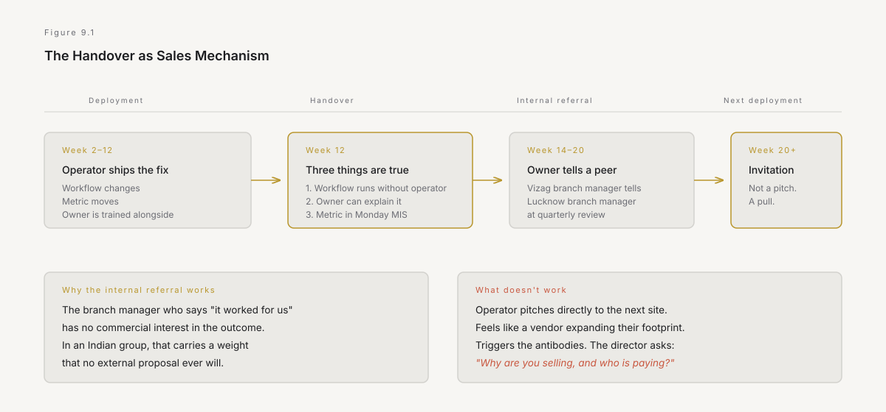
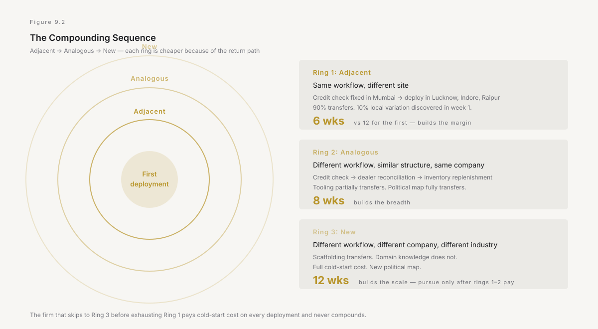
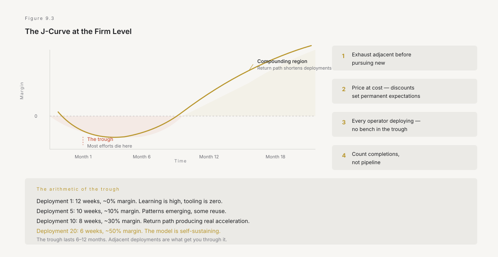

# 9. Land and expand

The first deployment changed one workflow and produced one witness. The question now is whether that single data point becomes a sequence or an anecdote — and the difference is entirely in what happens in the six weeks after the operator leaves.

This chapter is about the expansion: how one deployment becomes ten, how earned authority compounds, and why the order in which you move matters more than the speed at which you move. The J-curve from Chapter 2 applies here at the firm level — there is a trough between the first deployment and the point at which the model is self-sustaining, and most forward-deployed efforts die in it, not because the deployments failed, but because the sequence between them was wrong.

---

## The handover that funds the next deployment

Chapter 3 stated the rule: plan the handover before the build. Chapter 5 named the owner. Here is why the handover is not just an operational discipline but the commercial mechanism that makes the second deployment possible.

When the operator leaves, three things must be true, and the order is not arbitrary.

**The workflow runs without them.** This is the ODA test from Chapter 4 — what remains when the twelve people leave. If the operator's departure breaks the workflow, the deployment did not produce a capability. It produced a dependency, and dependencies do not generate the sentence. They generate a support contract, which is Chapter 7's body-shop drift.

**A named person owns it and can explain it.** Not can run it — can explain it. The difference matters because the person who explains it to their peers is the person who sells the next deployment, whether they intend to or not. When the branch manager in Vizag tells the branch manager in Lucknow — over a call, at a quarterly review, in the corridor outside the town hall — that the reconciliation process went from three days to four hours, that conversation is worth more than any presentation the operator could give. It is an internal referral, and internal referrals in an Indian group carry a weight that external proposals never will, because the person making the referral has no commercial interest in the outcome.

**The metric is visible to someone above the owner.** The number that changed must appear on a report that the owner's director already reads. Not a new report — an existing one. Not a dashboard the operator built — the MIS that goes out on Monday morning. If the improvement is visible only to the team that experienced it, it remains local knowledge. Local knowledge does not compound.

This is the mechanism that converts the first deployment into an invitation for the second. The director sees the number. The director asks the owner what changed. The owner describes it. The director asks whether the same thing could work at the Lucknow branch or the Raipur depot. That question is the second deployment's invitation, and it arrived without the operator making a pitch.

*Figure 9.1 — The handover is not an ending. It is the mechanism that produces the internal referral, which is the only sales motion that works inside an Indian group. The operator designs for it in week two, not week twelve.*

---

## The trough

Chapter 2 described the J-curve: the period after the initial investment when performance dips before the new model pays off. The J-curve applies to the forward-deployed firm with a specific and dangerous shape.

The first deployment took twelve weeks and cost forty lakh. It worked. It changed one workflow and produced one witness. Revenue from the engagement: forty lakh. Cost to deliver: roughly the same. Margin: approximately zero.

The second deployment starts from a higher floor because of the return path from Chapter 7 — some of the tooling, the schema patterns, the integration scaffolding can be reused. It takes ten weeks instead of twelve and the margin is slightly positive. Still not a business.

The third, fourth, and fifth follow the same pattern: each one is faster, each one is slightly more profitable, each one produces another witness. But the firm is now six months in, has delivered five engagements, has perhaps ten people deployed, and is running at a margin that would embarrass any services firm. Revenue is real but small. The team is learning fast but the learning has not yet compounded into the tooling enough to halve the deployment time.

This is the trough. It is the period between *the model works* and *the model scales*, and it is where most forward-deployed efforts die — not because the deployments are failing, but because the economics have not yet crossed into the compounding region.

Three things kill you in the trough, and each is a specific temptation.

**Scaling prematurely.** The five deployments worked, so someone proposes hiring thirty operators and selling fifty engagements. This fails because the return path has not yet produced enough generalised tooling to shorten the deployment meaningfully. The thirtieth operator is working from roughly the same floor as the first, which means the margin on the thirtieth deployment is the same as the first — approximately zero — and now you have thirty people to pay.

The hiring curve must follow the learning curve, not the demand curve. Chapter 11 expands this.

**Drifting into consulting.** The trough is where Chapter 7's first drift is most tempting. Revenue is thin, the pipeline is uncertain, and a client offers two hundred thousand dollars for a standalone assessment. The assessment is real work and real money. It is also a consulting engagement, and it will absorb an operator for eight weeks who would otherwise be deploying. In the trough, every operator-week matters, because operator-weeks are what produce the learning that gets you out of the trough. Spending them on assessments extends the trough.

**Losing the first witnesses.** In an Indian enterprise, people move. The branch manager who witnessed the first deployment gets promoted, transferred to another unit, or moves to a different group company. The plant head who championed the second deployment retires. The director who saw the number move takes a new role. Each departure removes a witness, and witnesses are the only asset the firm has accumulated beyond its tooling.

The mitigation is structural, not personal: the metric must outlive the witness. If the improvement shows up in a system of record — in the ERP, in the MIS, in the report the CFO's office already reads — then the metric persists regardless of who is in the chair. If the improvement shows up only in a side report the champion created, it dies with their tenure. Every deployment must change the system of record, and this is the commercial reason, not just the operational one.

---

## The compounding sequence

The expansion is not random. The order in which deployments are pursued determines whether the effort compounds or scatters, and the order has a specific logic.

**Adjacent, then analogous, then new.**

**Adjacent deployments** are the same workflow at a different site. The credit check process that was fixed at the Mumbai branch is deployed at the Lucknow branch, the Indore branch, the Raipur branch. The workflow is the same. The systems are the same. The exception cases are ninety percent the same, with ten percent local variation that the operator discovers in the first week. The return path is at maximum efficiency because almost everything transfers.

These are the deployments that build the margin. Each one is faster and cheaper than the last, because the operator is not solving a new problem — they are deploying a solved one in a new context. The tooling generalises. The deployment time drops. The margin rises. Adjacent deployments are how the firm gets out of the trough.

They are also politically easy. The director who saw the number move at the Mumbai branch does not need to be convinced that the Lucknow branch should try it. They need to be asked, and the asking is best done by the Mumbai branch's owner, not by the operator.

**Analogous deployments** are a different workflow with a similar structure at the same company. The credit check process is not the same as the dealer reconciliation process, but the shape is similar: manual transcription, a waiting step, a reconciliation, an approval. The tooling partially transfers. The operator's knowledge of the company — the systems, the politics, the decision-makers — transfers entirely. The deployment time is shorter than the first cold start but longer than an adjacent deployment.

Analogous deployments build the breadth. They demonstrate that the model is not a trick that works for one process. They build relationships with new teams, new owners, new directors. And they produce the cross-functional visibility that eventually brings the model to the attention of the group level — the promoter's office, the group strategy team, the board.

**New deployments** are a different workflow at a different company, in a different industry, with different systems. These are the hardest and the most expensive. The return path transfers some scaffolding but not the domain knowledge, the political map, or the relationships. The deployment time is close to the original first deployment.

New deployments build the scale. They are necessary for the firm's growth. But they should not be pursued until the adjacent and analogous sequence has produced enough margin and enough generalised tooling to fund them. A firm that takes on a new client before it has exhausted the adjacent deployments at its first client is choosing the hard path before the easy path has paid off.

*Figure 9.2 — The three rings of expansion. Each ring is cheaper and faster because of the return path. The firm that skips rings — going straight from first deployment to new client — pays the full cold-start cost every time and never compounds.*

---

## The Indian group as expansion terrain

The structure of an Indian industrial group makes it unusually fertile ground for the compounding sequence, for reasons that are structural rather than sentimental.

**Vertical integration creates adjacent deployments across the value chain.** A steel group that mines ore, smelts it, rolls it, and distributes it through a dealer network has the same reconciliation, the same approval chain, and the same month-end crunch at every stage. A deployment that fixes the dealer reconciliation at the distribution end has analogues at every upstream step. In a Western conglomerate, these stages might be separate companies with separate systems. In an Indian group, they are divisions of the same entity, often on the same ERP instance — which means the schema knowledge transfers, the integration patterns transfer, and the political map is one map, not five.

**Geographic dispersion creates adjacent deployments at scale.** An Indian group with operations across the country has the same process running — with local variation — at dozens of sites. The branch credit check works the same way in Mumbai, Lucknow, Indore, Coimbatore, and Nagpur, with exceptions for regional regulations, local dealer customs, and the specific workarounds each branch has developed. Each is an adjacent deployment. Each is faster than the last. A group with a hundred branches has a hundred adjacent deployments before you need a single new idea.

**The promoter structure creates a single decision point for analogous expansion.** In a professionally managed Western corporation, expanding from one division to another requires a separate sale to each division head, each of whom has their own budget, their own priorities, and their own political calculus. In a promoter-led Indian group, the promoter's conviction — once earned — opens every door in the group. The first three deployments earn the branch manager's trust. The next three earn the director's trust. The director's referral earns the promoter's attention. And the promoter's attention is the single most powerful accelerant available, because in an Indian group, the promoter's interest is not a recommendation. It is a directive.

This is the sequence that works: bottom-up evidence, mid-level referral, top-level attention. The temptation is to invert it — to go to the promoter first, get a mandate, and deploy from the top down. Chapter 4 explained why this fails: a mandate without proximity produces compliance rather than cooperation, and compliance is the posture people adopt while waiting for the initiative to pass. The bottom-up sequence is slower. It is also the only one that produces deployments people actually use.

**The IT services overhang creates a specific opportunity.** Every large Indian group has an existing relationship with one or more IT services firms — TCS, Infosys, Wipro, HCL, or their equivalents — running some combination of ERP support, application maintenance, and custom development. These relationships are measured in decades and in hundreds of crores annually. They are also, for the reasons Chapter 6 described, structurally unable to deliver the kind of small, fast, outcome-priced deployment the forward-deployed model offers.

The forward-deployed firm does not compete with the IT services firm. It operates below the IT services firm's engagement minimum, in workflows the IT services firm has never been asked to touch. The IT services firm maintains the ERP. The forward-deployed firm fixes the process the ERP was supposed to automate and did not. The two coexist because they serve different economic layers — and the forward-deployed firm's expansion across the group does not threaten the IT services firm's revenue, which is the one political condition that must hold for the antibodies to remain dormant.

---

## The return path in practice

Chapter 7 described the return path abstractly — what operators learn in the field feeds back into the firm's tooling. Here is what that looks like in practice, because the specificity is the point.

After ten deployments against credit-assessment workflows across three companies, the firm's tooling contains:

A schema library for the five most common Indian ERP configurations of credit-related tables — SAP, Oracle, Tally integrated with SAP, the in-house systems that two specific groups built in the early 2010s, and the combination where the dealer management system and the ERP have never been fully integrated and the bridge is a daily CSV extract.

An exception-case catalogue for credit decisions — the twelve most common reasons a credit check requires manual intervention, mapped to the system field that triggers each one, with the resolution pattern that worked for each. The catalogue is not exhaustive. It covers eighty percent of cases and lets the operator focus their first-week observation on the twenty percent that is specific to this site.

Integration templates for the three most common ways a credit decision flows into the system of record — direct API, batch upload with reconciliation, and the workaround where someone updates the system manually after the decision is made on paper. Each template has been tested against production data, handles the error cases that production data produces, and includes the retry logic that is necessary because the ERP's API is unreliable during batch-processing hours.

A deployment playbook — not the twelve-week structure, which is fixed, but the political map: who typically owns the credit process (the branch credit manager, not the branch head), who typically blocks it (the regional risk team, whose sign-off requirement was added after a bad debt in 2016 and has never been revisited), and how to navigate the GST reconciliation dependency that appears in every credit workflow because credit notes have GST implications.

None of this is a product. All of it is acceleration. The eleventh credit-assessment deployment starts from a six-week floor instead of a twelve-week floor, because the operator spends the first week on the twenty percent that is new rather than the eighty percent that has been seen before.

This is how the margin compounds. The first deployment's margin was approximately zero. The eleventh deployment's margin is roughly fifty percent, because the cost of delivery dropped by half while the value delivered did not. The return path is the mechanism that converts a services business into a compounding one, and it is the reason the firm can grow revenue faster than it grows headcount.

---

## The metric that matters

Chapter 1 opened with a metric — name the workflow that runs differently on Tuesday — and the expansion is measured by the same metric, pluralised.

Not workflows assessed. Not workflows proposed. Not workflows in progress. **Workflows changed, measured before and after, with a named owner, running differently on Tuesday.**

The count is the firm's real balance sheet. At five, the model works but does not compound. At twenty, the return path is producing visible acceleration and the margin is real. At fifty, the firm has enough pattern coverage that genuinely new problems are the exception rather than the rule. At a hundred, the firm is operating in the compounding region that Chapter 7 described, and each new deployment is cheaper, faster, and more profitable than the one before.

The count also reveals the expansion pattern. If twenty deployments are all at one company, the firm has depth but not breadth — it is dependent on one client and vulnerable to one client's reorganisation, one promoter's succession, one change in group strategy. If twenty deployments are at twenty companies, the firm has breadth but not depth — it has never compounded at a single client, and the return path is thin because no two deployments were adjacent.

The healthy pattern is clustered: five to ten deployments at the first client, three to five at the second and third, and one to two at the fourth and fifth. The clusters produce the compounding. The spread produces the resilience. Both are needed, and the proportion should shift over time as the tooling generalises.

---

## Surviving the trough

Pull it together. The trough is the period between the first deployment and the point at which the compounding sequence produces a self-sustaining margin. It lasts six months to a year. It is the period when the model has been proven in the field but not yet in the economics.

Four things get you through it.

**Exhaust the adjacent before pursuing the new.** Every adjacent deployment is cheaper and faster than the last. New deployments cost the full price. In the trough, margin matters more than revenue, and adjacent deployments are where the margin is. The discipline is to resist the temptation to sign a new client before the first client's adjacent deployments are done.

**Price every deployment at what it costs.** Not lower to win the deal, not higher to build margin that does not yet exist. In the trough, the honest price is roughly breakeven, and the honest price is the only one that produces a sustainable relationship. A client who paid cost for a deployment that worked will pay cost-plus for the next one without argument. A client who received a discount will expect a discount forever.

**Keep the team small and every operator deploying.** The trough is not the time for a bench. Every person on the team should be either deploying or building the return path tooling that shortens the next deployment. A firm in the trough with operators not deployed is burning the runway that gets it through.

**Measure in deployments completed, not pipeline.** The pipeline is comforting and misleading. A pipeline of twenty opportunities is worth nothing until one of them is a workflow that runs differently on Tuesday. In the trough, the only number that matters is the count — how many deployments have been completed, how many have produced a witness, and how fast the deployment time is dropping.

*Figure 9.3 — The J-curve at the firm level. The trough is six months to a year. What gets you through is adjacent deployments, honest pricing, small teams, and the discipline to count completions rather than pipeline.*

---

## What Part III has established so far

Two chapters in, the playbook has a shape.

Chapter 8 defined the selection: pick the wound that bleeds cash, has one owner, fits one site, touches the system of record, and can be fixed in twelve weeks. Reject the CEO's pet project, the interesting problem, and the visible one. Fill in the deployment card. If the card does not fill in, find a different wound.

This chapter defined the expansion: handover designs the referral, the J-curve trough is survived through adjacent deployments, the compounding sequence is adjacent then analogous then new, and the Indian group structure makes the sequence unusually efficient.

Chapter 10 is the hard one. Trust — the thing that cannot be collapsed by technology, that takes exactly as long as it ever did, and that determines whether the deployments the operator runs are the ones the organisation actually needs, or just the ones the organisation is willing to show them.

---

*Next: why trust is the binding constraint. Not the technology. Not the cost. Not the talent. The willingness of a person who has survived eight reorganisations to tell you what is actually broken — that is the thing that takes the longest to earn and costs the most to lose. Chapter 10 is about earning it.*
