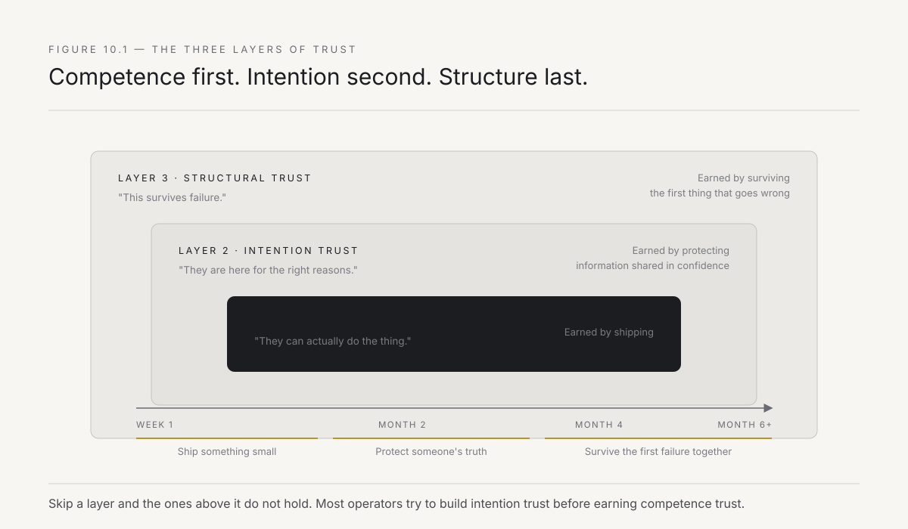
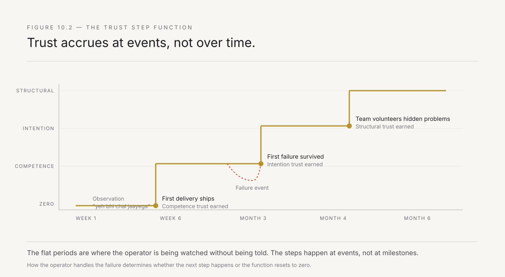
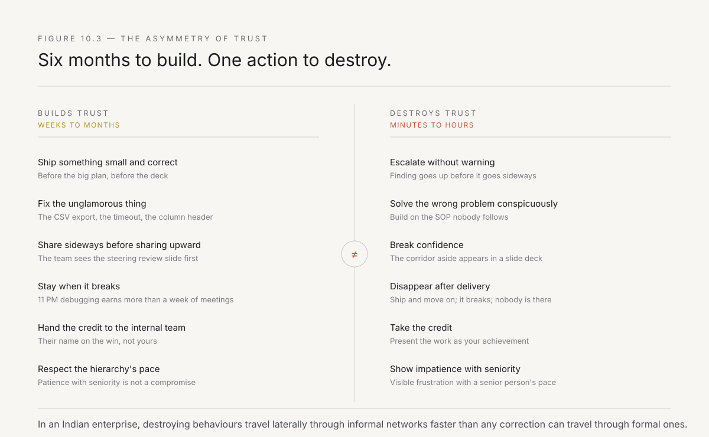

# 10. Underwriting trust

The previous two chapters covered selection and expansion — how to pick the right wound and how to compound one deployment into many. Both assumed something that, in practice, is the binding constraint on everything else: that the organisation trusts the operator enough to show them where it hurts.

This is not a soft problem. Trust determines the information the operator receives, and the information determines whether the deployment solves the real problem or a politely offered substitute. A team that is trusted gets told about the field in the form that nobody uses, the report that everyone knows is fiction, the process that exists solely to give one person a veto. A team that is not trusted gets the sanitised tour — the version of the problem that has already been pre-approved for external consumption, which by definition excludes everything that matters.

Chapter 4 made the claim: authority is accumulated laterally, by shipping things that work. This chapter is about the specific mechanism by which that accumulation happens, the specific behaviours that accelerate or destroy it, and why — in an Indian enterprise in particular — trust is the resource that takes the longest to earn and costs the most to lose.

---

## Why trust is the binding constraint

Be precise about what trust does in this context, because the word is used loosely and the mechanism is specific.

A forward-deployed operator needs three things from the host organisation that cannot be obtained through contracts, executive mandates, or steering committee approvals:

**Honest problem descriptions.** The real problem — the one that bleeds cash, the one Chapter 8 taught you to look for — is almost never the problem that appears in the project brief. The real problem involves someone's workaround, someone's territory, someone's quietly maintained spreadsheet that contradicts the ERP. Disclosing it requires the discloser to trust that the disclosure will not be used against them. In an Indian enterprise, where job security is personal and reorganisations are frequent, this trust is not given. It is earned, specifically, by demonstrating that the operator understands the difference between a problem and a blame.

**Access to the actual workflow.** Not the documented process. Not the SOP binder. The thing people actually do — which includes the phone call to the depot before the system entry, the manual override that happens every month-end, the WhatsApp group where the real coordination takes place. Seeing this requires being allowed into spaces where the official story does not hold, and people only allow that when they believe the observer is there to help, not to report.

**Permission to change things.** The difference between deploying a tool that sits beside the workflow and rewiring the workflow itself. Chapter 5 defined this as the distinction between the consultant's recommendation and the operator's implementation. But implementation requires the people inside the workflow to cooperate with the change — to adopt the new path, abandon the old one, report honestly when the new one breaks. That cooperation is trust, specifically, trust that the person asking them to change knows what they are doing and will be there when it goes wrong.

All three are trust problems, not authority problems. A CXO mandate can force a meeting. It cannot force a plant engineer to tell you that the batch upload has been failing silently for six months and she has been fixing it manually because the last time she reported it, nothing happened for a year.

**The speed limit on forward deployment is not technology, cost, or access. It is the rate at which trust accrues.**

---

## The three layers of trust

Trust in a deployment context operates on three layers, and they build in sequence. Skip a layer and the ones above it do not hold.

*Figure 10.1 — Trust builds in layers. Competence trust comes first and is earned by shipping. Intention trust comes second and is earned by staying. Structural trust comes last and is earned by surviving the first thing that goes wrong.*

**Competence trust: "They can actually do the thing."** This is the first layer and the easiest to earn. The operator demonstrates, through actual work, that they can build something that works. Not a prototype. Not a demo. A thing that runs in production, handles the edge cases, and does not break on the first day the operator is not watching.

In an Indian enterprise, competence trust has a specific shape. The plant head, the branch manager, the deputy general manager who has been running the process for fifteen years — this person has seen consultants before. They have seen the Big Four arrive with thirty slides, declare the process broken, recommend a system, leave, and nothing changed. They have seen the technology vendor do a pilot that worked beautifully on test data and collapsed on contact with the December volume spike. The bar for competence trust is not *can you build it* — it is *can you build it here, with our data, in our constraints, in a way that works when you leave the room*.

The operator earns this by shipping something small, fast, and visibly correct. Not the full solution. The first piece — a single reconciliation automated, a single report that matches reality, a single workflow step removed. The plant head watches it work for a week, checks the output against their own mental model, and decides: these people know what they are doing. That decision, once made, unlocks the second layer.

**Intention trust: "They are here for the right reasons."** This is harder and takes longer. The operator must demonstrate that their objective is to solve the problem, not to sell a platform, not to produce a case study, not to extend the engagement, and not to make anyone look bad.

Intention trust is destroyed faster than it is built. One poorly timed escalation — going to the CXO with a finding that should have been shared with the team first — destroys six months of intention trust in an afternoon. One recommendation that serves the operator's business model rather than the host's problem does the same. In an Indian context, where hierarchy is real and the consequences of being exposed are severe, the people closest to the work are exquisitely sensitive to whether the outsider is there to help them or to use them.

The test is simple and it is observed rather than stated: **does the operator protect the team's information or trade it for access?** A plant supervisor tells the operator that the quality data has been manually adjusted for three months because the sensor calibration is off and nobody approved the maintenance budget. What happens next? If the operator fixes the sensor calibration problem, intention trust accrues. If the operator includes "quality data integrity issues" in the next steering review, intention trust is gone — permanently — not just with that supervisor but with everyone who hears about it, and in an Indian enterprise, everyone hears about it by the next chai break.

**Structural trust: "This survives failure."** The deepest layer, and the one that turns a deployment into an ongoing relationship. Structural trust means: when something goes wrong — and it will — the operator stays, diagnoses, and fixes, rather than blaming the data, the requirements, or the team.

This is earned only by surviving a visible failure together. The automated report produces a wrong number and the CFO calls. The new workflow breaks during a peak period. The integration with SAP fails because someone changed a field mapping and did not tell anyone. These moments are not obstacles to trust — they are the mechanism by which the deepest trust is built, because the response reveals the operator's character in a way that no amount of smooth execution can.

In an Indian enterprise, the first visible failure is the moment the plant head decides whether the operator is a partner or a contractor. A partner stays, works through the night if necessary, fixes the issue, and does not leave until the team is confident. A contractor files a ticket and asks for a change request. The distinction is existential and it is made in the first forty-eight hours after the failure.

---

## The trust timeline

Trust does not build linearly. It follows a specific pattern that is worth naming because understanding it prevents two common mistakes: declaring trust too early and abandoning the investment too early.

*Figure 10.2 — Trust accrues in steps, not gradients. Each step corresponds to a visible event: something shipped, something survived, something protected. The flat periods between are where the operator is being watched without being told they are being watched.*

**Weeks one through three: observation.** The team watches the operator. They are polite, cooperative, and completely guarded. The operator sees the documented process, hears the official narrative, and receives exactly the information that has been pre-approved for external consumption. This is not hostility. It is the default posture of any team that has survived previous consulting engagements. In Hindi, the phrase is *yeh bhi chal jaayega* — this too shall pass. The team assumes the operator will leave like everyone else, and they are conserving energy by not investing in the relationship.

The mistake operators make in this phase is trying to build trust through relationships — dinners, team-building, personal conversations. These are not wrong, but they do not build trust. They build rapport, and rapport without demonstrated competence is pleasant and useless. The only thing that builds trust in weeks one through three is work: reading the data, understanding the process, asking questions that reveal genuine comprehension rather than a template. The moment the operator says something about the process that surprises the team — something that shows they have actually looked at the system, not the deck — a small door opens.

**Weeks four through eight: the first delivery.** Something ships. A small piece of the problem is solved visibly. The team sees the output, checks it against their own knowledge, and finds it correct. Competence trust is established — conditionally. The condition is that the thing continues to work without the operator hovering over it.

**Months two through four: the first failure.** Something goes wrong. The response determines whether intention trust and the beginnings of structural trust emerge, or whether the relationship resets to zero. If the operator handles the failure well — diagnoses quickly, fixes without blame, communicates transparently — the trust step function jumps. If they handle it badly, the team reverts to the observation posture and the clock restarts.

**Months four through six: the quiet phase.** The team begins to volunteer information that was not asked for. The deputy general manager mentions, over tea, that there is another process — one that was not in the scope — that has the same problem, only worse. The branch head asks if the operator can take a look at something unrelated, something personal to their own targets. These are not casual requests. They are trust signals, and they mean the operator has passed from *tolerated external* to *useful insider*.

This is Chapter 9's expansion mechanism, seen from the trust side. The adjacent deployment that drives the compounding sequence does not come from a steering committee identifying the next opportunity. It comes from someone inside the organisation trusting the operator enough to reveal a problem they have been hiding.

---

## What destroys trust — the specific behaviours

Trust destruction is asymmetric. Six months of careful, competent work can be undone by a single action, and the actions that destroy trust are specific enough to enumerate.

*Figure 10.3 — The asymmetry of trust. Building behaviours accumulate slowly. Destroying behaviours take effect immediately. In Indian enterprise context, the destroying behaviours are especially fatal because they travel laterally through informal networks faster than any correction can travel through formal ones.*

**Escalating without warning.** Taking a finding to a senior person without first telling the team whose work produced the finding. This is the single most common trust-destroying behaviour and it is the one most frequently committed by operators who think they are being diligent. In an Indian enterprise, where the relationship between a department head and their boss is layered with history, seniority, and often caste and regional dynamics, an outsider who escalates information out of sequence is not perceived as transparent. They are perceived as dangerous.

The rule is absolute: **nothing goes up that has not first gone sideways.** Before the CXO hears that the reconciliation process has a three-day lag, the reconciliation team hears it. Before the plant head hears that the quality data has been adjusted, the shift supervisor who adjusted it hears that you know and that you are there to fix the root cause, not to report the symptom. This costs time. It sometimes costs the opportunity for a dramatic steering review slide. It never costs trust.

**Solving the wrong problem conspicuously.** Building something technically impressive that does not address what the team actually needs. This is the competence trust failure: the operator has demonstrated skill but not understanding, and in an industrial context where the team has deep domain knowledge, the gap between skill and understanding is visible and insulting.

The variant specific to Indian enterprises: building a solution that assumes the documented process is the real process. The team watches the operator build something beautiful on top of an SOP that nobody follows, and their trust drops not because the technology failed but because the operator did not bother to learn what actually happens.

**Breaking confidence.** Using information shared informally in a formal context. The plant supervisor's aside about the sensor calibration appearing in a slide deck. The branch manager's complaint about the regional head's priorities showing up in a report. These are career-ending violations of trust, and they are permanent. The person who was burned will tell every colleague, and the operator's reputation in that part of the organisation is finished.

**Disappearing after delivery.** Shipping something and moving on to the next engagement. The thing breaks — as all things eventually do — and the team discovers that the operator is no longer available. In an Indian enterprise, where relationships are personal and continuity is expected, this is read as abandonment. The technical term for what the operator has done is *produce a correct and unused system*, because the team stops using the thing the moment they stop trusting the person who built it.

**Treating the hierarchy as an obstacle.** Attempting to work around the approval chain, the sign-off sequence, the seniority structure. The operator from Bangalore, twenty-eight years old, technically brilliant, impatient with the pace of a sixty-year-old plant head's decision-making — and visibly impatient in a culture where visible impatience toward a senior person is a form of disrespect that is never forgotten. The hierarchy is not an obstacle. It is the trust infrastructure of the organisation, and working within it is not a compromise. It is the work.

---

## The chai test

There is a diagnostic that Indian operators learn to read, and it is worth stating because it is more reliable than any formal trust metric.

The test is not whether people drink chai with you — everyone will, because hospitality is not optional in most Indian workplaces. The test is **what is discussed over the chai**.

**Level zero: the weather, the cricket, the commute.** This is not trust. This is politeness. The operator is being treated as a guest, which in Indian culture means being treated with warmth that carries precisely zero information about whether you will be told the truth.

**Level one: the project.** The conversation turns to the work, but only the work as officially described. The team discusses the requirements, the timeline, the deliverables. Still no trust, but the door is open to earning it.

**Level two: the real problems.** Unprompted, someone mentions something that is not in the scope. The data has issues. The process has a step that nobody talks about. There is a person — not named yet — who is going to resist. This is competence trust expressing itself: the team has decided the operator understands enough to hear the real version.

**Level three: the politics.** Someone tells the operator, quietly and without being asked, about the real power dynamics. Who actually decides. Why the last project failed — not the official story but the actual one. Which vice president is about to be transferred and what that means for the programme. This is intention trust: the team believes the operator will use this information to navigate effectively, not to gain advantage.

**Level four: the ask.** Someone from the organisation asks the operator for help with something personal — something that affects their own career, their own targets, their own standing. Can you look at this before the review? Can you help me present this number differently? Can you show my team how to do what your team does? This is structural trust: the person is investing their own reputation in the operator's competence and goodwill.

The chai test is not a metaphor. It is a literal diagnostic. The operator who sits in the canteen and pays attention to what is discussed — not what is said in the meeting room, where the hierarchy is present, but what is said over a five-rupee cup of tea in the corridor — knows exactly where they stand.

---

## Speed without trust

State the failure mode explicitly, because it is the most common way forward-deployed efforts die, and it is invisible to the people running them.

A technically competent team, moving fast, building correctly, shipping on schedule — and producing systems that nobody uses. The system is right. The process it encodes is right. The data it produces is accurate. And six months after handover, the branch is back to the spreadsheet, the plant is back to the phone call, the dealer management team is back to the manual reconciliation.

The diagnosis is not technical. The diagnosis is that the team built the right thing in the wrong trust layer. They had competence trust — the system works — but not intention trust — we do not believe you built it for us. And without intention trust, the first moment the system produces an output that contradicts someone's judgement, the someone abandons the system and returns to the thing they trust, which is their own process, however broken.

This is why Chapter 5's presence requirement is not a preference. Presence is the trust-building mechanism. The operator who has sat in the plant for three months, who has eaten in the canteen, who has stayed past six PM when the batch upload broke, who has learned the names of the operator's children — that operator has built something that the team considers theirs. The operator who flew in for three days, built something technically superior, and flew back to Bangalore has built something that the team considers an imposition.

**The speed limit is not how fast you can build. It is how fast trust allows the build to be adopted.**

---

## The trust investment

If trust is the binding constraint, the question becomes: what do you invest in, and what is the return?

The investment is time, presence, and the disciplined refusal to trade short-term wins for long-term trust. Specifically:

**Invest in the first failure.** Do not prevent failures from being visible. When the first thing goes wrong — and it will — treat it as the most important moment of the deployment, not as an obstacle to be minimised. The team is watching to see how the operator handles it, and their conclusion will determine the next six months.

**Invest in sideways communication.** Every hour spent telling the team what will be said in the steering review — before it is said — is an hour that builds trust more effectively than any amount of delivery. This is expensive. The team meeting that happens at 5 PM, the day before the steering review, where the operator walks through every slide and asks *is there anything here that will surprise you?* — that meeting is the highest-ROI activity in the deployment.

**Invest in the unglamorous work.** Fix the small things that nobody asked you to fix. The CSV export that has the wrong date format. The report that shows the wrong column header. The login that times out because nobody told IT to increase the session length. These fixes build trust not because they are impressive but because they demonstrate that the operator sees the world through the team's eyes, not through a project plan.

**Invest in the handover.** Not the handover of the system — the handover of the credit. The operator's job is to make the internal team look good, not to take credit for the work. In an Indian enterprise, where credit flows upward and blame flows downward with particular efficiency, an operator who visibly hands credit to the internal team is building structural trust that survives their departure. An operator who presents the work as their own achievement is building a case study and destroying a relationship.

The return on these investments is not measured in the current deployment. It is measured in the next one — the adjacent deployment from Chapter 9, the one that comes from someone inside the organisation volunteering a problem they have been hiding. That volunteer act is the return on trust, and it is worth more than any amount of delivery excellence, because delivery excellence without trust produces correct and unused systems, and trust with adequate delivery produces organisations that change.

---

## What Part III has established so far

Three chapters in, the playbook has a pattern.

Chapter 8 defined the selection: pick the wound that bleeds, check five conditions, use the deployment card as a filter, and reject the three attractive wrong picks. Chapter 9 defined the expansion: handover as a referral mechanism, the J-curve trough, the compounding sequence, and the Indian group structure as expansion terrain.

This chapter defined the constraint: trust is the binding limit, it builds in layers, it accrues in steps rather than gradients, it is destroyed asymmetrically and permanently, and the chai test is the only diagnostic that matters. Speed without trust produces correct and unused systems. Time invested in trust produces organisations willing to show you where they actually hurt.

That line is stated here as doctrine. Chapter 14 shows it as an incident — a real build where every automated check passed and the product was still badly wrong, caught only by a person willing to look past the confidence score. The mechanism is the same one described above, one level down: a system can trust its own gates the way an organisation trusts a vendor, and the trust is worth exactly as much as the verification behind it.

Chapter 11 is about the people who do this work. The operator — the person who sits in the plant, reads the room, writes the code, and earns the trust — does not come from the traditional consulting pipeline or the traditional engineering pipeline. Finding them, training them, and scaling the pool is the binding constraint on the forward-deployed model itself, and it has not been solved by anyone yet. That chapter is about why, and about the beginning of how.

---

*Next: the hiring constraint. The operator who can build and read the room simultaneously is the rarest person in the Indian talent landscape — too technical for the consulting firms, too commercial for the engineering teams, too patient for the startups. Chapter 11 is about finding them, testing for the intersection, and building the pipeline that the forward-deployed model cannot scale without.*
