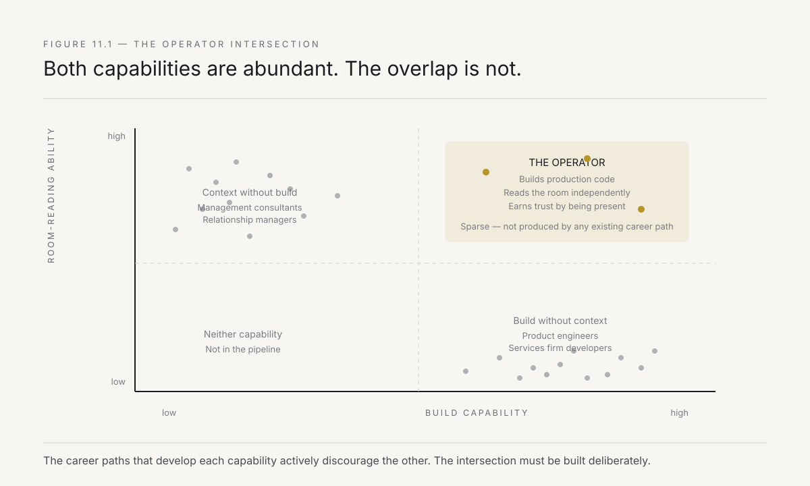
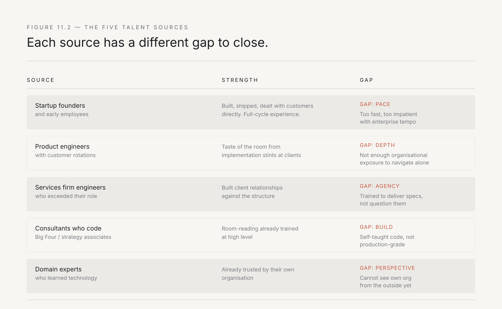
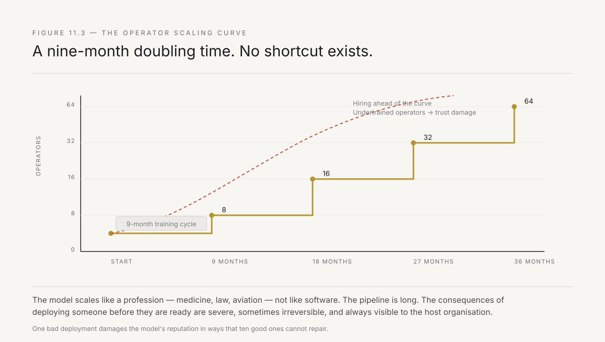

# 11. Rewire, don't advise

Every chapter so far assumes that a person exists who can do this work. Someone who writes production code, reads the room at a steering review, earns the trust of a plant head in Jamshedpur, and ships a workflow change in twelve weeks rather than writing a report about why it should change. Chapters 6 and 7 named this person the operator. Chapter 9 said the hiring curve must follow the learning curve. Chapter 10 established that trust is the binding constraint and trust accrues to individuals, not firms.

This chapter confronts the thing that none of the previous ones could: the operator does not exist in adequate numbers, and the pipeline that produces them does not exist at all.

The forward-deployed model is constrained not by its economics, not by its technology, and not by its market. It is constrained by the number of people who can simultaneously build and operate — who can write the code and do the work of putting it inside an organisation. This is the binding constraint on scale, and it will not be solved by raising salaries, changing job descriptions, or hoping that people who can do both things will appear on their own. It requires a deliberate pipeline, and the pipeline requires understanding why the intersection is so rare.

---

## Why the intersection is rare

State the two capabilities precisely, because conflating them is the reason most hiring for this role fails.

**Build capability** means the ability to write production software — not prototypes, not notebooks, not proofs of concept. Code that handles edge cases, survives real data, and runs without the author watching it. This is not a rare skill. India produces hundreds of thousands of engineers a year who can write production code. The IITs and NITs, the better private engineering colleges, the services firms that train people to build at scale — the supply of technical talent is not the constraint.

**Room-reading ability** means the ability to understand organisational context, navigate hierarchy, earn trust, identify the real problem behind the stated problem, and make decisions about what to build based on what the organisation can absorb rather than what is technically optimal. This is also not a rare skill. India produces plenty of people who can do this — the IIM graduates who go into consulting, the relationship managers at the large IT services firms, the business development people who have spent years navigating client organisations.

The rare thing is the intersection. The person who can do both — write the code and read the room — is rare because the two capabilities are developed by different career paths that almost never overlap.

*Figure 11.1 — The two capabilities are abundant separately. The intersection is sparse, because the career paths that develop each one actively discourage the other.*

The engineer who spends six years at a product company or a services firm has deep build capability and almost zero exposure to organisational navigation. Their entire career has been structured to shield them from the client — layers of project managers, business analysts, account managers, and delivery leads sit between the engineer and the person whose problem is being solved. The engineer has never been in the room when the plant head decides whether to trust the recommendation. They have never watched a steering review where the politics of the organisation override the logic of the data. They have never had to decide, in real time, that the technically correct solution is the wrong one because the organisation cannot adopt it this quarter.

The consultant who spends six years at a Big Four firm or at a strategy house has deep room-reading ability and almost zero build capability. They can navigate a client organisation, map the stakeholders, read the hierarchy, earn the CXO's trust — but they cannot write the code. They have never deployed to production. They have never debugged a data pipeline at 11 PM because the batch job failed and the plant's morning report depends on it. They have never built something that had to work without them watching it.

The services firm engineer who spends six years at an Infosys or a TCS has an interesting partial overlap — they write production code and they interact with clients — but the interaction model is structured to prevent exactly the kind of room-reading that the operator role requires. The services model separates the person who understands the client (the account manager) from the person who builds the thing (the developer). The developer's exposure to organisational context is filtered, mediated, and deliberately limited, because the services model's margin depends on the developer being interchangeable, and interchangeability requires standardisation of the interface between the developer and the problem.

**The intersection is not produced by any existing career path. It must be built deliberately.**

---

## Where operators come from

If the intersection does not exist naturally, where do the first operators come from? The answer, observed across five years of building forward-deployed teams in India, is five sources — each with a specific shape and a specific gap.

*Figure 11.2 — Five talent sources, each with a different gap to close. No single source is sufficient. The pipeline requires all five, with a training model designed for each gap.*

**Startup founders and early employees who have been through the full cycle.** People who built a product, shipped it, dealt with customers directly, navigated messy real-world constraints, and learned that the technically correct answer is not always the right one. These are the best raw material because the startup forced them to be both the builder and the operator. The gap: they are often too fast, too impatient with large-organisation pace, and they underestimate how much trust-building the Indian enterprise requires. They need to learn to slow down without losing their bias for action.

**Engineers from product companies who have done customer-facing rotations.** The SDE at a fintech who spent six months doing implementation for a banking client. The platform engineer at an enterprise SaaS company who was sent to a large customer's site for a deployment. These people have had a taste of the room but not enough to navigate it independently. The gap: they need significant exposure to organisational dynamics and the specific skill of translating technical recommendations into language that a non-technical decision-maker can act on.

**Services firm engineers who have exceeded their role.** The person at Infosys or Wipro or TCS who has, against the structure of their organisation, built direct relationships with the client team. The tech lead who has quietly become the person the client calls when they have a problem, bypassing the account manager. This person has developed room-reading ability in spite of their environment, which is a strong signal of natural aptitude. The gap: they have often been trained to deliver what is specified rather than to question the specification, and they need to learn that the operator's job is to change the spec when the spec is wrong.

**Management consultants who have learned to build.** The McKinsey or BCG associate who taught themselves to code, who became frustrated with producing recommendations that were never implemented, who wanted to see the change happen rather than write the deck that describes it. This is the rarest source but the highest ceiling, because these people have already been trained to read the room at a level that takes engineers years to learn. The gap: their build capability is often self-taught and not production-grade. They need structured engineering mentorship to bring their code quality to the level where they can ship without supervision.

**Domain experts who have learned technology.** The process engineer at a steel plant who learned Python. The supply chain manager who built their own dashboards. The bank branch manager who automated their own reconciliation in Excel and then learned SQL. These people have something no other source has: they already have the trust of their own organisation. The gap: they have not built software for others, and the transition from building for yourself to building for a team is significant. They also need to learn to see their own organisation from the outside, which is harder than it sounds.

---

## The test for the intersection

Hiring for the intersection cannot be done through conventional interviews, because conventional interviews test the two capabilities separately. A coding round tests build capability. A case study tests room-reading. Neither tests whether the person can do both simultaneously under the specific conditions that the operator role demands.

Three tests that work:

**The messy-data test.** Give the candidate a real dataset — not clean, not documented, with missing fields, inconsistent formats, and at least one structural error that makes the naive approach produce wrong results. Ask them to build something useful with it in four hours. Watch not just what they build but how they handle the ambiguity. The candidate who asks clarifying questions — *what does this field actually mean? Who enters this data? Why are these records duplicated?* — is showing room-reading ability applied to data. The candidate who builds something technically correct on the wrong assumption about the data structure is showing build capability without room-reading.

**The stakeholder simulation.** After the technical exercise, put the candidate in a thirty-minute roleplay where they present their findings to a "plant head" — a senior person playing the role of a sceptical, experienced domain expert who has seen outsiders come and go. The plant head pushes back: *we already know this, tell me something I don't know. This number is wrong — check your data. My team has been doing this for fifteen years, what makes you think your solution is better?*

The test is not whether the candidate's answer is correct. It is whether they can receive pushback without becoming defensive, acknowledge what they do not know, ask questions that show genuine curiosity about the domain, and adjust their recommendation in real time based on information they did not have when they started. The candidate who defends their analysis without listening is a good engineer. The candidate who says *you are right, I missed that — can you tell me more about how your team handles this case?* is a potential operator.

**The failure debrief.** Ask the candidate to describe a project that failed — not one that encountered difficulties and ultimately succeeded, but one that genuinely did not work. Listen for three things: Do they take ownership of the failure or attribute it to external factors? Do they describe what they learned in terms of organisational dynamics, not just technical mistakes? Do they show evidence that the failure changed how they approach problems, not just how they write code?

The candidate who says *the project failed because the client changed the requirements* is a contractor. The candidate who says *the project failed because I did not understand what the client actually needed until it was too late, and the reason I did not understand is that I was solving the problem I found interesting rather than the one that mattered to them* is an operator.

---

## The training model

Hiring is necessary but not sufficient. Even the best raw material from the five sources requires structured training to develop the intersection, and the training model is different from anything that exists in either the engineering pipeline or the consulting pipeline.

The model has three phases, and the phases are sequential because each one depends on the previous.

**Phase one: embedded apprenticeship (months one through three).** The new operator is paired with an experienced one on an active deployment. They do not lead. They do not own a workstream. They sit beside the senior operator and do exactly what the senior operator does — attend the meetings, write the code, handle the chai conversations, deal with the 10 PM WhatsApp message from the branch head. The learning is not taught. It is absorbed, and it can only be absorbed by proximity.

The specific things learned in this phase are the things that cannot be taught in a classroom: how the senior operator decides, in real time, whether to push back on a request or accommodate it. How they handle the moment when the plant head says something factually incorrect in a meeting — do they correct in front of the team, or wait and raise it privately? How they write code that is deliberately less elegant than it could be because the internal team will need to maintain it. How they explain a technical concept to a non-technical stakeholder without condescension, which requires understanding not just what to say but how to say it in a way that preserves the stakeholder's authority.

**Phase two: supervised deployment (months four through eight).** The operator leads a deployment with the senior operator available but not present. They own the relationship, the code, the decisions, and the consequences. The senior operator reviews code, takes the weekly call, and is available for the moments when the operator does not know what to do — which happen frequently and are the primary learning mechanism.

The critical transition in this phase is from reactive to proactive room-reading. In phase one, the operator follows the senior operator's lead. In phase two, they must read the room independently — notice when the team is guarding information, sense when the sponsor is about to lose patience, recognise when the technically correct solution needs to be simplified not because the team cannot handle the complexity but because the organisation cannot absorb the change this quarter. These are judgement calls, and judgement is only developed by making calls and seeing the consequences.

**Phase three: independent deployment with teaching responsibility (months nine onward).** The operator runs deployments independently and begins mentoring a new phase-one operator. Teaching is not an addition to the work — it is the mechanism by which the operator's own understanding deepens. The act of explaining to a new operator *why* they made a particular decision — why they built the simpler version, why they waited a week before raising the data quality issue, why they let the branch manager take credit for the automation — forces the operator to articulate knowledge that has been intuitive, which makes it transferable.

The timeline matters. Nine months minimum before an operator is fully independent. This is not a training cost that can be compressed by better curriculum or more intensive bootcamps, because the knowledge is not informational — it is experiential, and experience takes time.

---

## The scaling problem

Here is where the constraint bites. If each operator requires nine months of training before independence, and each senior operator can mentor one new operator while running their own deployment, the growth rate of the operator pool is bounded by the size of the current pool.

*Figure 11.3 — The operator pool grows with a doubling time tied to the training cycle. Hiring ahead of the curve produces undertrained operators who damage trust (Chapter 10) and lose deployments. Hiring behind it wastes demand. The constraint is real and cannot be removed by any known method — only worked within.*

The mathematics are straightforward. Start with four senior operators. Each can train one new operator per nine-month cycle while maintaining their own deployment. After nine months: eight operators. After eighteen months: sixteen. After twenty-seven months: thirty-two. This is geometric growth, but with a nine-month doubling time, and any attempt to accelerate it — training two people per senior operator, compressing the training cycle, deploying operators before they are ready — has the same consequence: deployments that fail because the operator was not ready, trust that is destroyed because the operator made mistakes that an experienced one would not, and organisations that conclude the forward-deployed model does not work when in fact the model was applied by someone who was not yet qualified to apply it.

This is the binding constraint on the forward-deployed economy, and it is worth being honest about its severity. A model that depends on a scarce human capability, whose training cannot be compressed, whose failure mode is trust destruction, whose growth rate is bounded by the existing pool — this is not a model that scales like software. It scales like a profession.

**The forward-deployed model scales the way medicine scales, or law, or aviation.** The pipeline is long. The standards are high. The consequences of deploying someone before they are ready are severe and sometimes irreversible. The temptation to lower the bar in response to demand is constant and must be resisted, because one bad deployment damages the model's reputation in ways that ten good ones cannot repair.

---

## Why "rewire, don't advise" is the filter

The chapter's title names the principle that separates operators from everyone else in the talent pool, and it functions as a filter at every stage — hiring, training, evaluation, and retention.

**Advise** means: study the problem, write the recommendation, present the findings, and leave. The output is a document. The change, if it happens, is someone else's responsibility. The consultant's value is analytical — they see what others do not — and their engagement model is designed to avoid responsibility for implementation, because implementation is messy, risky, and cannot be billed at the same margin.

**Rewire** means: study the problem, build the fix, deploy the fix, stay until the fix works, and take responsibility for the outcome. The output is a changed workflow. The value is operational — the thing works — and the engagement model requires the operator to be present, accountable, and personally invested in the result.

The distinction is not about intelligence, skill, or work ethic. It is about **what you consider the deliverable**. The person who considers the analysis the deliverable is an advisor. The person who considers the working system the deliverable is an operator. Both are legitimate. Only one scales the forward-deployed model.

The filter works because the preference is deep and durable. People who want to advise do not want to sit in a plant in Rourkela for three months. People who want to rewire do not want to produce a hundred-page deck that sits on a SharePoint. The preference reveals itself in the first deployment and it does not change with incentives.

Testing for it in interviews is simple: ask the candidate what they consider done. The advisor says: *I delivered the recommendation and the client accepted it.* The operator says: *the process changed and the number moved.* If the number did not move, the operator does not consider the work done, regardless of what was delivered. That attitude — that the work is not done until reality changes — is the thing that cannot be taught and must be selected for.

---

## The economics of the pipeline

The operator pipeline is expensive. Nine months of training during which the operator is partially productive. A senior operator whose own deployment velocity is reduced by the mentoring load. The deployments that move slower because the operator is learning. The trust that builds more cautiously because the organisation is being served by someone who is still developing.

The economics only work if three conditions hold:

**Retention is high.** An operator who leaves after two years has consumed nine months of training and produced thirteen months of independent work. An operator who stays for five years has consumed nine months and produced fifty-one months. The unit economics shift from marginal to compelling somewhere around year three, which means the forward-deployed firm must create conditions that make operators stay — not through retention bonuses but through work that is genuinely more interesting, more impactful, and more autonomous than anything available in the conventional talent market.

**The operator pool generates referrals.** The best source of new operators is existing operators who identify potential in people they encounter — the services firm engineer who exceeds their role, the startup founder who is looking for the next thing, the management consultant who wants to build. This is the compounding sequence from Chapter 9, applied to talent rather than deployments.

**The failures are contained.** When an undertrained operator damages trust in a deployment, the cost is not just the lost deployment — it is the organisational conclusion that the model does not work. Containing the damage requires the firm to have a senior operator available to step in quickly, repair the relationship, and complete the work. This is an insurance cost, and it means the firm must maintain a reserve of senior operator capacity that is not deployed — which reduces short-term utilisation but preserves long-term reputation.

---

## What Part III has established

Four chapters. A complete playbook shape.

Chapter 8: select the wound that bleeds, check five conditions, reject three attractive wrong picks. Chapter 9: expand through handover, survive the trough, compound adjacent then analogous then new. Chapter 10: trust is the binding constraint, it builds in layers, and speed without trust produces correct and unused systems. Chapter 11: the operator is the scarce resource, the intersection of build capability and room-reading ability is not produced by any existing career path, the training cycle is nine months, and the model scales like a profession.

Chapter 12 is the last piece of the playbook: the antibodies. Every organisation has an immune system designed to reject exactly the kind of change the operator introduces. Procurement, IT governance, data security, the compliance team, the PMO — each has a legitimate function and each, applied without adjustment to the forward-deployed model, will kill the deployment. Chapter 12 is about how to survive the immune response without triggering it, and without pretending the antibodies are irrational — because they are not.

---

*Next: the antibodies. The organisation's immune system is not irrational — it was designed to protect against exactly the kind of fast, unsupervised change that the forward-deployed operator introduces. Chapter 12 is about reading the immune response, distinguishing the antibodies that protect from the ones that merely preserve, and building deployments that survive the rejection without provoking it.*
