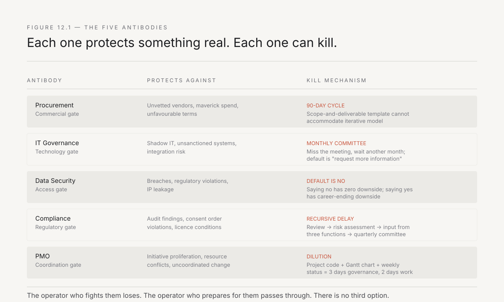
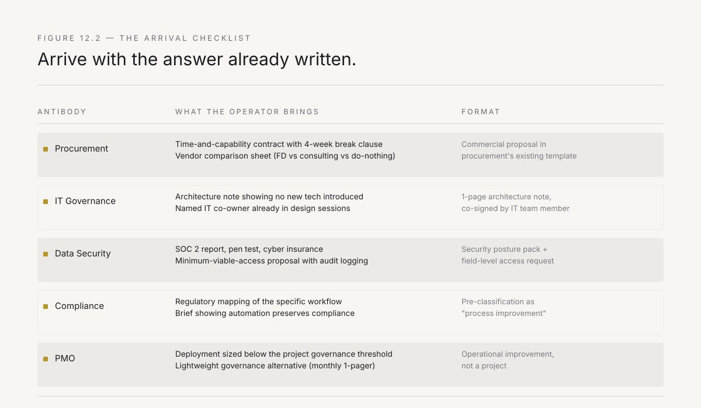
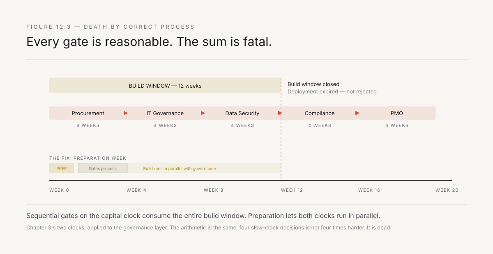

# 12. The antibodies

Chapter 3 named them: the antibodies are polite. They do not shout, they do not block, and they rarely say no. They say *let us run this through the process*, and the process takes ninety days, and by the time the process is done the build clock has moved on and the deployment is dead. Not rejected — just expired, killed by correct procedure applied at a pace that was never designed for what the operator is trying to do.

This is the last chapter of the playbook, and Chapter 3 promised that there would be no clever trick in it. There is not. The antibodies are not irrational. They are not bureaucratic obstacles erected by people who do not understand innovation. They are the immune system of an organisation that has survived for decades by protecting itself against exactly the kind of fast, unsupervised change that the forward-deployed operator introduces. The operator who treats them as obstacles to be circumvented will be destroyed by them. The operator who treats them as legitimate functions to be satisfied — on their terms, not on the operator's schedule — will survive.

This chapter names the five specific antibodies, explains why each exists, shows exactly how each kills a deployment, and describes the preparation that lets a deployment pass through each one without triggering the rejection response.

---

## Why the immune system exists

Before naming the antibodies, earn the right to discuss them by acknowledging what they protect.

A large Indian enterprise — a steel company, a banking group, a conglomerate with forty subsidiaries and two hundred thousand employees — did not get large by being open to rapid, unsupervised change. It got large by being disciplined, controlled, and careful. The procurement process that takes ninety days exists because the last time someone bought software without going through procurement, it was a ₹12 crore contract with a vendor who disappeared after six months. The IT governance review exists because the last time someone deployed a system without IT sign-off, it opened a security vulnerability that took three months to close. The data security policy exists because the last time someone gave an external consultant access to production data, the consultant's laptop was stolen and the company spent a year in regulatory remediation.

Every antibody has a scar behind it. The operator who does not know the scar does not understand the antibody, and the operator who does not understand the antibody cannot survive it.

**The immune system is not the enemy. The immune system is the reason the host is still alive.**

The forward-deployed model's problem is specific: the immune system was calibrated for a different kind of external engagement. It was designed to evaluate vendors who sell products, consultants who sell time, and system integrators who sell projects. It was not designed to evaluate an operator who sits inside the workflow, writes code in production systems, and changes processes in real time. The operator does not fit any of the categories the immune system knows how to process, and when the immune system encounters something it cannot categorise, it does not approve. It waits. And waiting, on the build clock, is death.

---

## Antibody one: procurement

**What it protects against.** Unvetted vendors, unfavourable contract terms, maverick spending, and the specific Indian enterprise risk of related-party transactions that attract regulatory scrutiny.

**How it kills the deployment.** The procurement process is designed for a purchase: a defined scope, a fixed price, a delivery timeline, and a set of acceptance criteria. The forward-deployed model is not a purchase. The scope is deliberately undefined — the operator finds the real problem after arriving. The price is tied to outcomes that cannot be specified in advance. The timeline is iterative, not fixed. The acceptance criteria are *the workflow changed and the number moved*, which is not a line item that procurement's template can accommodate.

The procurement team does its job correctly: it asks for a scope of work, a commercial proposal, a comparison with alternative vendors, and a sign-off chain that runs through the business head, the finance controller, and sometimes the promoter's office. Each step takes two to four weeks. A deployment that needs to start in two weeks and iterate in real time is not something procurement can process at the speed the build clock demands.

**How the operator survives it.** The answer is not to circumvent procurement. The answer is to arrive with a commercial structure that fits procurement's existing categories while preserving the forward-deployed model's flexibility.

The specific structure that works in Indian enterprises: a **time-and-capability contract** rather than a scope-and-deliverable contract. The operator is engaged for a defined period — twelve weeks, typically — with a defined capability (one operator, specified skills, on-site presence) and a defined domain (one workflow, one team, one site). The deliverable is not a system. The deliverable is a measured change in a specified metric. The contract includes a break clause at the end of the first four weeks, so procurement can frame it as a low-commitment trial.

This structure maps to procurement's existing "professional services" category. It has a defined cost, a defined timeline, and a defined engagement model. It does not require procurement to invent a new category. The operator prepares the commercial proposal, the comparison sheet (comparing the forward-deployed model to the alternative of a traditional consulting engagement and to the alternative of doing nothing), and the sign-off package before the first meeting with procurement. The procurement team's job becomes processing a package that already fits their template, not figuring out how to evaluate something they have never seen.

The preparation takes a week. It saves two months.

*Figure 12.1 — Five antibodies, each with a legitimate protective function. The operator who fights them loses. The operator who prepares for them passes through. There is no shortcut — only preparation.*

---

## Antibody two: IT governance

**What it protects against.** Shadow IT, unsanctioned systems, integration risks, and the proliferation of tools that IT cannot support after the builder leaves.

**How it kills the deployment.** IT governance in a large Indian enterprise is typically centralised under a CIO or CTO whose organisation manages a landscape of SAP, Oracle, Salesforce, and a dozen legacy systems that have been running for fifteen years. The governance review asks: What technology stack will you use? How does it integrate with our existing systems? Who supports it after you leave? Does it comply with our security standards? Is the vendor on our empanelled list?

These are legitimate questions. They are also questions that take four to eight weeks to answer through the formal governance process, because the process was designed for system implementations that run for eighteen months, not for deployments that run for twelve weeks.

The specific kill mechanism: the IT governance committee meets monthly. Missing the meeting means waiting another month. The committee's default posture is to request more information, which means waiting two months. By the time the deployment has IT governance approval, the business sponsor has lost patience, the budget cycle has moved on, and the problem has been papered over with a workaround that will last until the next audit.

**How the operator survives it.** Two preparations, both done before the governance request is submitted.

First: **build on the existing stack.** The operator does not bring a platform. The operator writes code that runs on infrastructure IT already manages — the existing cloud tenant, the existing database, the existing integration middleware. The technology review becomes trivial because there is no new technology to review. The operator is writing Python scripts that run on the company's existing Azure subscription, connecting to the company's existing SQL Server, producing outputs that feed into the company's existing SAP instance. IT governance's question — *what technology are you introducing?* — has the answer: *none that you do not already own and support*.

Second: **name the IT co-owner from day one.** The operator identifies the IT team member who will own the system after the operator leaves, and includes that person in every design decision from the first week. When the governance review happens, the IT co-owner is in the room, can answer every technical question, and is already invested in the system's success. The governance committee is not evaluating an external system. It is evaluating a system that their own team member helped build, understands, and has committed to support.

---

## Antibody three: data security

**What it protects against.** Data breaches, regulatory violations (DPDP Act, RBI data localisation, SEBI guidelines), intellectual property leakage, and the reputational risk of a data incident in a company whose brand is older than the internet.

**How it kills the deployment.** The CISO's office — or in smaller organisations, the IT security team — has a checklist. External access to production data requires: a data processing agreement, a security audit of the external party's infrastructure, a classification review of the data to be accessed, a role-based access control plan, and sign-off from the data owner, the CISO, and often the legal team. In regulated industries (banking, insurance, pharmaceuticals), add the compliance team's review.

The forward-deployed operator needs access to production data to do the work. Not a sanitised sample. Not a test environment that was last refreshed six months ago. The actual data, with its actual inconsistencies, its actual volumes, and its actual edge cases — because the deployment is about fixing a process that runs on real data, and you cannot fix what you cannot see.

The kill mechanism is delay compounded by risk aversion. The CISO's default answer to *can an external person access our production data?* is *no*, because saying no has zero downside and saying yes has career-ending downside if something goes wrong. The operator who escalates past the CISO to the business sponsor is using Chapter 10's trust-destroying behaviour — escalating without warning — and will never get data access from that CISO again.

**How the operator survives it.** The preparation is specific and it must be done before the first meeting with the CISO.

**Bring your own security posture.** The operator's firm has a documented security policy, an annual penetration test, a SOC 2 Type II report or its equivalent, and cyber insurance. These are not cheap. They are the cost of doing business in enterprises where data security is non-negotiable. The operator presents these at the first meeting, not as a response to a request, but as a proactive disclosure: *here is our security posture, here is our audit report, here is our insurance. We take this as seriously as you do.*

**Propose the minimum viable access.** Not full production access. Read-only access to the specific tables required, through the company's existing VPN, on devices that comply with the company's endpoint security policy, with audit logging enabled. The operator specifies exactly which data fields are needed, why they are needed, and what the operator will not access. The CISO's question becomes *should we grant this specific, limited, audited access?* rather than *should we give an outsider access to our data?* — and the first question is easier to say yes to.

**Accept the constraints.** If the CISO says the operator cannot have access to a specific field — say, customer Aadhaar numbers — the operator does not argue. The operator redesigns the solution to work without that field. The signal this sends is more valuable than the data: *this person respects our boundaries and works within them*, which is the beginning of trust with the security team.

*Figure 12.2 — What the operator prepares before meeting each antibody. The principle is the same every time: arrive with the answer already written in the format the antibody expects. The work is preparation, not persuasion.*

---

## Antibody four: compliance

**What it protects against.** Regulatory risk, audit findings, and the specific Indian enterprise hazard of a process change that violates a condition in a consent order, a banking licence, or an environmental clearance.

**How it kills the deployment.** The compliance team's mandate is to ensure that every process change is reviewed against the applicable regulatory framework. In a bank, changing a loan approval workflow requires a review against RBI's guidelines on credit risk management. In a pharmaceutical company, changing a batch record process requires a review against GMP regulations. In a listed company, changing a financial reporting workflow requires a review against SEBI's LODR requirements.

The compliance team is not wrong to review. The problem is that the review is triggered by the word *change*, and the forward-deployed operator's entire purpose is change. Every deployment is a process change, and every process change triggers a compliance review that was designed for annual policy updates, not for iterative workflow modifications that happen weekly.

The kill mechanism is recursive delay. The compliance review finds that the change touches a regulated process. The regulated process requires a risk assessment. The risk assessment requires input from the business, IT, and legal. Each input takes two weeks. The consolidated assessment goes to the compliance committee, which meets quarterly. The committee requests clarification. The clarification takes another cycle. The deployment's twelve-week window has closed, and the operator has delivered nothing.

**How the operator survives it.** **Pre-classify the deployment's regulatory exposure.** Before the compliance team hears about the deployment, the operator has already mapped which regulations apply to the workflow being changed, identified which specific clauses are relevant, and prepared a brief that shows exactly how the changed workflow remains compliant.

The key move: frame the deployment as a **process improvement within existing regulatory boundaries**, not as a new process. The dealer reconciliation is not being replaced — it is being automated. The same data, the same approvals, the same outputs, the same audit trail. The only thing that changes is that a human is no longer re-keying data from one system to another. The compliance review for *automating an existing compliant process* is categorically simpler than the review for *introducing a new process*, and the framing is not a trick — it is accurate, because the forward-deployed model changes how work is done, not what work is done.

---

## Antibody five: the PMO

**What it protects against.** Uncoordinated change, resource conflicts, initiative proliferation, and the specific Indian enterprise pattern of a new project launched every quarter by a different vice president, each competing for the same IT resources, the same business team's attention, and the same budget line.

**How it kills the deployment.** The Programme Management Office tracks all change initiatives. Every project gets a project code, a resource allocation, a status report cadence, and a place in the portfolio prioritisation. The PMO's question to the forward-deployed operator is: *where does this fit in the portfolio? What is the priority relative to the fourteen other initiatives currently in flight? Which of those initiatives will be deprioritised to make room for yours?*

These are reasonable questions. They are also questions that the forward-deployed model cannot answer in the PMO's framework, because the PMO's framework assumes a project with a defined scope, a defined team, a defined timeline, and a defined set of dependencies. The forward-deployed deployment is deliberately small, deliberately fast, and deliberately independent of other initiatives — but the PMO has no category for *small, fast, and independent*. It has *project*, *programme*, and *portfolio*, and none of them fit.

The kill mechanism: the PMO assigns the deployment a project code, adds it to the monthly status review, requests a Gantt chart, and allocates a project manager. The project manager requests a weekly status meeting, a risk register, a RAID log, and a change control process. The operator is now spending three days a week on governance and two days a week on the actual work. The deployment is not blocked. It is diluted until it cannot produce results, and then it is cancelled in the next portfolio rationalisation because it has not produced results.

**How the operator survives it.** **Stay below the project threshold.** Every PMO has a threshold — a cost, a duration, or a team size — below which an initiative does not require full project governance. The threshold varies: ₹25 lakh in some organisations, ₹50 lakh in others, three months in some, six months in others. The forward-deployed deployment is designed to stay below this threshold by being small, cheap, and short.

The operator learns the threshold before proposing the deployment. The commercial structure from the procurement section is designed to fit under it. The deployment is framed as an operational improvement, not a project — because it is an operational improvement, and the framing is accurate.

If the deployment exceeds the threshold, the operator proposes a **lightweight governance alternative**: a monthly check-in with the PMO head, a one-page status note rather than a twenty-slide review deck, and a clear commitment to exit criteria that the PMO can track. The goal is to give the PMO visibility without giving it control, because the PMO's value is coordination and its cost is overhead, and the balance must be struck explicitly rather than defaulted to the PMO's standard template.

*Figure 12.3 — The build clock runs out while the capital clock's gates process. A deployment needing sign-off from all five antibodies sequentially is not five times harder than one. It is dead — the same arithmetic as Chapter 3's two clocks, applied to the governance layer.*

---

## The preparation principle

State it plainly, because the temptation to skip it is constant and the consequences of skipping it are terminal.

**The operator's job is not to persuade the antibodies. It is to arrive already carrying the answers, in the format the antibodies expect, at the quality the antibodies require.**

This means the operator spends the first week of a new engagement not building but preparing. The commercial proposal for procurement. The technology architecture note for IT governance. The security posture documentation for the CISO. The regulatory mapping for compliance. The governance alternative for the PMO. Five documents, each written in the language and format of the function it addresses, each anticipating the specific questions that function will ask, each providing the specific evidence that function needs to say yes.

The preparation week is the most counterintuitive investment in the playbook. The operator is a builder. They want to build. The sponsor is impatient. They want results. And the operator is spending the first week writing documents instead of writing code. But the operator who skips the preparation week and starts building will, at week four, encounter the first antibody. The antibody will request documentation that takes two weeks to prepare. During those two weeks, the build stops. At week six, the second antibody arrives. Another two weeks. At week ten, the deployment has produced documentation, not change, and the sponsor has concluded that the forward-deployed model is just consulting with a different name.

The operator who invests the preparation week encounters the same antibodies, hands them the same documentation — pre-prepared, pre-formatted, pre-approved by the relevant internal co-owner — and continues building while the antibodies process. The build clock and the capital clock run in parallel rather than in sequence, and the deployment survives.

The same principle turns up one level down, inside the build itself, which is worth naming because it confirms the principle is not specific to client organisations. Chapter 14's evidenced build describes a rule the team adopted the hard way: no AI agent is dispatched to write code without an approved specification and a mapped surface of exactly what it will touch, agreed before the work starts. That is the preparation principle again, applied to a different antibody — the ambiguity an unprepared request leaves for a fast, literal-minded executor to resolve badly. Arrive with the answer already agreed, or the executor — whether it is a compliance committee or a coding agent — will supply its own.

Chapter 3 said it: there is no clever trick. There is only preparation.

---

## The antibodies that protect versus the antibodies that preserve

One distinction remains, and it is the hardest judgement call in the playbook.

Not every antibody is protecting something real. Some are protecting a process that exists solely because it has always existed — a sign-off that adds no information, a review that checks nothing that the previous review did not already check, a committee that exists because someone's role depends on the committee existing.

The operator must distinguish between these two types, and the distinction matters because the response is different.

**Protective antibodies** — the ones that guard against genuine risks — must be satisfied fully and respectfully. The CISO who insists on a security review is protecting the company. The compliance team that reviews regulatory exposure is doing its job. The operator prepares, cooperates, and earns the right to pass through.

**Preservative antibodies** — the ones that exist to maintain a structure rather than to protect a function — must be navigated differently. The operator cannot fight them directly, because fighting any antibody triggers the full immune response. But the operator can, with the sponsor's support, request an exception to the specific preservative process for the duration of the deployment, with a commitment to a full retrospective at the end. The exception is not a circumvention. It is a negotiated adjustment, agreed by the relevant authority, documented, and time-limited.

The judgement call is hard because the distinction is not always clear, and the consequences of getting it wrong in either direction are severe. Treat a protective antibody as preservative, and the operator creates a genuine risk that damages the deployment and the model's reputation. Treat a preservative antibody as protective, and the operator wastes weeks satisfying a process that adds no value, losing the build clock to governance theatre.

The test: **does the antibody produce information that changes a decision?** If the security review would cause the operator to change the architecture, it is protective. If the security review produces a report that nobody reads and changes nothing, it is preservative. The first must be honoured. The second must be navigated. Both must be respected, because the people operating both believe they are doing important work, and visible disrespect for either triggers the same immune response.

---

## What Part III has established

Five chapters. A complete playbook.

Chapter 8: select the wound that bleeds — five conditions, three wrong picks, the deployment card as a filter. Chapter 9: expand through handover — the J-curve trough, the compounding sequence, the Indian group as expansion terrain. Chapter 10: trust is the binding constraint — three layers, the step function, the chai test, and why speed without trust produces correct and unused systems. Chapter 11: the operator is the scarce resource — the intersection is not produced by any existing career path, five talent sources, a nine-month training cycle, and scaling like a profession. Chapter 12: the antibodies are legitimate — five specific immune responses, each survived through preparation not persuasion, and the hardest judgement call is distinguishing the antibodies that protect from the ones that preserve.

The playbook is complete. What remains is the question the playbook raises: if this model works — if forward deployment is the intervention that closes the adoption gap — then what does the industry that delivers it look like? Not consulting, not staff augmentation, not managed services. Something new, and something whose economics, talent model, and institutional form do not yet exist.

---

*Part III ends here. The playbook is complete: pick the wound, expand through handover, earn the trust, hire the operator, survive the antibodies. Part IV asks what happens when the playbook works — what the industry that deploys it looks like, what institutional forms carry it, what the country-sized opportunity means, and what you build from here. Chapter 13 starts with the distinction that makes the rest possible: the new consulting is not consulting.*
