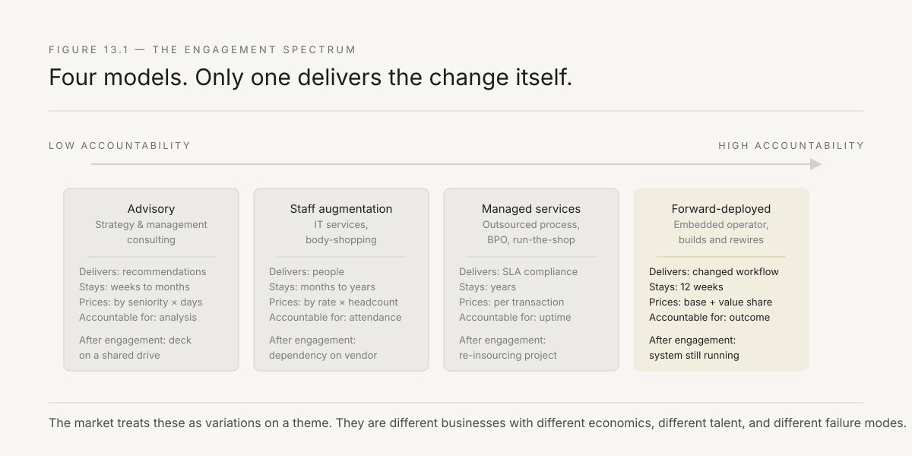
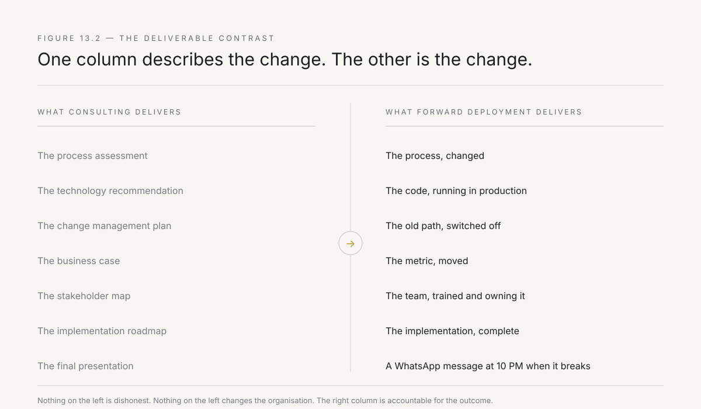
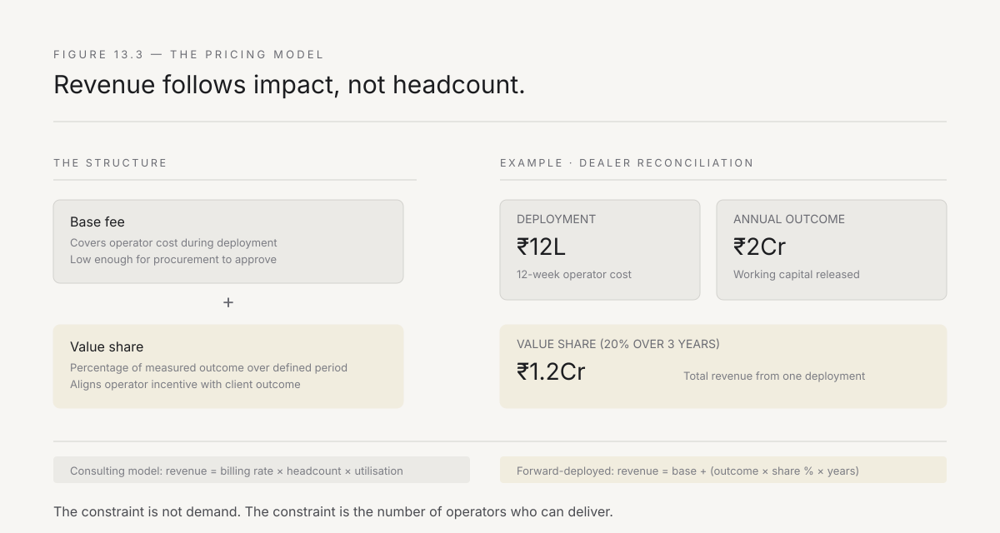

# 13. The new consulting is not consulting

The playbook is written. Select the wound, land and expand, earn the trust, hire the operator, survive the antibodies. Parts I through III argued that the forward-deployed model works — that it closes the adoption gap where transformation offices, consulting engagements, and technology implementations have failed, and that it does so because it puts the right person at the right point with the right tools and the right economics.

Part IV asks a different question: what does the world look like if the model succeeds?

This chapter starts with the comparison that everyone reaches for and that is precisely wrong. The forward-deployed model looks like consulting. It puts people inside client organisations to solve problems. It charges for their time. It produces outcomes that the client could not produce alone. And the comparison is wrong — not in degree but in kind — because the differences are not superficial variations on a shared model. They are structural, and they produce a business that behaves differently in every dimension that matters: what it delivers, how it prices, whom it hires, how it scales, and what happens when the engagement ends.

Getting this distinction right matters because getting it wrong is the fastest way to build a forward-deployed firm that is actually a consulting firm with engineering talent — which is a category that already exists, already fails at transformation, and already charges too much for outcomes that do not stick.

---

## The five structural differences

State them precisely, because each one is a design decision that shapes the firm.

**Difference one: the deliverable is a changed system, not a recommendation.** A consulting engagement delivers analysis, insight, and advice. The client receives a deck, a report, a set of recommendations, and — in the best case — a roadmap for implementation. Implementation is a separate engagement, often by a different firm, sometimes years later, frequently never.

A forward-deployed engagement delivers a working change. The workflow is different at the end than it was at the beginning. The data flows through a new path. The old process is switched off. The metric moves. The deliverable is not a document that describes what should change — it is the change itself, running in production, used by the people whose work it affects.

This is not a philosophical distinction. It has contractual, financial, and reputational consequences. A consulting firm is accountable for the quality of its advice. A forward-deployed firm is accountable for the quality of its outcome. A consulting firm can deliver an excellent recommendation that is never implemented and call the engagement a success. A forward-deployed firm that delivers an excellent system that nobody uses has failed, visibly, and the failure is its own — not the client's failure to implement.

**Difference two: pricing is tied to outcomes, not to time.** Consulting is sold by the hour, the day, or the project — and the price is a function of the seniority of the people involved, not of the value they create. A partner's day costs more than an associate's day regardless of whether the partner's day produces more value. The incentive structure is clear: the consulting firm benefits from longer engagements, larger teams, and more senior staffing, none of which are aligned with the client's interest in getting the problem solved as quickly and cheaply as possible.

The forward-deployed model does not eliminate time-based pricing — the operator's cost is real and must be recovered — but it shifts the anchor from *how many people for how long* to *what metric will move and by how much*. The deployment at the Mumbai branch costs X, and the expected outcome is that dealer reconciliation time drops from four days to six hours, releasing working capital of Y. The client evaluates X against Y, and the decision is an investment decision, not a procurement decision.

The pricing structure that works in Indian enterprises: a **base fee** that covers the operator's cost during the deployment period, set low enough that procurement can approve it without executive escalation, plus a **value share** tied to the measured outcome over a defined period after the deployment completes. The base fee makes the engagement affordable. The value share makes the operator's incentives identical to the client's. The combination makes the forward-deployed firm structurally different from a consulting firm, because a consulting firm that ties its revenue to outcomes is making a bet that its own execution model is not designed to win.

*Figure 13.1 — Four models, each progressively more embedded. Advisory sits at one end — high insight, low accountability. Forward deployment sits at the other — moderate insight, total accountability. The market treats them as variations. They are different businesses.*

**Difference three: the relationship survives the engagement.** A consulting engagement ends. The team leaves. The relationship continues through the partner, who maintains it for the purpose of selling the next engagement. The knowledge about the client's actual operations — the knowledge the team built during the engagement — leaves with the team and is partially captured in a deliverable that sits on a shared drive.

A forward-deployed engagement ends differently. The system the operator built is still running. The internal team that the operator trained is still using it. The data is still flowing through the path the operator created. The operator's phone number is still in someone's WhatsApp contacts, and when the system breaks at 10 PM on a Friday — and it will — that someone calls.

This creates a relationship that is structurally different from the consulting relationship. It is not maintained by a partner for commercial purposes. It is maintained by the system itself — by the ongoing dependency between the client's workflow and the infrastructure the operator built. The relationship is not *we hired them once and might again*. It is *their work is inside our operations and we need it to keep working*.

In an Indian enterprise, where relationships are personal and long-term, this structural dependency produces something that no amount of client management can replicate: genuine mutual investment. The operator cares whether the system works because the operator's reputation — and the operator's next deployment — depends on it. The client cares about the relationship because the client's process depends on the system. The alignment is not manufactured by incentive design. It is a natural consequence of the model.

**Difference four: the talent model is inverted.** Consulting firms hire for room-reading ability and treat technical skills as trainable. The junior consultant learns to build decks, structure analyses, and manage stakeholders. Technical depth is a specialisation, not a requirement.

The forward-deployed firm hires for the intersection of build capability and room-reading ability — Chapter 11's binding constraint — and cannot compromise on either. The operator must write production code and navigate the organisation. The talent pool is smaller, the training cycle is longer, and the retention imperative is higher.

This inversion has a consequence that shapes the entire firm: **the forward-deployed firm cannot scale by hiring.** It can only scale by training, and training requires time, mentorship, and the disciplined acceptance that growth is bounded by the operator pipeline. A consulting firm that wins a large engagement hires twenty associates in a month. A forward-deployed firm that wins the same engagement cannot staff it, because the operators who could deliver it do not exist and cannot be produced in a month.

This is not a weakness. It is a design constraint that, accepted rather than fought, produces a firm that delivers reliably rather than a firm that sells beyond its capacity and then scrambles to staff. The forward-deployed firm that says *we can start in three months, because that is when our next operator completes training* is making a statement that no consulting firm will make, and it is a statement that — in an Indian enterprise that has learned to distrust firms that overpromise — builds more trust than any pitch deck.

**Difference five: the unit economics are different.** A consulting firm's gross margin is the difference between the billing rate and the cost of the consultant, multiplied by utilisation. The model is linear: revenue grows with headcount, margin is maintained by leverage (junior consultants doing senior-priced work), and profitability depends on keeping utilisation above eighty percent.

The forward-deployed firm's economics are different because the value share changes the revenue model. A deployment that produces ₹2 crore in annual working capital savings, priced at a twenty percent value share over three years, generates ₹1.2 crore in revenue from a twelve-week deployment by a single operator. The operator's loaded cost for twelve weeks is approximately ₹12 lakh. The gross margin is not a function of the billing rate. It is a function of the value created.

This changes the firm's relationship to scale. A consulting firm needs volume because its margin per engagement is moderate and fixed. A forward-deployed firm needs fewer, higher-impact deployments because its margin per engagement is variable and potentially large. The constraint is not demand — there are more bleeding wounds in Indian enterprises than any firm can address. The constraint is supply — the number of operators who can deliver.

*Figure 13.2 — Two columns, one engagement. The consulting firm delivers the left column. The forward-deployed firm delivers the right column. Both are real work. One changes the organisation. The other describes what the change should be.*

---

## Why the comparison persists

If the differences are structural, why does everyone — including potential clients, potential employees, and potential investors — compare the forward-deployed model to consulting?

Three reasons, each worth naming because each produces a specific mistake.

**Surface similarity.** Both models put people inside client organisations. Both charge for professional services. Both produce outcomes that the client values. At the pitch level, the description sounds the same: *we send smart people to solve your problems.* The difference — that one sends people to recommend solutions and the other sends people to build them — is invisible until the engagement starts, and by then the client's expectations have been set by the comparison.

The mistake this produces: the client expects a consulting experience — weekly status reviews, steering committees, executive-level relationship management, a polished final presentation — and receives an engineering experience, which is a person in the plant writing code. The gap between expectation and experience creates friction that the operator must manage, and the management burden falls entirely on the operator because the client's reference frame is the only one they have.

**Category capture.** The professional services market has established categories: strategy consulting, management consulting, IT consulting, staff augmentation, managed services. Investors, analysts, and clients think in categories, and the forward-deployed model does not fit any existing one. It gets shoved into the nearest category — usually IT consulting or managed services — and inherits that category's expectations about pricing, margins, talent, and growth rates.

The mistake this produces: the forward-deployed firm benchmarks itself against consulting firm metrics — utilisation rates, billing multiples, revenue per partner — and makes decisions to optimise those metrics. It hires faster than its training model supports, to improve utilisation. It raises billing rates to improve revenue per head. It adds leverage by putting junior operators on engagements they are not ready for. Each optimisation makes the firm more like a consulting firm and less like a forward-deployed firm, and within three years the firm has become the thing it was designed to replace.

**Founder identity.** Many forward-deployed firms are started by people who came from consulting — who saw the gap between recommendation and implementation and decided to close it. These founders carry consulting's DNA: the relationship-driven sales model, the partner-led engagement model, the leverage-based economics, and the instinct to grow by hiring. The DNA expresses itself in decisions that feel natural and are structurally wrong: hiring relationship managers instead of operators, building a sales function instead of a delivery function, measuring pipeline instead of completions.

---

## What the market actually looks like

The forward-deployed market in India is not a segment of the consulting market. It is a segment of the enterprise transformation market — the same ₹2.4 lakh crore market that Chapter 2 described as mostly failing. The addressable portion is the subset of that market where the problem can be solved by putting an operator at the point of the work: a workflow that bleeds, an owner who wants the fix, a system of record that can be changed.

The market has three tiers, and each tier has different economics:

**Tier one: large industrial groups.** The Tatas, the Birlas, the Adanis, the Mahindras, the Reliance subsidiaries. These groups have dozens of operating companies, each with hundreds of workflows that could be forward-deployed. A single group can sustain ten to twenty deployments per year for a decade. The economics are favourable because the value per deployment is high (each wound bleeds lakhs or crores per year), the expansion terrain is vast (Chapter 9's compounding sequence runs across dozens of subsidiaries), and the trust, once earned with the group's leadership, opens doors that would take years to open individually.

The challenge: these groups already have relationships with every major consulting firm, every major IT services firm, and every major technology vendor. The forward-deployed firm must differentiate not by pitch but by outcome — which means the first deployment must succeed visibly, which means Chapter 8's selection criteria become existential.

**Tier two: mid-market enterprises.** Companies with ₹500 crore to ₹5,000 crore in revenue, typically family-owned or first-generation promoter-led, with one to five major operating sites. These companies have the same bleeding wounds as the large groups but fewer antibodies, faster decision-making, and a promoter who is often directly involved in operational decisions.

The economics: lower value per deployment (the wounds are smaller), but faster sales cycles, shorter deployment timelines, and a promoter who can say yes without a procurement review. The expansion terrain is limited (fewer subsidiaries, fewer geographies), so the compounding sequence from Chapter 9 is shorter. The forward-deployed firm compensates with volume — more clients, smaller deployments, faster turns.

**Tier three: public sector and regulated industries.** Banks, insurance companies, government enterprises, defence contractors. These organisations have the largest wounds and the strongest antibodies. Chapter 12's preparation principle is not optional — it is existential. The deployments are slower, the compliance burden is higher, and the trust-building period is longer. But the value per deployment is enormous, the switching costs are high (once the operator's work is embedded in a regulated process, replacing it requires another regulatory review), and the relationship, once established, is measured in decades.

*Figure 13.3 — The base-plus-value-share model. The base covers the operator's cost during deployment. The value share aligns the firm's incentive with the client's outcome. The total revenue is a function of impact, not headcount.*

---

## The discipline of not becoming consulting

The forward-deployed firm faces a constant gravitational pull toward consulting, because consulting is easier to sell, easier to staff, easier to scale, and easier to explain to investors. The pull expresses itself in specific temptations:

The temptation to **add an advisory layer.** Clients ask for strategy work — *before you fix the workflow, help us decide which workflows to fix.* The forward-deployed firm that says yes has added a revenue stream that is pure consulting, that requires different talent, that dilutes the firm's identity, and that creates an internal incentive to extend the advisory phase (which is high-margin and low-risk) at the expense of the deployment phase (which is lower-margin and high-risk).

The temptation to **hire for scale.** When demand exceeds supply — and it will, because Chapter 11's operator pipeline is the binding constraint — the temptation is to lower the hiring bar, compress the training cycle, and deploy operators who are not ready. The short-term gain is revenue. The long-term cost is trust destruction (Chapter 10) and reputation damage that takes years to repair.

The temptation to **optimise for utilisation.** Consulting firms live and die by utilisation — the percentage of billable hours out of total available hours. A forward-deployed firm that optimises for utilisation deploys operators on engagements that are available rather than engagements that are right, accepts clients whose problems do not fit the model, and burns operators on deployments that cannot succeed. The right metric is not utilisation. It is **completion rate** — the percentage of deployments that produce the intended outcome — because completion rate drives the value share, the referral rate, and the long-term economics.

The temptation to **sell before delivering.** Consulting firms have sales teams, business development functions, and partner-led relationships that generate pipeline. The forward-deployed firm's sales function is Chapter 9's handover mechanism — the deployment that works, producing the referral that opens the next door. A forward-deployed firm that builds a sales team before it has a track record is selling promises, and promises without evidence are consulting.

The discipline is to resist every one of these temptations, knowing that each one will feel rational, each one will be advocated by smart people, and each one will, if accepted, turn the firm into the thing it was designed to replace. The forward-deployed firm is not consulting. The moment it starts behaving like consulting, it has already failed.

---

## The Indian landscape and why the distinction matters here

The distinction between forward deployment and consulting is not academic. In India, it is the difference between building in a market that is ready and building in a market that has been trained to expect the wrong thing.

**The Big Four's India presence.** Deloitte, PwC, EY, and KPMG collectively employ over three hundred thousand people in India. Their consulting practices serve every major enterprise. They are trusted, established, and — for the kind of transformation work that the forward-deployed model targets — structurally incapable of delivering the outcome. Not because they lack talent. Because their engagement model separates the person who understands the problem (the partner and the senior manager) from the person who could build the fix (the associate who writes the analysis, not the code). The recommendation is excellent. The implementation is someone else's problem. The forward-deployed firm enters this market not as a competitor to the Big Four but as the answer to the question the Big Four's clients have been asking for fifteen years: *your analysis is always right — why does nothing change?*

**The IT services firms' transformation practices.** Infosys, TCS, Wipro, and HCL have all built "transformation" or "digital" practices. These practices combine consulting-style advisory with technology implementation, and they look, on paper, like the forward-deployed model. The difference is in the talent model and the accountability structure. The IT services transformation practice staffs with a consulting lead (room-reading, no build capability) and a delivery team (build capability, no room-reading). The two halves communicate through documents — requirements, specifications, test plans — and the translation loss between the room-reader and the builder is where the adoption gap lives. The forward-deployed operator eliminates the translation loss by being both halves in one person.

**The startup ecosystem.** India's enterprise SaaS ecosystem — Zoho, Freshworks, Darwinbox, and a generation of vertical SaaS companies — has taught Indian enterprises that technology can be delivered differently. Faster, cheaper, more responsive. But the SaaS model is a product model, not a deployment model. The product is the same for every customer. The deployment — the work of fitting the product into the customer's actual workflow — is minimised, not maximised, because deployment is a cost to the SaaS company, not a revenue source. The forward-deployed model inverts this: the deployment is the product, and the technology is the tool the deployment uses.

Understanding these three incumbent categories is essential because every potential client, every potential employee, and every potential investor will map the forward-deployed firm onto one of them. The firm must be able to articulate, in one sentence, why it is none of them: *we are not the people who tell you what to change — we are the people who change it, and we stay until the number moves.*

---

## What "not consulting" means for the founder

One implication remains, and it is personal.

The founder of a forward-deployed firm — the person reading this book, possibly — must decide whether they are building a consulting firm or something else. The decision is not made once, in a pitch deck. It is made every week, in the small choices that accumulate into identity.

When the large client asks for a strategy phase before the deployment, the founder decides. When the investor asks why the firm's growth rate is slower than a consulting firm's, the founder decides. When the best candidate — brilliant room-reader, zero build capability — applies, the founder decides. When the deployment in Jamshedpur is going slowly and the operator could be redeployed to a new client with a bigger cheque, the founder decides.

Each decision has a right answer that is hard and a wrong answer that is easy, and the wrong answer always looks like growth. More services, more clients, more revenue, more employees. The right answer looks like discipline. Fewer services, fewer clients, less revenue, fewer employees — but a higher completion rate, a stronger reputation, a deeper trust, and a model that compounds rather than dilutes.

**The forward-deployed firm that succeeds is the one whose founder can say no to consulting revenue every week for five years.**

That is the discipline, and it is harder than it sounds, because the person who starts this firm is almost certainly someone who came from consulting, who knows how to sell consulting, who has relationships that would buy consulting, and who must resist the gravitational pull of the thing they know how to do in order to build the thing that does not yet exist.

---

*Next: what actually happens between a person and the machine. Not the doctrine — the mechanics, and the evidence. Chapter 14 walks through a real, evidenced build — anonymised, but reconstructed from its own commit history and internal postmortems — to show exactly what compresses under AI assistance and what does not, including the sharpest failure this book has on record: a system that passed every automated check and was still badly wrong.*
