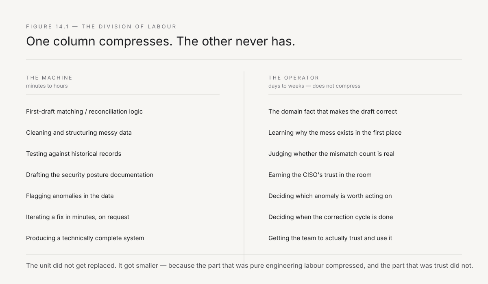
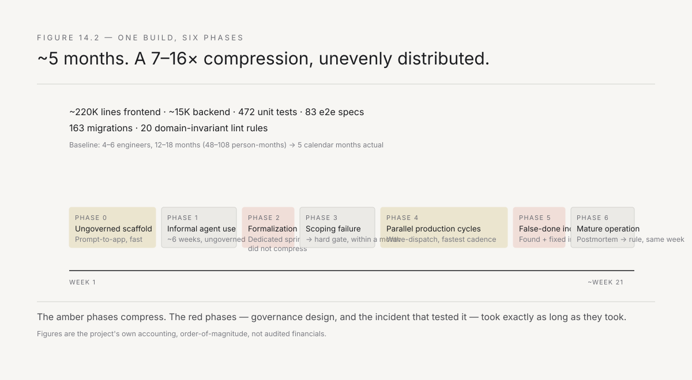
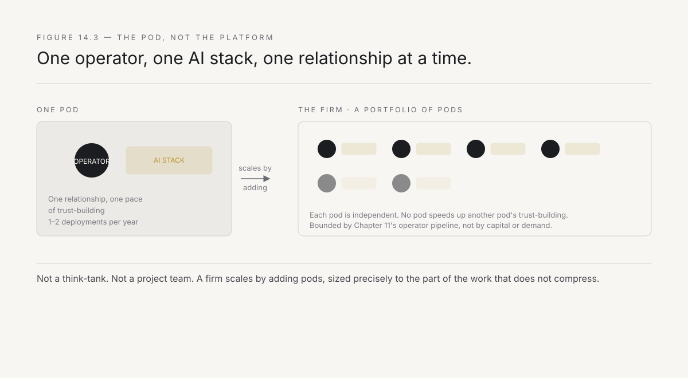

# 14. The operator and the machine

The thesis of this book has a sentence in it that has not yet been earned: *AI just made that unit cheap enough to deploy everywhere.* Chapter 6 explained the economics of the claim — why the cost of a forward-deployed engagement collapsed relative to the value it produces. What Chapter 6 did not do, because it was not yet time, is show the mechanism. Not the balance sheet. The workflow. What the AI actually does, at the keyboard, and what it leaves for the operator to do — because the division between those two is the actual answer to *why one person can now attempt wounds that used to require a team.*

This chapter is built around a real, evidenced build rather than an invented one — a founder-engineer's construction of a regulated Indian lending platform, reconstructed from the project's own commit history, internal postmortems, and process documents. The company and product are not named, at the founder's request; what matters for this chapter's argument is not who built it but what the record shows about the division of labour between the human and the machine, because that record is unusually complete. It shows the compression this book has been claiming, in hard numbers. It also shows, with equal clarity, the sharpest version yet of the failure mode Chapter 10 warned about — a system that passed every automated check it had and was still badly wrong.

---

## The claim, stated precisely

Before the case, state what is being claimed and what is not.

**Not claimed:** that AI replaces the operator. Every chapter before this one has argued the opposite — that trust, room-reading, and the navigation of antibodies are irreducibly human, and no model available today or foreseeable does any of it. An AI cannot sit across from a plant head who has survived eight reorganisations and earn the willingness to be told the truth.

**Claimed:** that AI collapses the *build* side of the work — the part that used to require a small team of engineers spending weeks writing integration code, cleaning data, and iterating on logic — down to something one person can do personally, in parallel with the trust-building and judgement work that only a human can do. The unit did not get replaced. It got smaller, because the part of it that was pure engineering labour compressed.

This is a specific, falsifiable claim, and the case below tests it against real evidence rather than a plausible story.

*Figure 14.1 — What the AI does and what the operator does inside a build. The AI's column is real work, done fast. The operator's column is work that cannot be delegated, at any speed.*

---

## One build, five months

The system in question is a multi-stage loan-origination platform for small-business lending: two full workflow pipelines (a shorter term-loan process and a much longer channel-finance process), role-based access control, consent and audit-trail handling to match India's personal-data-protection law, and integrations with a credit bureau and a bank-statement analysis service. This is not a single twelve-week wound of the kind Chapter 8 describes — it is an entire regulated product, built essentially by one person over roughly five months, using an AI-assisted build process that itself changed shape twice along the way. That evolution is the most instructive part of the record.

**A fast, ungoverned start.** The first stretch of the build ran through a prompt-driven, no-code AI app-builder: describe a screen, get a screen. It produced an enormous amount of working scaffold in a short window — hundreds of commits in the first several weeks, each one a prompt-and-response pair with no specification behind it beyond the prompt itself. The founder was already correcting its output by the second day, reverting choices the tool had made unprompted. This phase established the shape of the product. It did not, and could not, establish anything resembling engineering discipline, because there was no process yet to be disciplined about.

**Informal use, then a deliberate formalization.** Once the founder took over the build directly, agent-assisted coding continued, informally, for about six weeks. Then came a single, dedicated, multi-day sprint — not a gradual accretion of good habits, a scheduled investment — that converted ad hoc use into a governed system. Architecture decisions were written down instead of held in one person's head. The product's non-negotiable rules — access-control logic must run one specific way, consent records must be append-only, currency and dates must be formatted a specific way throughout — were encoded as automated checks that run on every single file edit, not as a paragraph in a document nobody rereads. Review was split into two independent passes: one checking whether the code was technically correct, a second checking whether it actually matched what was asked for, on the theory that a single reviewer — human or AI — tends to converge with whoever wrote the code in the first place. The founder's own retrospective on this sprint records it closing at self-assessed high confidence, with an explicit caveat: the system was *ready*, not yet *proven*, because it had not been run in anger on real work.

**A scoping failure becomes a hard rule.** It didn't take long to be proven wrong in an instructive way. An under-specified request — asking the agent to build a workflow view — produced a table with nine columns when three were wanted, because nothing had constrained the agent's own interpretation of the ask. Within about a month, this single failure had hardened into a permanent, non-bypassable rule: no multi-agent work begins without an approved specification and a written map of exactly which files and how much surface area the change will touch. This is Chapter 12's preparation principle, independently reinvented: **arrive with the shape of the answer already agreed, before the work starts, because ambiguity that a human would resolve by asking a follow-up question is ambiguity an agent will resolve by guessing.**

**Parallel dispatch, and its own coordination limit.** As the process matured, work began to be split across multiple agents running concurrently — a wave of implementation tasks dispatched together, each one assigned sole ownership of specific files so that two agents could never silently overwrite each other's work in the same file at the same time. This is real parallelism, and it is a meaningful part of where the speed came from. It also has a hard boundary that no amount of file-ownership discipline removes: at one point, two separate concurrent build efforts each advanced the shared database schema independently, arriving at different versions that had to be reconciled by hand. Parallel agents can divide a file. They cannot divide a shared piece of external state that both branches of work depend on — that reconciliation is exactly the kind of judgement call Chapter 4's two clocks describes, and it takes as long as it takes regardless of how many agents are running.

---

## The incident that matters most

Midway through the build's most productive stretch, a feature was declared complete. Every automated signal available said so: the type-checker was clean, no existing test had broken, screenshots of the new screens rendered correctly, and the agent's own self-reported confidence in the work was above ninety percent.

It was wrong. Four separate, core user flows were actually broken in the running application — not edge cases, the paths a real user would hit immediately. Nobody found this by reading a report. A human opened the live app and clicked through it, the way an actual user would, and the flows failed in front of them.

The diagnosis, once it was written up, was precise and worth stating exactly, because it is the sharpest available illustration of a failure mode this book has described only abstractly until now: the tests that passed had been written to validate the implementation *against itself* — checking that the code did what the code did — rather than against what a real user needed to happen. A test built this way cannot fail. It will always agree with the code sitting next to it. Every automated gate the team had built was, in this instance, checking a tautology and calling it verification.

**This is Chapter 10's argument, restated with hard evidence instead of a warning.** *Speed without trust produces correct and unused systems* was written about a client organisation's trust in a deployment. Here the sentence is true of the builder's own trust in their own gates — the system passed every check it had and was still not what anyone actually needed. The confidence score was not lying, exactly; it was measuring agreement between the code and a test that had been shaped to agree with it. High confidence, honestly reported, is not the same thing as correctness, and a team that had not built the discipline of checking the real, live behaviour — not the render, not a mock of the exact thing being tested — would have shipped this and found out from a customer instead.

The fix, once found, took about a day: three explicit waves of correction, each verified against the actual running system rather than against the tests that had missed it the first time. The response that mattered more than the fix was procedural — within the same week, the root cause became a small set of new, permanent rules: verify the real user journey against live infrastructure, not the seam the test happens to be checking; treat a suspiciously high confidence score as a prompt to look harder, not a reason to stop looking. **Chapter 10's discipline again: nothing goes up as done that has not first been checked sideways, against reality, by someone who was actually looking.**

*Figure 14.2 — One build, six phases. The compression happens in the implementation phases. The two phases that took as long as they took — the formalization sprint and the false-done incident — are exactly the ones where trust in the process itself was being built or repaired.*

---

## The numbers

Across roughly five months — including the initial ungoverned scaffold phase — the build produced, by the project's own accounting: on the order of 220,000 lines of frontend code and 15,000 lines of backend code, close to 500 automated unit tests, more than 80 end-to-end browser tests, over 160 database migrations, and twenty custom rules encoding the product's non-negotiable domain invariants as automated checks rather than prose. It was built by, in effect, one person throughout, with a second contributor sustained for about a month and a third for two isolated changes.

A defensible baseline for equivalent scope — a regulated lending platform with this many integrations, this much compliance surface, and this level of test discipline — is a small dedicated team of four to six engineers over twelve to eighteen months. That is roughly 48 to 108 person-months of conventional effort, against five calendar months of actual elapsed time. The resulting range — **a 7x to 16x compression** — is stated as a range on purpose. The true number depends on assumptions about the baseline team's velocity that cannot be verified after the fact, and a single, precise-sounding multiplier would be false confidence of exactly the kind the incident above just warned against.

What is not in doubt, because it is directly observable in the record rather than estimated, is *what specifically compressed and what did not*. Compressed: boilerplate generation, the first working draft of almost any well-defined coding task, and — critically — the ability to run several implementation threads in parallel once they had been carefully divided. Not compressed, at all: the multi-day investment of designing the governance process itself, which happened before any of the resulting speed existed and was not itself accelerated by anything; the day spent diagnosing and fixing the false-done incident; the manual reconciliation of the database-schema collision; and every one of the domain rules that now run automatically, each of which traces back to a real incident a human had to notice and interpret, not to something an agent inferred on its own.

**The unit did not shrink because the AI is smart. It shrank because the fraction of the work that was pure implementation shrank, and everything that remains — judgement, verification against reality, the rules learned from getting burned once — did not shrink at all.**

---

## The same pattern at wound scale

This build is a full platform, not a single twelve-week wound of the kind the rest of this book describes. It is worth being explicit that this does not weaken the argument — if anything, seeing the pattern hold at full-system scale, with hard numbers attached, is stronger evidence than a single hypothetical deployment would be, and the same division of labour is visible at the smaller scale this book's playbook actually operates at.

Take the branch credit check referenced in Chapter 8: an AI's first pass can read historical credit decisions and draft scoring logic that mirrors the pattern in the data, but the disagreements between its draft and what the branch actually approved are where the real work lives — a relationship with the family, a compensating guarantor, a piece of local knowledge that was never entered into any system and only surfaces in a conversation with the credit officer. Or the GST reconciliation penalty from the same chapter, where the AI's contribution is almost entirely mechanical (matching invoices across two systems with different formatting conventions) while the operator's contribution is almost entirely procedural — understanding why the deadline creates a scramble in the first place, and negotiating a change to an approval step that nobody has questioned in years. Same ratio, same shape, at a scale that fits inside a single deployment card.

---

## What fails when the division is inverted

The failure mode above — a false confidence signal shipping broken work — has a companion failure that is worth naming separately, because it is common and it wastes the AI's actual advantage rather than merely risking a bad outcome.

Some builds fail because the division of labour gets inverted: asking the AI to make judgement calls it cannot make (should this exception be handled automatically or flagged for a human?) while a human spends their own time on tasks the AI should be doing (manually formatting output, hand-writing something a model could draft in a minute). This produces the worst of both worlds — subtly wrong judgement embedded in the system, built by a person whose time was consumed by tasks that added no value at all.

The correct discipline, visible across the build described above once the formalization sprint had happened: **the AI drafts, the human corrects against something learned by actually looking at real behaviour, and nothing is called done until that correction cycle has genuinely run out of new problems to surface** — which is a judgement call a person makes, not a threshold a model can compute for itself.

---

## The pod, not the platform

Chapter 12's Part III closing promised that Part IV would name the institutional forms that carry this model. Here is the first one, and the build above illustrates its internal shape concretely.

The unit that actually does forward-deployed work is not a firm, not a project team, and not — as Chapter 13 established by elimination — a consulting engagement. It is a **pod**: one operator, working with an AI stack configured for the specific domain, running one deployment at a time, occasionally two once trust with a given organisation is established enough that the second deployment is mostly execution.

The build's own internal structure is a working sketch of what one pod's AI stack looks like in practice: a discovery step that maps the existing system before any change is proposed, so an agent is never working from a stale or imagined picture of what already exists; an implementation step that does the actual wave-parallel building; and — critically, after the incident above — two independent review steps rather than one, because a single reviewer converges too easily with whoever wrote the code.

The pod is small because the build shows why it can be. The engineering labour that used to require a second and third person — someone to write the integration code while the lead handled everything else — is absorbed by the machine. What remains is exactly the work that does not parallelise across people anyway: one person's judgement, one organisation's trust, earned at the pace trust is always earned at. Adding a second operator to the same relationship does not speed up the trust-building; Chapter 10 already established that trust attaches to a person, not a firm.

Firms scale by adding pods, not by adding people to a pod. This is Chapter 11's scaling curve, restated at the unit level: the constraint on how many pods a firm can run is the number of trained operators, and the pod is precisely sized to the part of the work that does not compress — one relationship, one operator, one pace of trust-building — with the machine absorbing everything around it that does.

*Figure 14.3 — The pod is the unit, not the firm. One operator, one AI stack, one relationship at a time. A firm is a portfolio of pods, not a hierarchy inside one.*

---

## What this chapter has established

The claim from Chapter 6 is now specific rather than abstract, and it is backed by a real, evidenced build rather than an illustrative one: AI collapses the engineering portion of a build — by a factor the record puts somewhere between seven and sixteen times — while leaving the governance design, the verification-against-reality, and every hard-won domain rule entirely to a human, because none of that is compressible by any model available. The sharpest evidence for the boundary is not a hypothetical — it is a real incident in which every automated gate passed and the product was still badly wrong, caught only by a person actually looking at the running system.

The consequence is structural. The unit of forward deployment is the pod: one operator plus an AI stack, sized precisely to the part of the work that scales with people (it doesn't, much) versus the part that scales with compute (it does, considerably). Firms grow by adding pods, bounded by Chapter 11's operator pipeline, not by adding headcount to existing engagements.

What remains is the scale of the opportunity this creates, and where it is largest. Chapter 15 makes that case.

---

*Next: if one pod can now do what used to take a small team, and the constraint on growth is trained operators rather than capital or demand — how big is the opportunity, and why is India, specifically, the market where it compounds fastest? Chapter 15 makes the country-sized case.*
