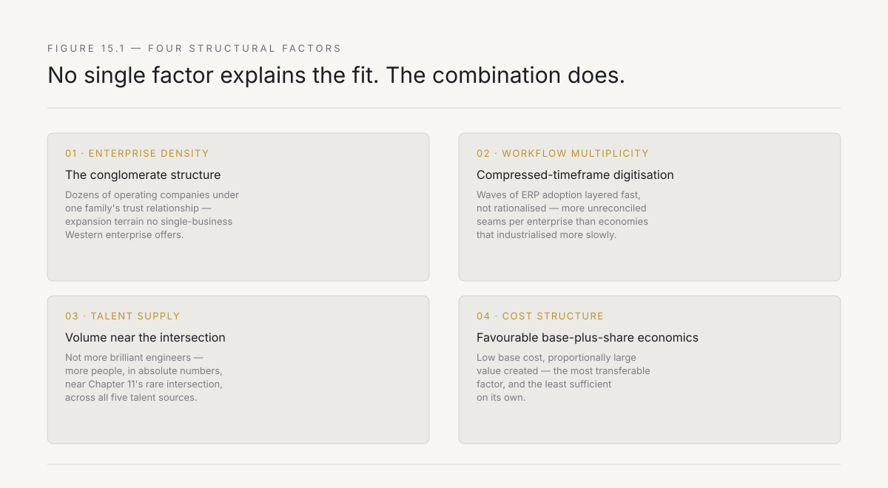
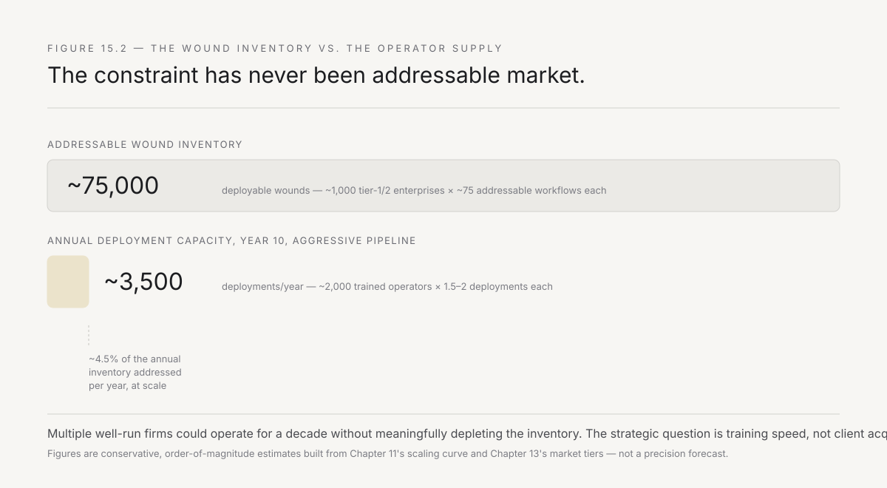
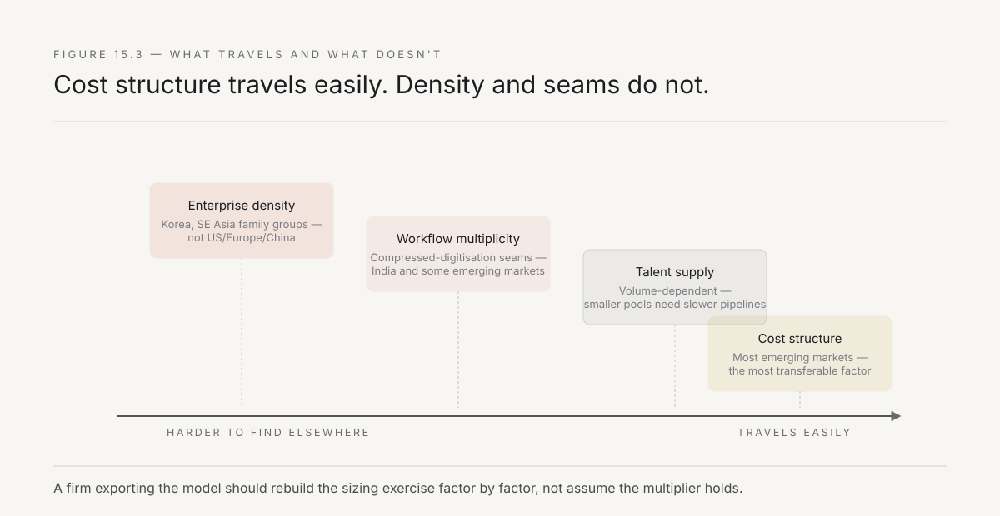

# 15. The country-sized opportunity

Every chapter so far has used India as the setting — the plant in Rourkela, the dealer network, the promoter-led mid-market firm, the Big Four's presence, the group structure that makes expansion efficient. This chapter asks the question directly: why India, specifically, rather than any other large economy with old enterprises and unsolved workflow problems? And having answered it, what is the actual size of the opportunity, stated honestly rather than as a pitch-deck number?

The answer is structural, not sentimental, and Chapter 7 said as much in passing. This chapter earns that claim by naming the four structural factors precisely, sizing the addressable opportunity against the operator constraint from Chapter 11, and being honest about where the model would need to adapt if it moved to a market that lacks India's specific structure.

---

## Four structural factors, not one

State them as a system, because no single factor explains the fit — it is the combination that makes India unusually fertile ground.

**Enterprise density: the conglomerate structure.** Chapter 6 named it — a large Indian industrial group is forty thousand employees, a hundred business units, plants across six states, a dealer network in three hundred towns, a thousand distinct workflows. This is not incidental to Indian business — it is the dominant organisational form at the top of the economy. The Tatas, the Birlas, the Adanis, the Mahindras, the Reliance group, and dozens of regional conglomerates below them each contain what amounts to dozens of separate enterprises under one ownership structure, sharing capital, sometimes sharing back-office functions, and — critically for Chapter 9's compounding sequence — sharing the trust relationship an operator builds with the family or the group leadership.

Compare this to the American or European enterprise landscape, which is dominated by single-business public companies with professional management and a board structure that treats each acquisition as a discrete, arm's-length asset. A forward-deployed firm that earns trust with one American company has earned trust with one company. A forward-deployed firm that earns trust with one Indian promoter family has, in practice, earned a hearing across every operating company the family controls — which is why Chapter 9 could describe the group as expansion terrain in a way that has no clean equivalent in a Fortune 500 company.

**Workflow multiplicity per enterprise.** The number of distinct, bleeding workflows inside a single Indian enterprise is unusually high, for a specific reason: much of Indian industry industrialised and digitised in compressed timeframes, layering ERP systems, regional variations, and regulatory requirements on top of processes that were still partly manual as recently as the 2000s. A steel plant in Germany or Japan has had forty years to rationalise its processes into a small number of well-instrumented systems. A steel plant in Odisha may have SAP for financials, a bespoke system for production planning built in 2011, a WhatsApp-based coordination layer that emerged organically because the formal systems could not keep pace with operational reality, and a dealer network still running partially on phone calls and spreadsheets. Every one of these seams is a candidate wound.

This is not a criticism of Indian industry — it is a description of an economy that industrialised fast, adopted enterprise software in waves rather than as a single coherent system, and as a result has more unreconciled seams per enterprise than economies that industrialised more slowly and rationalised as they went. Chapter 2's adoption gap is wider in India not because Indian companies are less capable, but because they have absorbed more waves of change per decade than their Western counterparts, and each wave leaves seams behind.

**Talent supply.** Chapter 11 established the binding constraint: operators who combine build capability and room-reading ability. India's advantage here is specific and worth stating precisely — it is not that India produces more brilliant engineers than any other country (a claim that would not survive scrutiny), but that India produces an unusually large *volume* of people who sit near the intersection Chapter 11 described, across all five talent sources named there. The sheer scale of India's engineering graduate output, combined with a business culture where family businesses, services firms, and consulting all operate in close proximity — often within the same extended family or the same city's professional network — means the raw material for the operator pipeline exists in larger absolute numbers than in most other markets, even though the training cycle (nine months, per Chapter 11) is the same everywhere.

**Cost structure.** An operator's fully loaded cost in India is a fraction of the equivalent cost in the United States or Western Europe, while the value created by fixing a wound — measured in working capital released, penalties avoided, cash collected faster — is denominated in the same order of magnitude relative to the enterprise's revenue as it would be anywhere. This asymmetry is Chapter 13's pricing model's best friend: a base-plus-value-share structure works especially well where the base is low and the value created is proportionally large, because it means the client's downside risk is small and the firm's upside is not artificially capped by a market rate for engineering labour that has nothing to do with the value produced.

*Figure 15.1 — Four factors, compounding. No single one is unique to India. The combination — dense conglomerates, unreconciled seams, talent volume, and favourable cost structure — is what makes the model compound faster here than almost anywhere else.*

---

## Why now, specifically

The four structural factors have been true for a decade or more. What has changed recently, and what makes this the right moment rather than merely a persistently available one, is a fifth factor layered on top of the other four: the digital public infrastructure that India built over the past ten years has quietly produced better data exhaust than most enterprises realise they have.

UPI's transaction rails, the GST invoice-matching requirement, Aadhaar-linked KYC, and the account aggregator framework did not set out to make forward deployment easier. But their side effect is that a meaningful share of the informal, undocumented processes Chapter 2 identified as the source of the adoption gap now leave a digital trace somewhere — a UPI settlement record, a GST filing, an e-way bill — even when the enterprise's own internal systems have not caught up to using that trace as a system of record. The dealer reconciliation case study in Chapter 14 depended on this: the dispatch and GST data existed, digitised, before the operator arrived. A decade earlier, the same wound would have required weeks of the engagement simply digitising paper records before any matching logic could be written.

This is a genuine tailwind, and it is worth being precise about what kind: it lowers the cost of the AI's contribution described in Chapter 14 (better-structured source data, less digitisation labour) without touching the trust-building side of the work at all, which remains exactly as slow as Chapter 10 describes. The country-sized opportunity was structurally present for a decade. It became economically live only once the digitisation layer underneath it matured enough for the AI-compression argument in Chapter 14 to actually hold.

---

## Sizing the opportunity, honestly

Every pitch deck in this space produces an enormous total addressable market number by multiplying the number of large enterprises by an assumed spend per enterprise. This chapter does the opposite: it sizes the opportunity against the actual constraint, which Chapter 11 established is not demand. It is trained operators.

**Start with the wound inventory.** A conservative estimate, built from the pattern established across Chapters 6 through 13: a mid-to-large Indian enterprise — the tier-one and tier-two categories from Chapter 13 — contains somewhere between fifty and two hundred workflows that would pass Chapter 8's five-condition filter (small, adjacent to money, one hungry owner, presence-compatible, touches the system of record). India has roughly a thousand companies in the ₹500 crore-plus revenue range that constitute the addressable tier-one and tier-two market. At a conservative average of seventy-five addressable wounds per enterprise, the wound inventory across this population is on the order of seventy-five thousand distinct, fundable deployments.

**Now apply the operator constraint.** Chapter 11's scaling curve showed a nine-month doubling time starting from a small base of senior operators. Even an aggressive, well-funded pipeline — say, starting from twenty senior operators and doubling every nine months for ten years — produces a pool measured in the low thousands of trained operators by year ten, not the tens of thousands that would be needed to address the full wound inventory. At Chapter 14's pod structure — one to two deployments per pod per year, accounting for the trust-building time each deployment requires — a pool of two thousand operators addresses perhaps three to four thousand deployments annually.

**The honest conclusion:** the constraint is not whether there is enough demand. There is, by a wide margin, more addressable wound inventory than any single firm — or even a handful of competing firms — could address within a working career. The constraint is entirely the operator pipeline, which means the strategic question for anyone building in this space is not *how do we find more clients* but *how do we train operators faster without lowering the bar that Chapter 11 established as non-negotiable.*

This reframes the opportunity correctly. It is not a market to be captured before competitors arrive — the addressable inventory is large enough that multiple well-run forward-deployed firms could operate for a decade without meaningfully depleting it. It is a talent-development problem disguised as a market opportunity, and the firm that solves the talent pipeline fastest, without compromising Chapter 10's trust standard, captures a disproportionate share not by being first but by being the only one still delivering at quality when the inevitable undertrained competitors damage the model's reputation and exit.

*Figure 15.2 — The wound inventory dwarfs the operator supply, at any realistic training rate. The binding constraint is not addressable market. It has never been addressable market.*

---

## Sequencing the tiers

Chapter 13 named three market tiers — large groups, mid-market enterprises, regulated and public-sector organisations — and treated them as parallel segments. At the country level, they are better understood as a sequence, and the order matters for anyone thinking about how to actually build against this opportunity rather than just size it.

**Start with tier two, not tier one.** It is tempting to chase the large groups first, because Chapter 13 correctly noted their value per deployment is highest and their expansion terrain is vast. But tier-one groups also carry the most antibodies, the longest trust-building timelines, and the most entrenched incumbent relationships with the Big Four and the IT services firms. A firm's first ten deployments are better spent in tier two — mid-market, promoter-led, faster decision cycles, fewer antibodies — where Chapter 11's operators can complete the training cycle against real engagements without the antibody load of a tier-one group consuming the entire twelve-week window in governance rather than build.

**Tier-one access is earned, not sold.** The pattern visible across the deployments referenced in this book: a tier-one group's first engagement rarely comes from a cold sales process. It comes from a promoter family's exposure to a successful mid-market deployment — sometimes literally a portfolio company of the same family office, sometimes a supplier or customer relationship, sometimes the informal network Chapter 10's chai test described. This means the fastest path to tier one is not a better pitch to tier one. It is enough completed tier-two deployments that tier-one access arrives as a referral, at which point Chapter 12's antibodies are easier to navigate because someone on the inside is already vouching for the model.

**Tier three follows both, once the model has a track record.** Regulated industries and public-sector enterprises are the least forgiving of an undertrained operator or an unproven model — Chapter 11's scaling discipline matters most here, because a visible failure in a regulated environment does more reputational damage than one anywhere else. The firms that eventually work successfully in tier three are, almost without exception, firms that spent several years compounding through tiers two and one first.

This sequencing is itself part of the country-sized argument: it is not just that the total wound inventory is large, but that the structure of the Indian enterprise landscape provides a natural, lower-risk on-ramp — tier two — that most other markets, with flatter enterprise hierarchies and less family-network referral density, do not offer as cleanly.

---

## The compounding effect across a decade

The size of the opportunity is not static, and it is worth naming why it grows rather than depletes as the model scales — which is unusual for a services business and is a direct consequence of Chapter 9's compounding sequence applied at the market level.

Each successful deployment does two things simultaneously: it fixes a wound (consuming a unit of the wound inventory) and it generates trust that opens adjacent, analogous, and new deployments within the same group (Chapter 9), plus — increasingly, as the model's reputation builds — referrals to other groups entirely, through the same informal networks that Chapter 10's chai test described as carrying information faster than any formal channel. A promoter family that has watched a sibling company's plant fix its maintenance logging will hear about it at a family gathering, a wedding, an industry association meeting, long before any sales process would have reached them.

This means the effective addressable market does not shrink deployment by deployment. It is closer to a compounding function: each deployment both consumes inventory and expands the network of trust through which future deployments become reachable at lower cost. A ten-year projection of this dynamic — conservative on the operator training rate, consistent with the referral effects already visible in the deployments described in Chapters 8 and 9 — suggests the constraint remains the operator pipeline for the entire decade, not market saturation.

---

## Where this does not transfer cleanly

Honesty requires naming the boundary. The four structural factors that make India unusually fertile are not universal, and a forward-deployed firm considering a different market should check each one rather than assuming the model travels unchanged.

**Enterprise density** exists in similar form in a handful of other markets — Korea's chaebol structure, some Southeast Asian family conglomerates, parts of the Middle Eastern business landscape — but not in the United States, most of Western Europe, or China's more state-directed enterprise structure, where the group-as-expansion-terrain dynamic from Chapter 9 would need a different mechanism entirely.

**Workflow multiplicity from compressed digitisation** is a genuinely India-specific (and, to a lesser degree, broader emerging-market) phenomenon. A market that industrialised and digitised gradually over a longer period has fewer unreconciled seams, which means the wound inventory per enterprise would likely be smaller, and the deployments themselves might look more like Chapter 13's tier-three (regulated, antibody-heavy, high-value, slow) than the tier-one and tier-two pattern that makes the Indian model move quickly.

**Talent supply** in the specific volume India offers is not easily replicated. A market with a smaller absolute pool of people near Chapter 11's intersection would need a correspondingly smaller ambition for the pace of pipeline growth, or would need to import operators — which reintroduces the presence and trust-building costs Chapter 10 described as already the binding constraint.

**Cost structure** favourable to the base-plus-value-share model exists in most emerging markets, which suggests the model's economics would transfer reasonably well to comparable economies — Southeast Asia, parts of Latin America, parts of Africa — even where the other three factors are weaker. This is the most transferable of the four, and the least sufficient on its own.

The honest summary: the forward-deployed model is not uniquely Indian in its logic, but it is unusually well-matched to India's specific enterprise structure, and a firm exporting it elsewhere should expect to rebuild the market-sizing exercise from the four factors above rather than assume the multiplier holds.

*Figure 15.3 — What holds elsewhere and what does not. Cost structure travels easily. Enterprise density and compressed-digitisation seams are the harder factors to find outside India and a small number of comparable markets.*

---

## What this chapter has established

The opportunity is country-sized, but the size comes from a specific combination — dense conglomerate structure, workflow multiplicity from compressed digitisation, talent volume, and favourable cost structure — not from India being simply "a big market with old companies." The addressable wound inventory, conservatively estimated, exceeds what any realistic operator pipeline could address for a decade, which means the strategic constraint is training, not demand, and the opportunity compounds through trust-driven referral rather than depleting through capture.

The model is not universal. It is unusually well-suited to India and would need rebuilding, factor by factor, to transfer elsewhere.

What remains is the question every reader arrives at eventually: given all of this — the doctrine, the playbook, the economics, the opportunity — what does the enterprise leader reading this book actually do next?

---

*Next: Chapter 16 turns from the builder's playbook to the buyer's. If you run — or advise, or sit on the board of — an Indian enterprise with workflows that bleed, what should you demand from a forward-deployed engagement, how do you tell if it is working, and what is the one decision you can make this week?*
