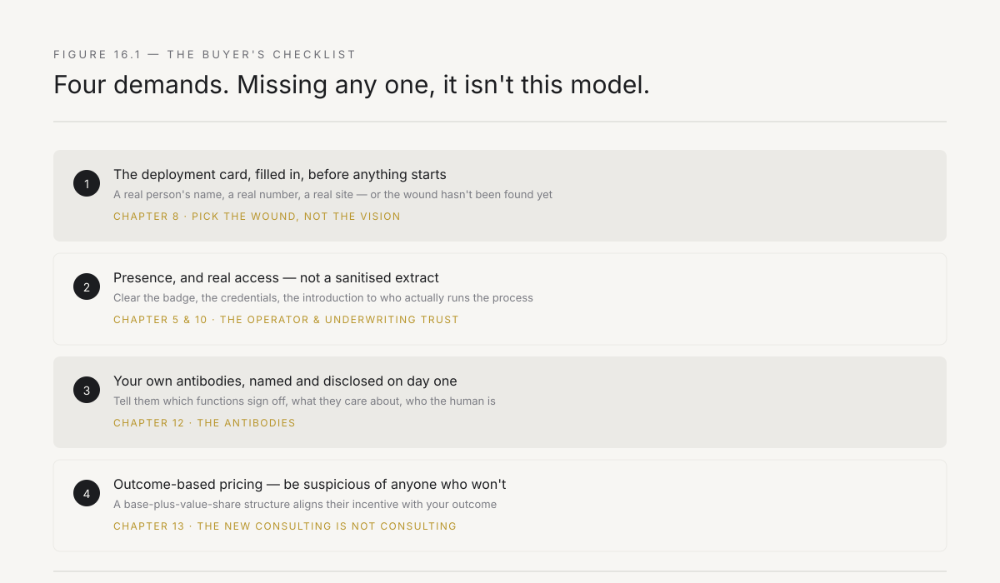
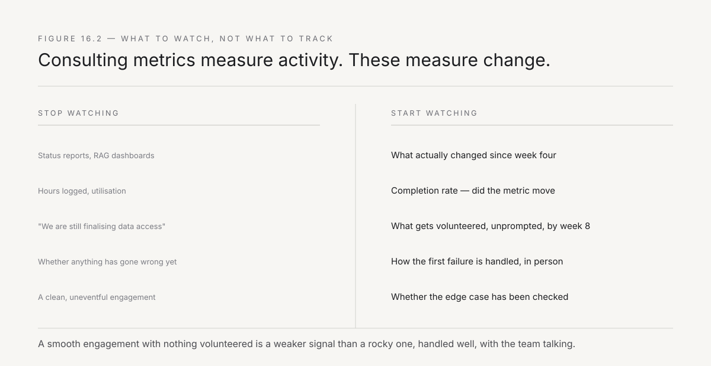
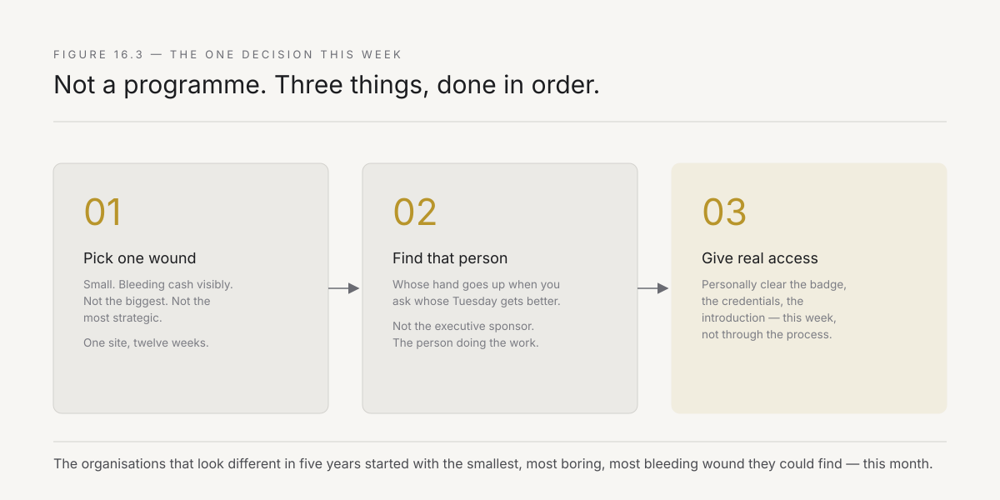

# 16. What you build from here

This chapter is addressed to a different reader than the previous fifteen. Chapters 8 through 15 spoke to the operator, the founder, the person building a forward-deployed capability. This one speaks to you if you are the person on the other side of the table — the CXO, the group head, the promoter, the board member who has read this far because somewhere in your organisation there is a wound that has been bleeding for years, and every attempt to fix it has produced a deck, a steering committee, and no change.

You do not need to become an operator. You need to know what to demand, how to tell whether it is working, and what to do this week. This chapter is that, and nothing more — not a summary of the previous fifteen chapters, but the specific, actionable distillation of them for the person who will decide whether to bring this into their organisation.

---

## What you are actually deciding

Be precise about the decision in front of you, because it is not the decision your procurement process will initially frame it as.

You are not deciding whether to buy a piece of software. You are not deciding whether to hire a consulting firm. You are deciding whether to give one person — a stranger, at first — enough access, enough time, and enough of your organisation's trust to find out what is actually broken and fix it, in public, in twelve weeks, with a number attached.

This is a smaller decision than a transformation programme and a larger one than a software purchase, and the reason most enterprise buyers get it wrong is that they route it through the process built for one of the other two. Chapter 12 named the antibodies that result: procurement asks for a scope that cannot be specified in advance, IT governance asks for a technology review of a system that does not yet exist, compliance asks for a risk assessment of a change that has not yet been designed. None of these functions are wrong to ask. They are asking questions built for a different kind of decision, and if you let the process run unmodified, you will not get an answer in twelve weeks — you will get a status meeting in twelve weeks, and the wound will still be bleeding.

**Your first job, as the buyer, is to recognise that this decision needs a different container than your existing procurement process provides — and to build that container yourself, because no one below you in the organisation has the authority to.**

---

## What to demand

Four things, each drawn directly from the playbook the rest of this book laid out for the people who will do the work. If a forward-deployed engagement does not include all four, it is not forward deployment — it is consulting wearing the vocabulary.

**Demand the deployment card, filled in, before anything starts.** Chapter 8 defined it: a wound that is small in scope (one site, one team, one process — not a national rollout), adjacent to money (a visible cash effect, not a strategic aspiration), owned by one named person who wants it fixed, compatible with sustained on-site presence, and touching the system of record rather than sitting beside it. If the firm proposing the engagement cannot fill in this card with specifics — a real person's name, a real number, a real site — before the engagement begins, they have not yet found the wound. Send them back to find it. A forward-deployed engagement that starts without a filled-in deployment card will spend its first six weeks discovering that the problem it was hired to solve is not the real problem, and you will have paid for the discovery.

**Demand presence, and give it real access.** Chapter 5 and Chapter 10 both make the same point from different angles: the operator's value depends on being physically at the point of the work, for weeks, with access to the actual systems and the actual people — not a sanitised data extract and a conference room. If your organisation's instinct is to protect the operator from the mess — to give them a clean dataset, a scheduled hour with the relevant team, a supervised tour — you are protecting the mess from being found, which is the opposite of what you are paying for. The single highest-leverage thing you can do as the sponsoring executive is personally clear the specific obstacles to presence: the badge access, the system credentials, the introduction to the person who actually runs the process rather than the person who presents about it.

**Demand that your own antibodies are told, not surprised.** Chapter 12 put the burden of preparation on the operator — arrive with the answers already written in procurement's format, IT governance's format, the CISO's format. But you have a matching obligation: tell the operator, before they start, which of your internal functions will need to sign off, what those functions actually care about, and who the specific human being is in each one. An engagement that discovers your compliance function exists only when compliance objects in week eight is an engagement you set up to fail. You know your own antibodies. Name them on day one.

**Demand outcome-based pricing, and be suspicious of anyone who won't offer it.** Chapter 13 described the base-plus-value-share structure specifically because it aligns the firm's incentive with yours. A firm that insists on pure time-and-materials pricing, with no portion of its revenue tied to the metric actually moving, is telling you something about how confident it is in its own model. That does not mean refuse anyone who prices differently — some legitimate constraints (a first engagement with no track record to price against, a wound whose value is hard to measure) make a pure value-share structure impractical — but it means asking the question directly, and treating a firm's discomfort with the question as information.

*Figure 16.1 — Four demands, each traceable to a specific chapter's argument. An engagement missing any one of these is not the model this book describes, whatever it calls itself.*

---

## How to tell if it is working

You will be tempted to evaluate the engagement the way you evaluate every other vendor relationship: status reports, milestone tracking, a RAG-status dashboard. Resist this, for the specific reason Chapter 13 named — utilisation and status-tracking are consulting metrics, built to measure activity, and activity is not what you are buying.

**The metric that matters is completion rate, not activity.** At week four, do not ask *what has the team been doing.* Ask *what changed.* Not what was analysed, not what was designed, not what is in progress — what is different, today, in the actual workflow, than it was four weeks ago. If the honest answer at week four is "we are still finalising the data access," that is a genuine signal, and it usually means one of your own antibodies (the third demand above) was not disclosed early enough, not that the firm is failing.

**Watch for the specific signal Chapter 10 described: what gets volunteered.** By week six to eight, is the internal team volunteering information that was not asked for — a second problem, a hidden workaround, a colleague's parallel struggle with something similar? This is the trust signal, and its presence or absence tells you more about whether the engagement is on track than any status report will. If, by week eight, your team is still giving the operator the official tour rather than the real one, something in the relationship has not taken, and it is worth a direct conversation with your own team about why — not automatically with the operator.

**Watch for the failure mode Chapter 14 named: a system that works on the data it was tested against and nobody has checked the edge case.** Before you declare a deployment a success, ask specifically what happens in the case nobody thought to check — the partial shipment, the exception customer, the month where the volume triples. A forward-deployed team that has done this correctly will have an answer, because Chapter 14's discipline (the AI drafts, the human corrects against something learned by being present, nothing ships until the correction cycle runs out of exceptions) produces teams that go looking for the edge case rather than waiting for it to surface as a customer complaint.

**Do not confuse a smooth engagement with a working one, or a rocky one with a failing one.** Chapter 10 was explicit: the first visible failure, handled well, builds more trust than months of smooth delivery. If something breaks in week six and the operator is visibly, personally present fixing it — not filing a ticket, not blaming the data — that is a stronger signal of long-term success than an engagement where nothing has gone wrong yet, because nothing going wrong yet usually means nothing real has been attempted yet either.

*Figure 16.2 — Consulting metrics measure activity. The metrics that actually predict whether this works measure change, trust, and how failure is handled — none of which show up on a status dashboard.*

---

## What changes inside your organisation once the first one works

If the first deployment succeeds — the metric moves, the old path is switched off, the team owns the new one — something happens inside your organisation that is worth anticipating, because it is the actual payoff and it is easy to miss if you are only looking for the original number.

The person who was sceptical becomes the referral. Chapter 9 described this from the operator's side — handover as the sales mechanism for the second deployment. From your side, it means the deputy general manager who watched their four-day reconciliation become a six-hour one is now, unprompted, telling their counterpart at the sister company. You do not need to manage this. You need to not get in its way, which mostly means not routing the second engagement through a heavier process than the first one earned.

The organisation's tolerance for a different kind of vendor relationship expands. Once your procurement team has successfully processed one time-and-capability contract with a value-share component, the second one is not a novel category anymore — it is precedent. This is worth protecting deliberately: the institutional memory of *we did this once and it worked* is more valuable than the specific deployment, because it is what makes the fifth and tenth deployment faster to approve than the first.

You will discover you have more wounds than you thought. Chapter 8's five-condition filter, once your organisation has seen it applied successfully once, becomes a lens your own people start applying unprompted. The plant manager who watched the reconciliation fix will start noticing their own team's equivalent problem and asking whether it qualifies. This is the compounding sequence from Chapter 9, and Chapter 15's country-sized opportunity, both visible from inside a single organisation rather than across a market.

---

## Build or buy

One decision has been implicit throughout this chapter and deserves to be made explicit: should your organisation hire an external forward-deployed firm, or build this capability internally, using this book as the playbook?

The honest answer depends on a question only you can answer: does your organisation already employ people who sit near Chapter 11's intersection — engineers with genuine build capability who have also demonstrated, in some other context, the ability to navigate your specific organisation's politics and earn trust laterally? If a handful of such people already exist inside your company — often overlooked, often underused because your organisation has no role that asks for both capabilities at once — the fastest path may be to identify them, give them the deployment card and the mandate from this chapter, and let them run the first wound internally. An internal operator starts with a trust advantage no external firm can match: they are already known, already inside the hierarchy, already fluent in the specific politics of your organisation.

The case for going external, at least for the first deployment, is equally specific: an external operator has done this before, has the pattern-matching from other deployments that tells them what a real wound looks like versus a plausible-sounding fake one (Chapter 8's three wrong picks), and — critically — has no internal political history that makes them either a threat or an ally before they have done anything. An internal candidate who reports to a function with a stake in the outcome will find their room-reading compromised by their own position in the hierarchy in ways an external operator does not experience.

The pattern that has worked best across the deployments referenced in this book: start with one external deployment, deliberately including an internal person as Chapter 11's phase-one apprentice, embedded alongside the external operator for the full twelve weeks. This gives you a first deployment with an experienced hand at the controls and, if it succeeds, an internal person nine months into the training cycle that Chapter 11 describes — ready to lead the second deployment with external support only where needed. Building entirely internally, from a standing start, without ever having seen a deployment done well, is the highest-risk path, because Chapter 11's training model depends on apprenticeship next to someone who has already done it.

## The objections you will hear, and the honest answer

Before you take this to your organisation, expect specific pushback, because it is predictable and it is worth having an answer ready rather than being caught by it in the room.

**"We already have an IT team / digital transformation office for this."** They may be excellent at what they do, and what they do is usually not this. Chapter 1 described the transformation office's structural position: accountable for the strategy, not the workflow, incentivised to produce artefacts that survive review rather than changes that survive contact with the floor. This is not a criticism of the people. It is a description of what the role, as commonly structured, actually optimises for. The test is simple: ask your transformation office how many workflows they have personally rewired, hands on keyboard, in the last year, versus how many roadmaps they have produced. The answer will tell you whether this is redundant with what you already have.

**"This sounds like more consultants with better branding."** Chapter 13 exists to answer this precisely, and the test is concrete, not rhetorical: ask any firm pitching this model whether they will accept outcome-based pricing on a meaningful share of the fee, whether they will commit to on-site presence for the deployment's full duration, and whether the deliverable is a changed system or a report. A firm that hedges on any of the three is, whatever it calls itself, offering you the thing Chapter 13 spent a chapter distinguishing this from.

**"Why not just hire our own engineers directly instead of paying an operator's margin?"** You can, and Chapter 11's answer applies directly: the intersection of build capability and room-reading ability is rare, the training cycle is nine months minimum, and a standard engineering hiring process is not built to test for the room-reading half at all. If you have the patience for a nine-month internal build and can identify the right raw material, the build-or-buy section above describes exactly how to do it. If you need the first wound fixed this quarter, you are paying for a capability that took someone else nine months and several failed deployments to build, and that is a legitimate thing to pay for.

**"How do we know this will work here — our industry / our region / our company is different."** You don't, with certainty, until you try it on one small wound. This is precisely why Chapter 8's selection discipline exists — small, bounded, twelve weeks, one measurable number. The entire structure of the first deployment is designed to answer this question cheaply, with a real result, rather than through a pilot study or a proof-of-concept exercise that consumes six months and produces a recommendation instead of a change.

---

## The one decision this week

Not a programme. Not a steering committee. Not a request for proposals sent to five firms simultaneously, which — per Chapter 12 — will route the entire question through your procurement antibody before anyone has found a real wound to fix.

**Pick one wound.** Not the biggest one. Not the most strategic one. The one Chapter 8 describes: small, bleeding cash visibly, with one person whose Tuesday would get better if it were fixed, in a site where someone can sit for twelve weeks.

**Find that person.** Not the executive who will sponsor the initiative in a steering committee. The person doing the work today, whose hand would go up if you asked *whose Tuesday gets better if this is fixed.* Talk to them directly, this week, before any vendor conversation begins. Ask them what is actually broken — not what the process documentation says, what they actually do, and what they have stopped complaining about because they assumed it could not change.

**Give real access.** Whatever forward-deployed capability you choose to work with — a firm, an internal team you are building using this book as the playbook, a single operator you have found — the single highest-leverage decision available to you this week is deciding, personally, to clear the access, the introductions, and the presence that the engagement needs, rather than letting it be discovered through the normal process over the following two months.

*Figure 16.3 — Three steps, in order, this week. Not a programme.*

Every chapter in this book has argued, in one register or another, that transformation happens at the level of one workflow, changed by one person who is present, trusted, and given real authority to rewire rather than recommend. You do not need to read the other fifteen chapters again to act on this one. You need to pick the wound, find the person, and get out of the way of the access.

**The organisations that will look meaningfully different in five years are not the ones with the best transformation strategy. They are the ones that started with the smallest, most boring, most bleeding wound they could find — this month, not next quarter — and let one trusted person fix it in public.**

---

*The book ends here. Sixteen chapters: why transformation fails from the top, what forward deployment actually is, the playbook for doing it, and the economy it creates. The argument was never abstract — it was that the unit of change is one person, present at the point of the work, with the authority and now the tools to rewire rather than recommend. Whether you are the operator or the buyer, the next step is not another chapter. It is one wound, one person, and twelve weeks.*
