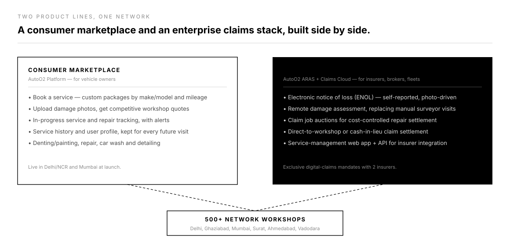
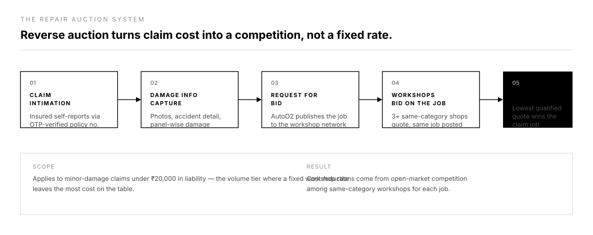

# AutoO2 — motor insurance claims SaaS

*A B2B claims platform I co-founded, built, and took to 500+ workshops.*

**Role:** Co-founder & chief product officer · **Company:** AutoO2 (Carmenta Solutions) · **Timeline:** June 2015 – April 2018

AutoO2 (operated as Carmenta Solutions Private Limited) was the entrepreneurial stint before the corporate roles: I co-founded the company from zero and served as CPO, conceptualising, designing, building, and launching the product line myself rather than inheriting a team or a roadmap. The vision was to become a connected digital post-sales vehicle care technology enterprise — one platform serving both individual vehicle owners and the B2B insurance ecosystem around them.

The business ran two product lines side by side:

- **A consumer marketplace** — the AutoO2 Platform, a self-serve booking and repair marketplace for vehicle servicing, denting/painting, and car care, matching vehicle owners to a network of workshops with photo-based quotes and real-time job tracking.
- **An enterprise claims stack** — AutoO2 ARAS and AutoO2 Claims Cloud, sold to motor insurers, brokers, and fleet operators as a remote damage assessment and electronic-notice-of-loss (ENOL) system that replaced manual surveyor visits with self-reported, photo-driven claims.

## What I built

- **AutoO2 ARAS**, our core claims SaaS for insurers — remote damage capture, claim assessment, and settlement workflows built to cut surveyor dependency and claims cost
- **AutoO2 Claims Cloud**, the self-inspection workflow engine for motor/own-damage claims, extended into an enterprise suite: a claims web app for service management, and an API for insurers to integrate AutoO2 into their own claims systems
- **The repair auction system** — a reverse-auction mechanism where network workshops bid on minor-damage claim jobs (under ₹20,000), creating a self-correcting, competitive cost-control layer instead of fixed pricing
- **The workshop network itself** — recruiting, onboarding, and rating 500+ workshops so insurers had a vetted panel to route claims through, and fleet operators had guaranteed service coverage
- **AutoO2 Service Marketplace**, adding four vehicle maintenance services alongside the digital insurance claims support

## Outcome

We onboarded 500+ network workshops across Delhi, Ghaziabad, Mumbai, Surat, Ahmedabad, and Vadodara within eight months of launch, raised $100,000+ in pre-seed capital, and secured exclusive digital claims mandates from two insurance companies for touchless claim servicing. AutoO2 later won an equity-free grant of ₹10,00,000 from Mumbai Fintech, a Government of Maharashtra initiative.

As founder and CPO, I owned this end to end — product, positioning to insurers and brokers, and the workshop network that made the claims promise real — which is the part of my background I draw on most when I talk about building 0→1.

## The deeper dive

*Figure 1 — the consumer marketplace and the enterprise claims stack ran side by side, converging on the same 500+ workshop network.*

The two product lines shared infrastructure but sold to completely different buyers: the consumer marketplace competed on convenience for a vehicle owner booking a service, while the enterprise claims stack competed on cost and turnaround time for an insurer's claims team. Both depended on the same underlying asset — a vetted, rated network of repair workshops — which is why building and maintaining that network was as much a product responsibility as any feature.

*Figure 2 — the reverse-auction mechanism behind claim job cost control.*

The repair auction system was the clearest example of designing a market, not just a workflow. For minor-damage claims (under ₹20,000 in liability), instead of routing a job to a single pre-agreed workshop at a fixed rate, AutoO2 published the job to same-category workshops in the network and let them bid. Competition — not a negotiated rate card — set the price, and the insurer still retained final say over which workshop got the job.

*The pivot story and platform screens are coming — placeholder until that write-up is ready.*
