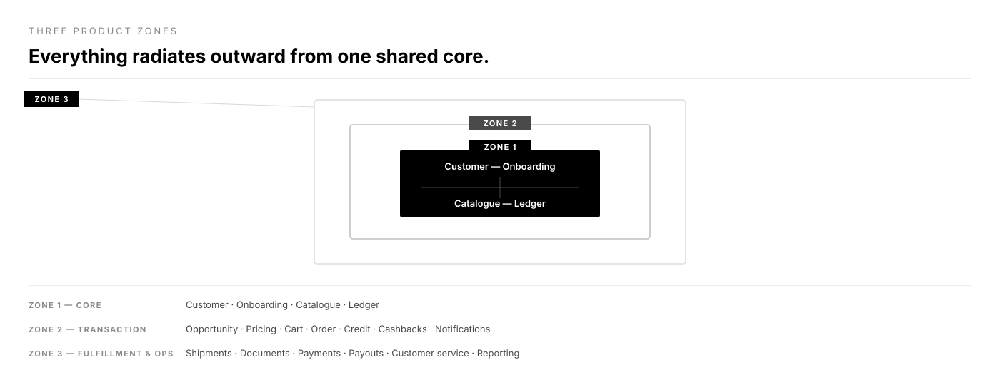
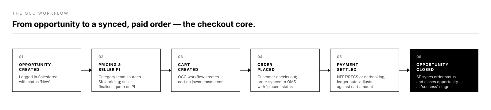

# JSW One MSME — B2B marketplace

*A credit-enabled marketplace for MSMEs to purchase industrial supplies.*

**Role:** SPM · **Company:** JSW One Platforms · **Timeline:** November 2021 – April 2024

JSW One MSME (jswonemsme.com) is a B2B marketplace that lets MSMEs purchase industrial supplies with embedded credit. I led product and strategy for the platform, and personally designed its most load-bearing piece: the booking core.

## What I built

- The booking core — the end-to-end order-creation journey — integrated deeply with Salesforce CRM, ERP, customer notifications, the discounts engine, and the catalogue and pricing system
- The discounts and cashbacks engine, marketing automation, and WhatsApp Business integration, working with the engineering team
- The internal technical documentation repository
- Company-wide demos, PM training, and onboarding frameworks for new hires, supervising a team of 10+ designers and engineers

## Outcome

The booking core supported the business through its run to a $1B exit rate in FY '23–24.

## The deeper dive

The platform sits in three concentric zones — a stable core (customer, catalogue, ledger), a transaction layer built around Salesforce, and an outer fulfillment and reporting layer — with two journeys running outward from that core: one through Salesforce up to order creation, and one through ERP from there to completion.

*Figure 1 — the platform's three zones, from the shared core to fulfillment and reporting.*

The order-creation-and-checkout (OCC) flow is where most of the product decisions live — opportunity conversion, seller pricing, ledger-based credit offset, and payment reconciliation, all before an order ever reaches ERP.

*Figure 2 — the high-level OCC (order creation and checkout) workflow, from opportunity to payment confirmation.*

The pre-order and post-order journeys share the same core but run through different systems end to end. Toggle between them below to see which building blocks each journey touches.
